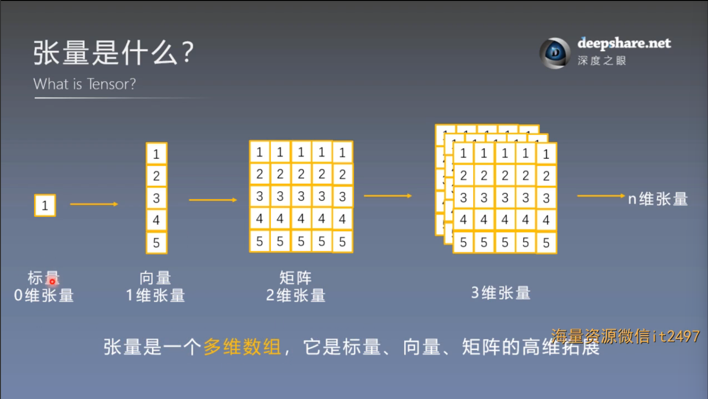
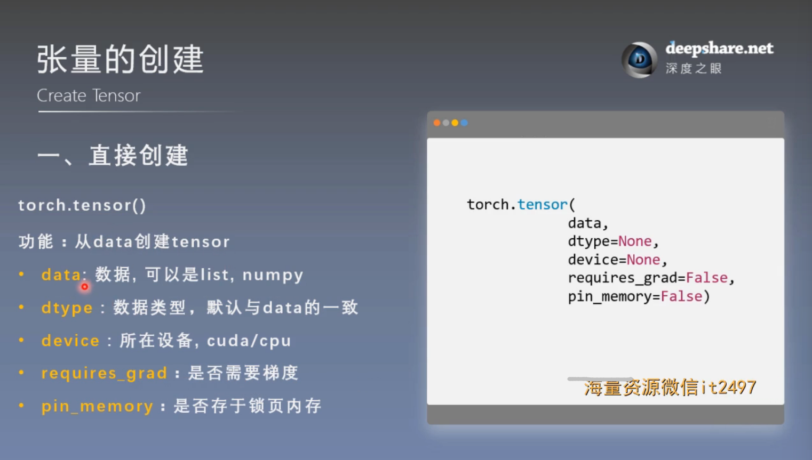
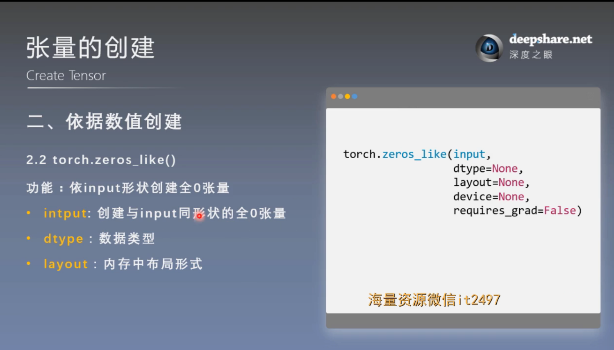

# PyTorch的Tensor(张量)
## 1. 张量是什么

(1). 张量是一个多维数组，它是标量，向量，矩阵的高位拓展

(2). 张量维度的概念和numpy数组类似，可以看之前的python基础numpy库部分

## 2. 张量的创建
### 一. 直接创建
#### 1. torch.tensor()

(1). 功能：从data直接创建tensor

#### 2. torch.from_numpy(ndarray)
(1). 功能：从numpy创建tensor

**注意事项**：从torch.from_numpy创建的tensor与原ndarray**共享内存**，当修改其中一个的数据，另外一个也将会被改动

### 二. 依据数值创建
#### 1. torch.zeros()
(1). 功能：依size创建全0张量

#### 2. torch.zeros_like()
功能：依input形状创建全0张量

#### 3. 其他
- torch.ones()
- torch.ones_like()
- torch.full()
- torch.full_like()
- torch.arange()
- torch.linspace()
- torch.logspace()
- torch.eye()
### 三：依概率创建张量
#### 1. torch.normal()
有四种模式：
1. mean为标量，std为标量
2. mean为标量，std为张量
3. mean为张量，std为标量
4. mean为张量，std为张量

    **规则和广播规则类似**（见程序演示）
#### 2. 其他
- torch.randn()
- torch.randn_like()

    正态分布
- torch.rand()
- torch.rand_like()
- torch.randint()
- torch.randint_like()

    均匀分布
- torch.randperm()  ——随机排列
- torch.bernoulli()  ——以input为概率，生成伯努利分布