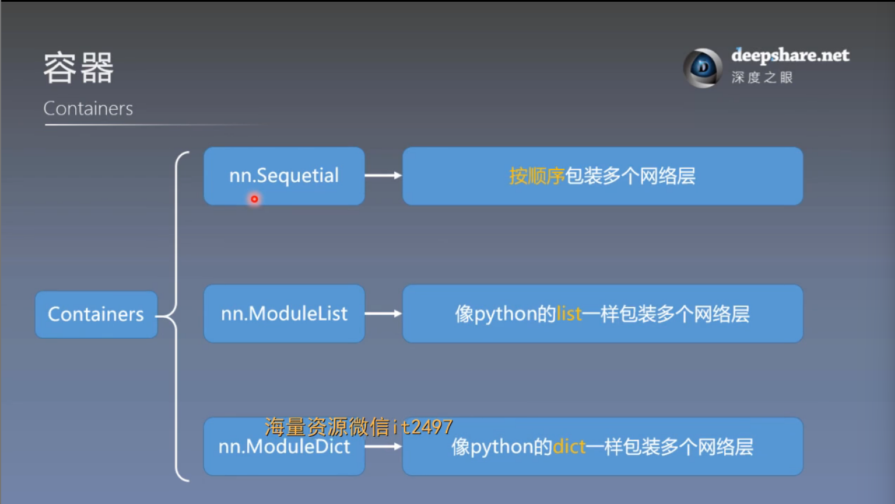
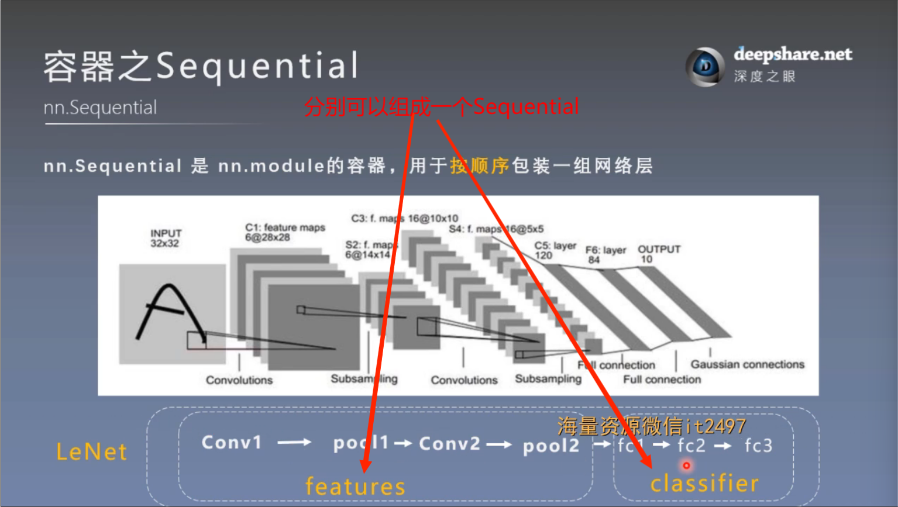
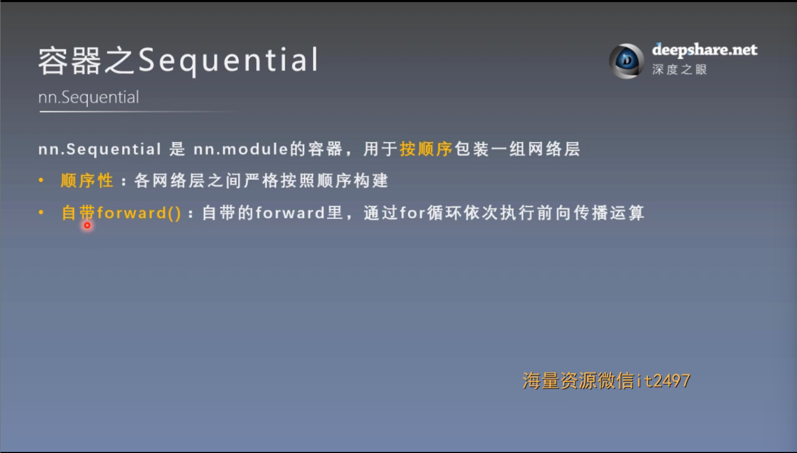
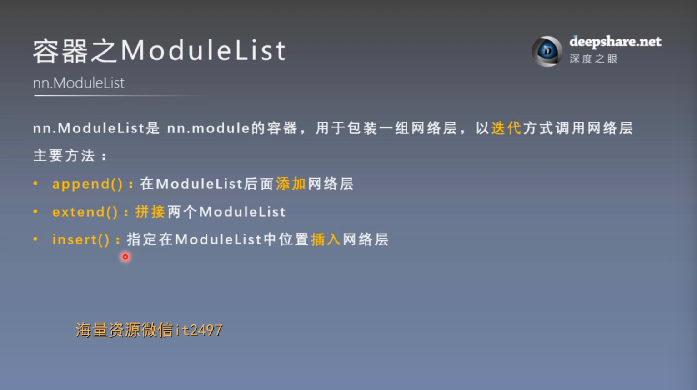
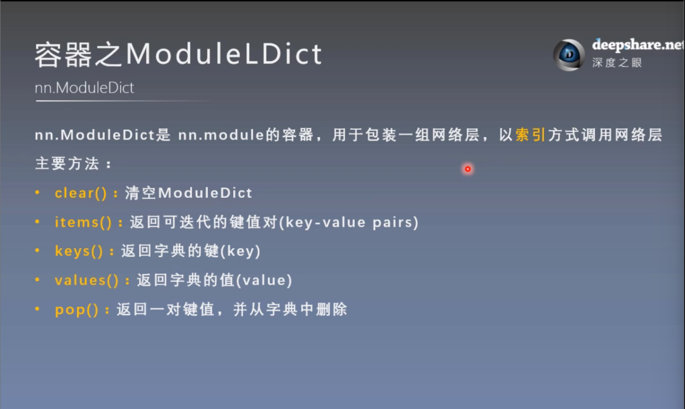
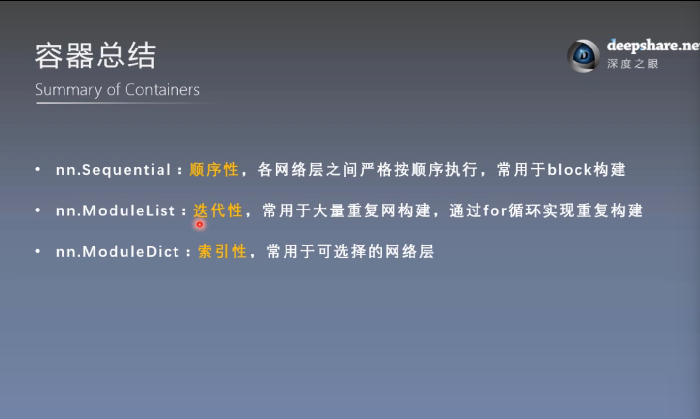
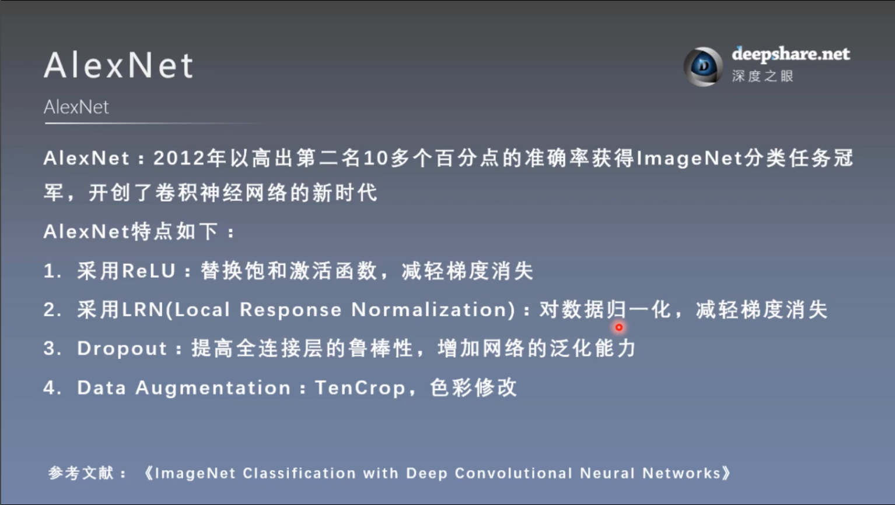
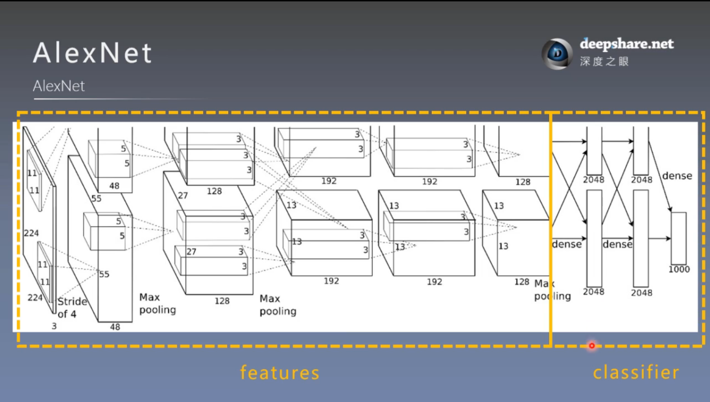

# 模型容器与AlexNet构建

## 一. 模型容器（Containers）

### 1. 常用容器



#### （1）nn.Sequential

使用 例：

```json
self.features = nn.Sequential(
        nn.Conv2d(3, 6, 5),
        nn.ReLU(),
        nn.MaxPool2d(kernel_size=2, stride=2),
        nn.Conv2d(6, 16, 5),
        nn.ReLU(),
        nn.MaxPool2d(kernel_size=2, stride=2)
```



可以使forward方法设计起来更加简介清楚

使用容器之前：

```json
def forward(self, x):  # 按前向传播的顺序拼接子模块
    out = F.relu(self.conv1(x))
    out = F.max_pool2d(out, 2)
    out = F.relu(self.conv2(out))
    out = F.max_pool2d(out, 2)
    out = out.view(out.size(0), -1)
    out = F.relu(self.fc1(out))
    out = F.relu(self.fc2(out))
    out = self.fc3(out)
    return out
```

使用容器之后：

```json
def forward(self, x):
    x = self.features(x)
    x = x.view(x.size()[0], -1)
    x = self.classifier(x)
    return x
```

实际上，就是在Sequential容器中通过一个for循环对Sequential中的网络层进行forward

注：Sequential还可以对网络层进行命名，默认是0，1，2，……

使用方法：传入一个有序字典

```json
self.classifier = nn.Sequential(OrderedDict({
        "fc1": nn.Linear(16*5*5, 120),
        "relu3": nn.ReLU(),
        "fc2": nn.Linear(120, 84),
        "relu4": nn.ReLU(inplace=True),
        "fc3":nn.Linear(84, classes)
    }))
```

两个特性：



#### （2）nn.ModuleList



使用方法（例）：

```json
self.linears = nn.ModuleList([nn.Linear(10,10) for i in range(20)])
```

#### （3）nn.ModuleDict



使用方法（例）：

```json
self.choices = nn.ModuleDict({
            "conv": nn.Conv2d(10, 10, 3),
            "pool": nn.MaxPool2d(3)
        })
```

#### 总结



## 二. AlexNet构建

### 1. 介绍



### 2. 构建


