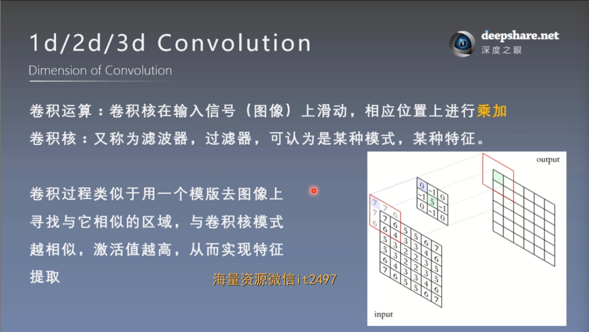
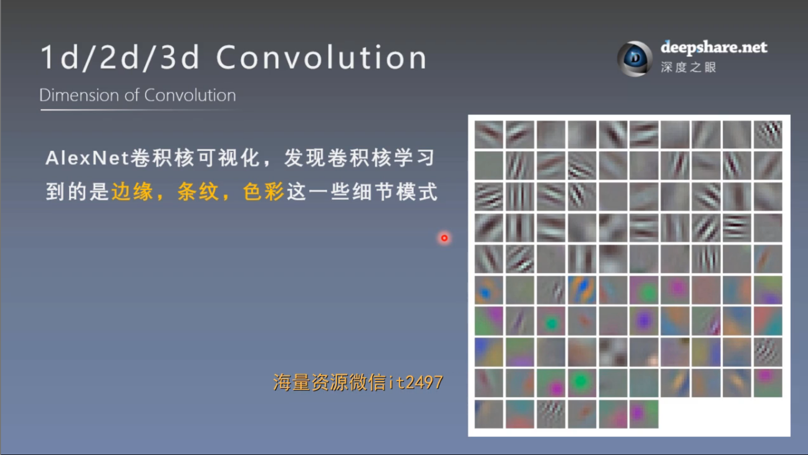
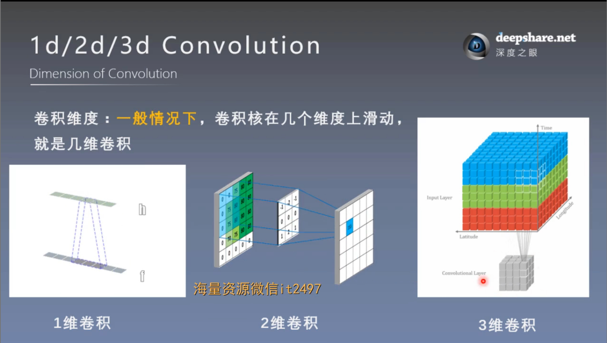
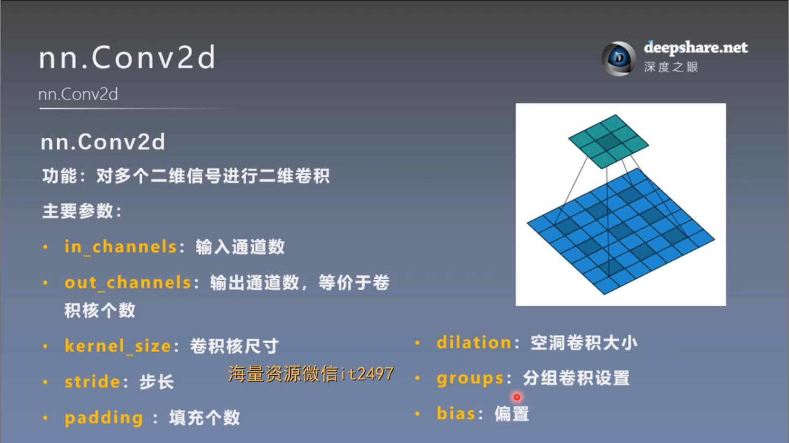
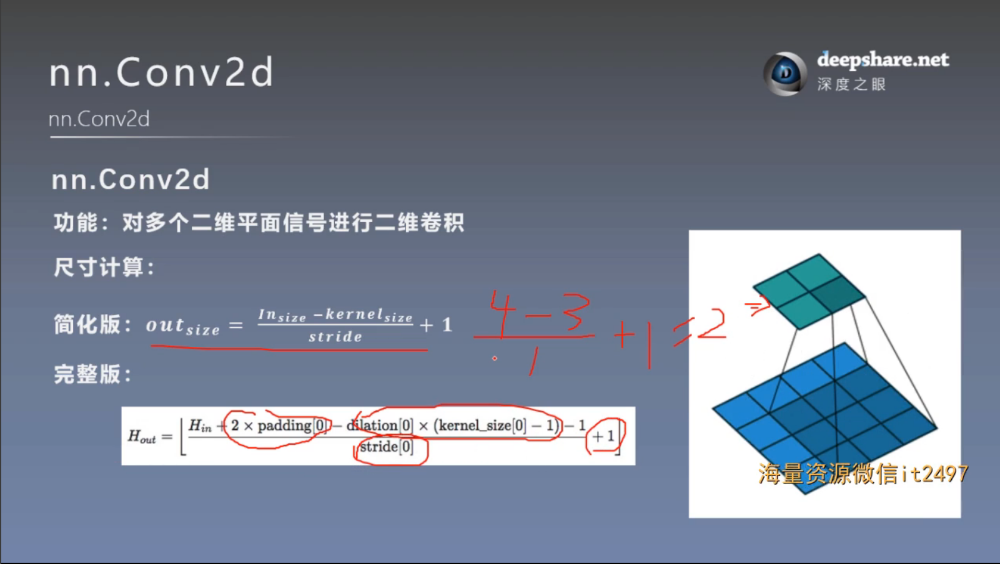
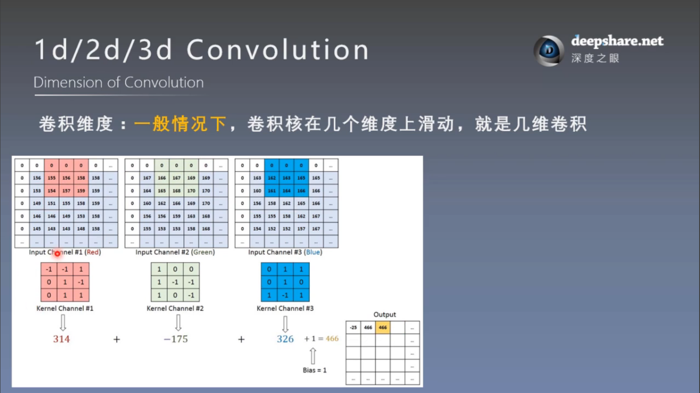
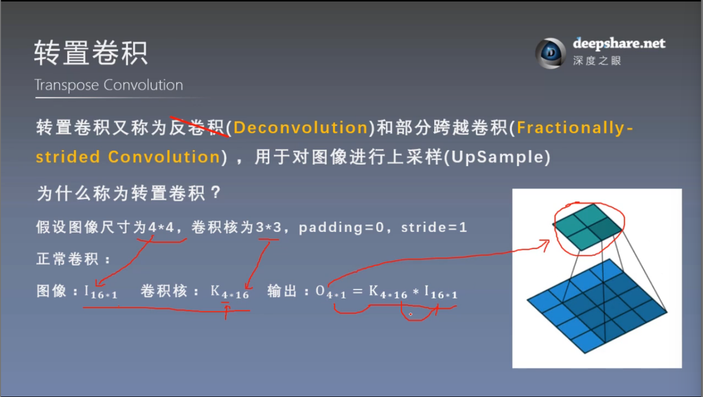
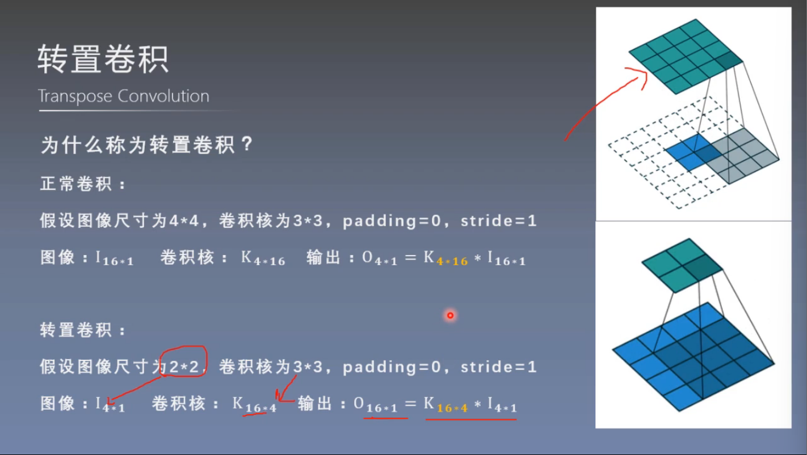
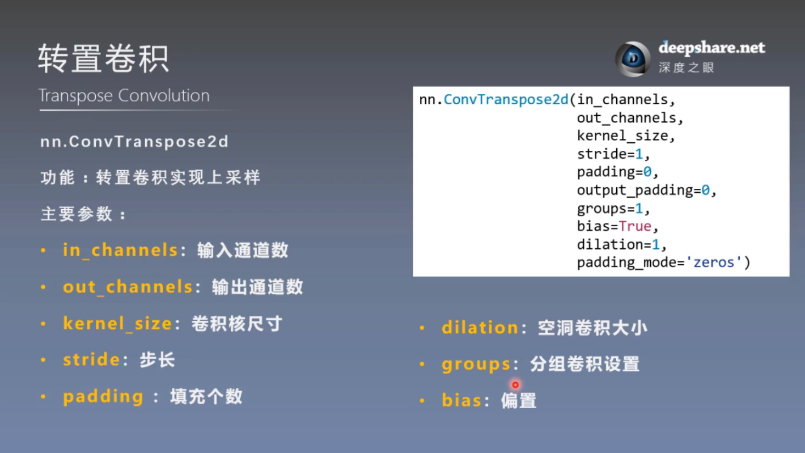
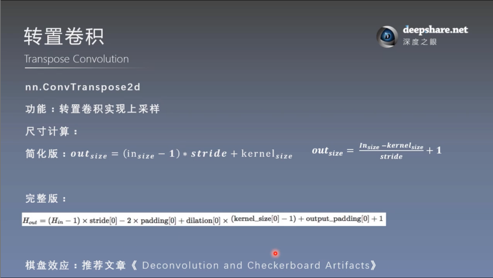

# nn网络层-卷积层
## 1. 1d/2d/3d卷积

**注意卷积维度的概念**

## 2. 卷积-nn.Conv2d()

参数说明
- in_channels：输入的通道数（例如，对于彩色图像，in_channels=3，表示RGB三通道）。
- out_channels：卷积操作输出的通道数（即卷积核的数量，也决定了输出特征图的通道数）。
- kernel_size：卷积核的大小，可以是单个整数（例如 3 表示 3x3 的卷积核）或者是一个元组（例如 (3, 5) 表示 3x5 的卷积核）。
- stride：卷积核滑动的步长，默认为 1。步长控制卷积操作在输入图像上的移动速度，步长较大时，输出的特征图尺寸较小。
- padding：输入图像的边缘填充。填充是为了避免卷积操作导致输出尺寸缩小。可以是 0 或其他整数，也可以是一个元组 (h, w)，表示在高度和宽度方向上的填充。
- dilation：空洞卷积大小，卷积核元素之间的间隔（膨胀卷积）。默认为 1，表示没有膨胀。如果设为 2，则卷积核的每两个相邻元素之间的间隔会增大。
- groups：控制卷积操作的分组数量。默认为 1，表示常规的卷积。如果设置为 in_channels，将会执行深度可分离卷积。
- bias：是否添加偏置项。默认为 True，表示添加偏置项。
- padding_mode：填充模式，默认为 'zeros'，即用零填充输入数据。如果设置为 'reflect' 或 'replicate'，则会使用不同的填充方法。

**尺寸**

**再次强调卷积维度的概念**

## 3. 转置卷积-nn.ConvTranspose——上采样

转置卷积的通病——棋盘效应