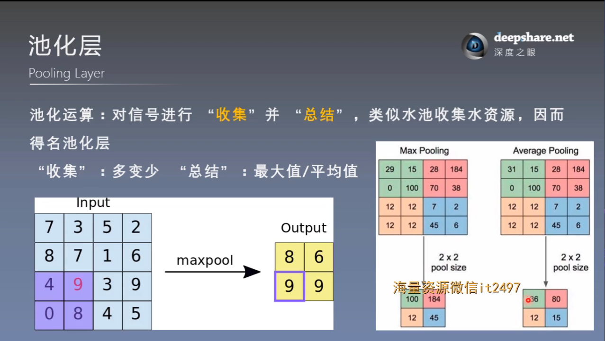
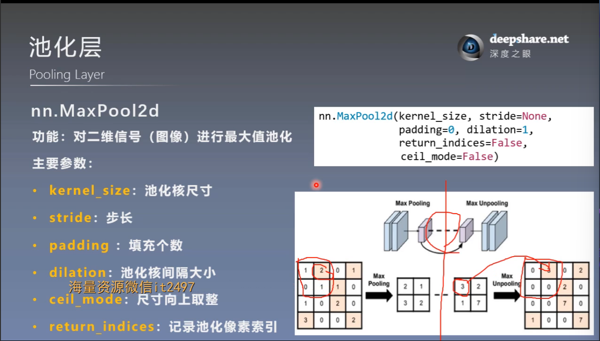
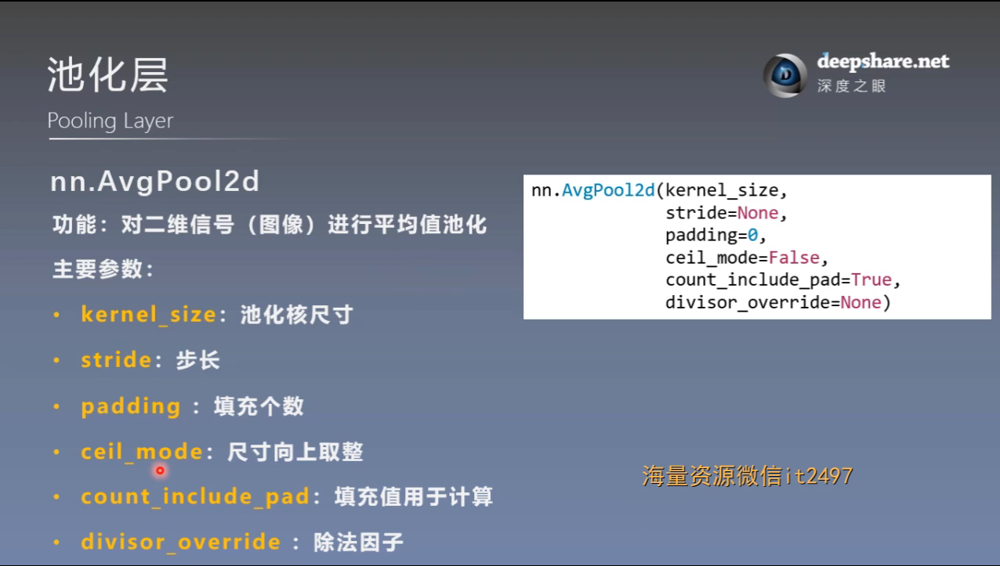
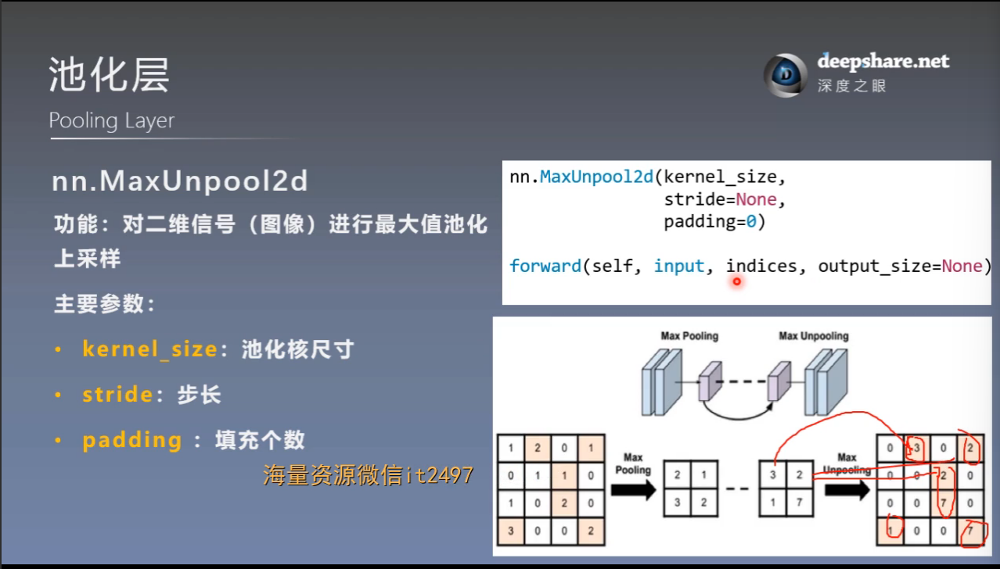
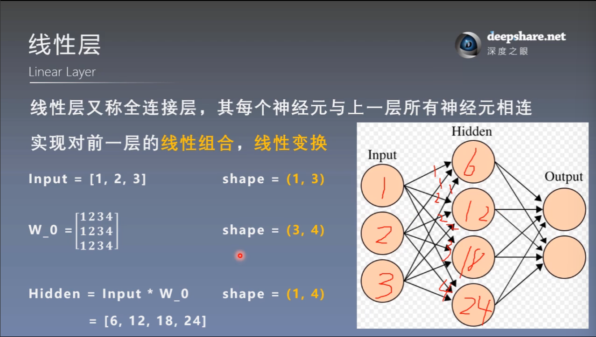
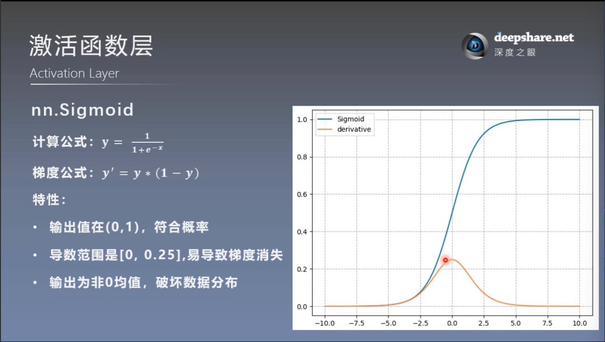
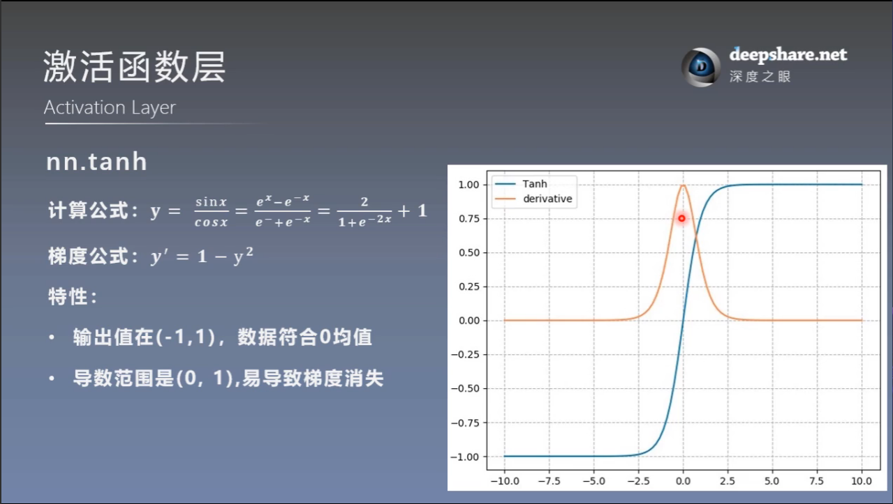
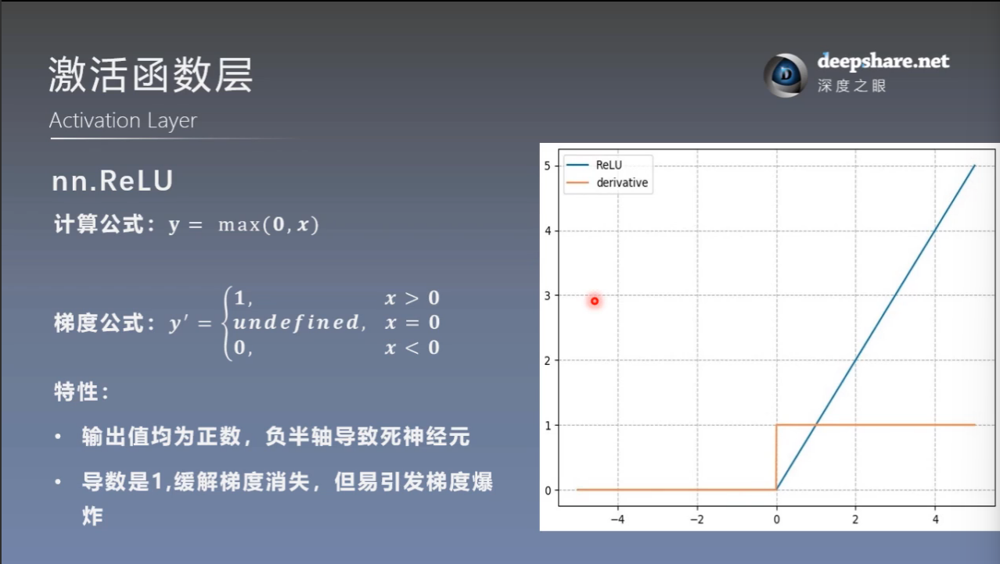
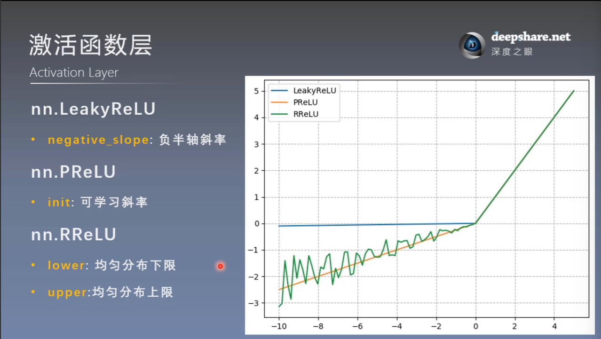

# nn网络层-池化-线性-激活函数层

## 一. 池化层-Pooling Layer

### 1. 概念

### 2. 常用函数

### 3. 反池化及常用函数

## 二. 线性层-Linear Layer

### 1. 概念

### 2. 常用函数

## 三. 激活函数层-Activation Layer

多个线性层叠加等价于一个线性层，因此没有意义，引入激活函数层，赋予多层神经网络**深度**的意义

### 1. 常用激活函数

（1）nn.Sigmoid

（2）nn.tanh

以上激活函数易导致梯度消失（从反向传播的链式法则理解）

（3）nn.ReLU

ReLU易引发梯度爆炸和死神经元

改进后的三个函数：

