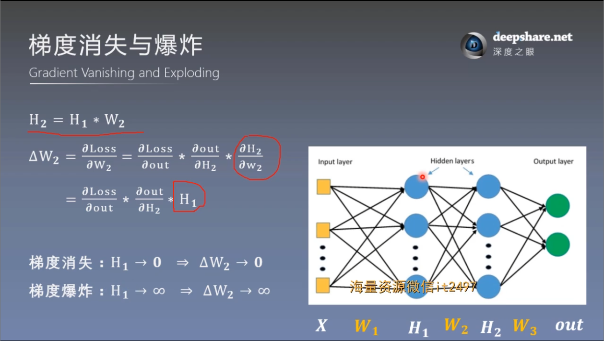
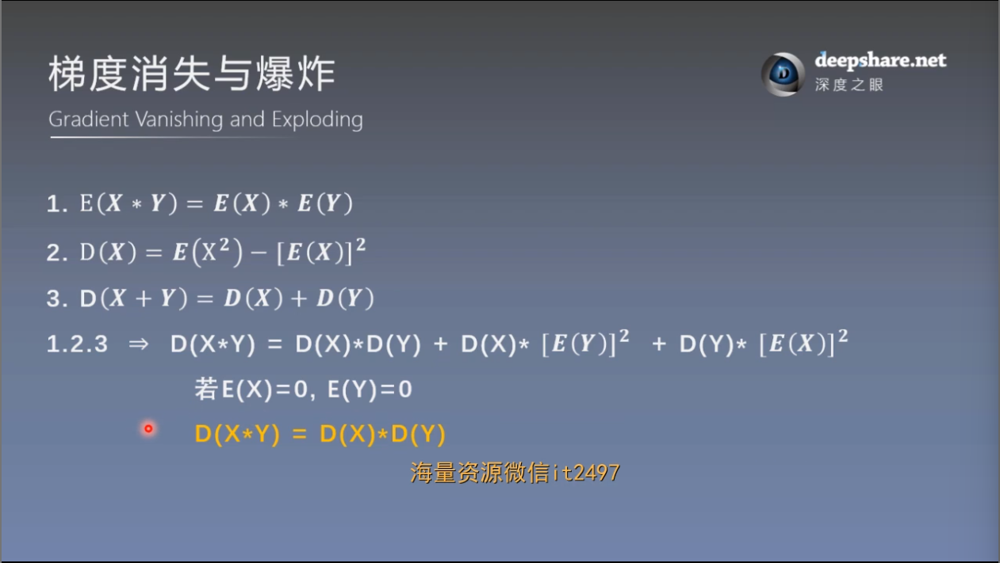
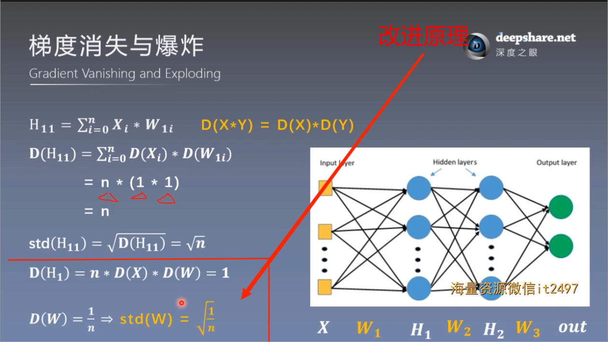
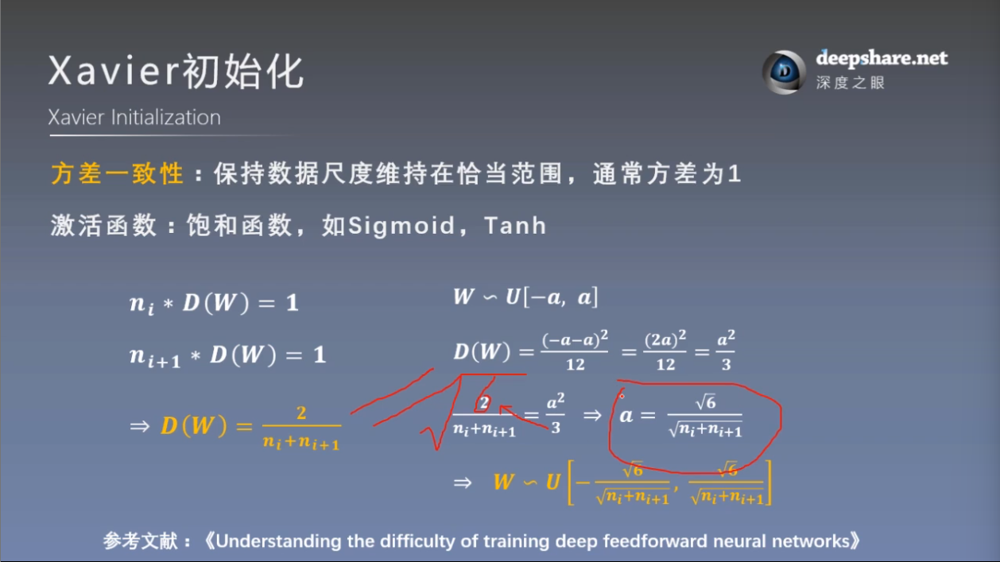
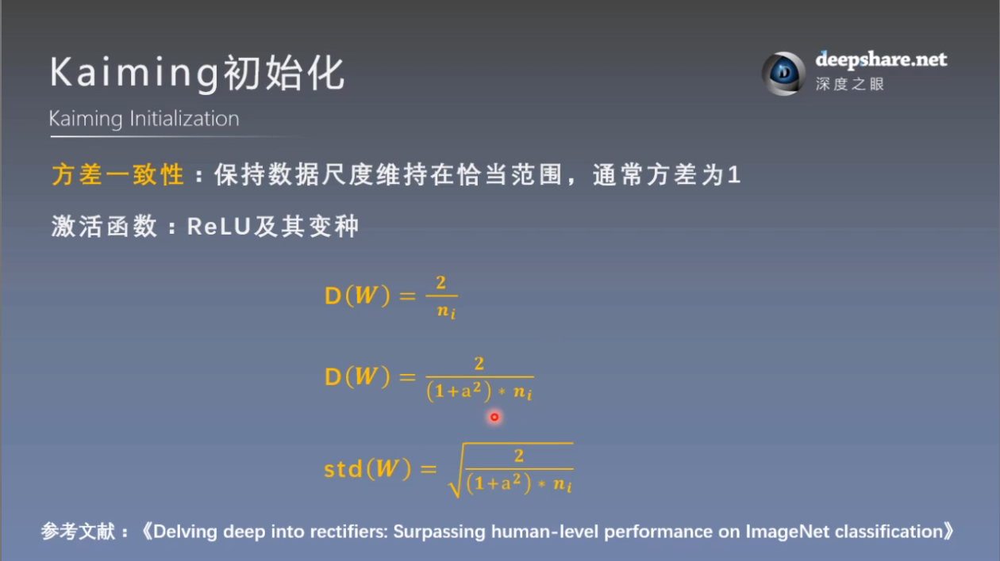
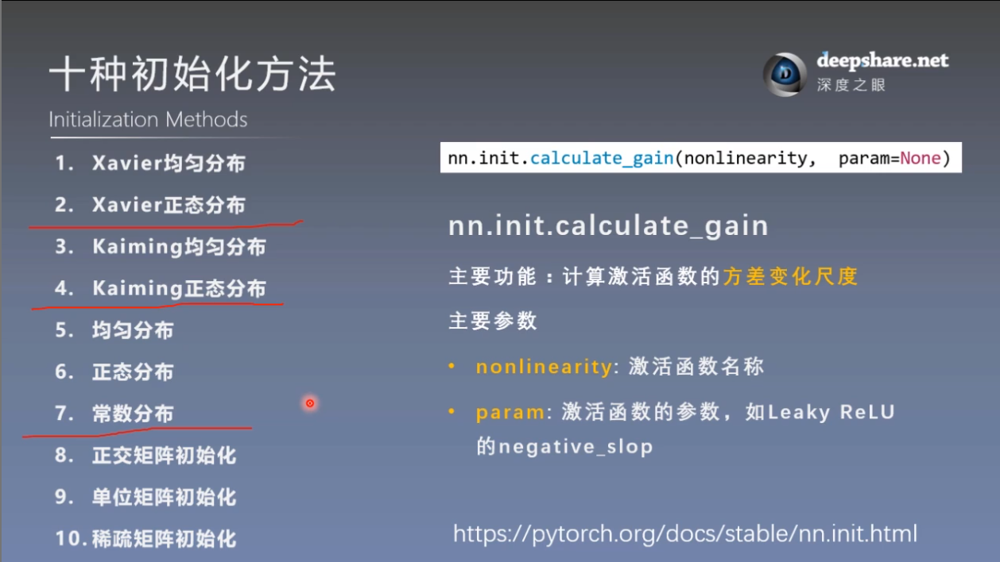

# 权值初始化
## 一. 梯度消失与爆炸
### 1. 原理

为什么会梯度爆炸？

即当前层梯度大小，与上一层输出有关，上一层输出的标准差越大，输出数据的范围就越大，就会出现很大或很小的数，就会导致梯度爆炸，梯度消失同理

## 二. Xavier方法和Kaiming方法
### 1. Xavier初始化

### 2. Kaiming初始化

## 三. 常用初始化方法与增益（方差变化尺度）

