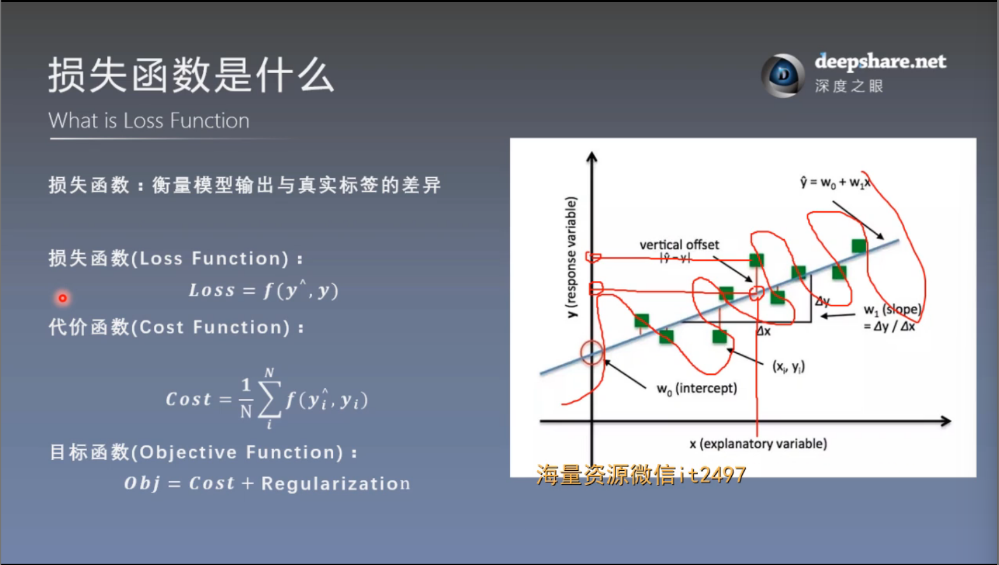
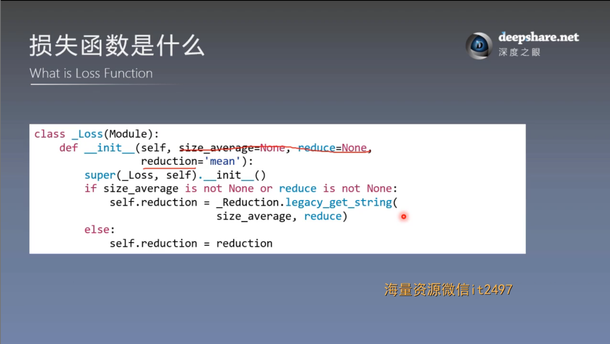
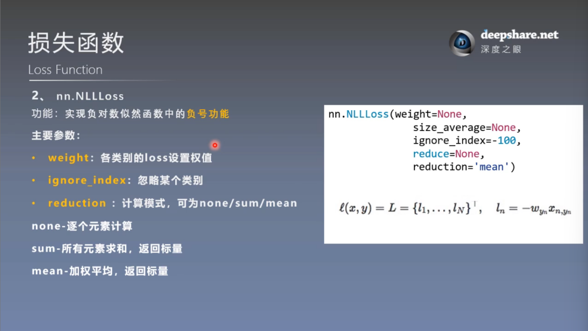
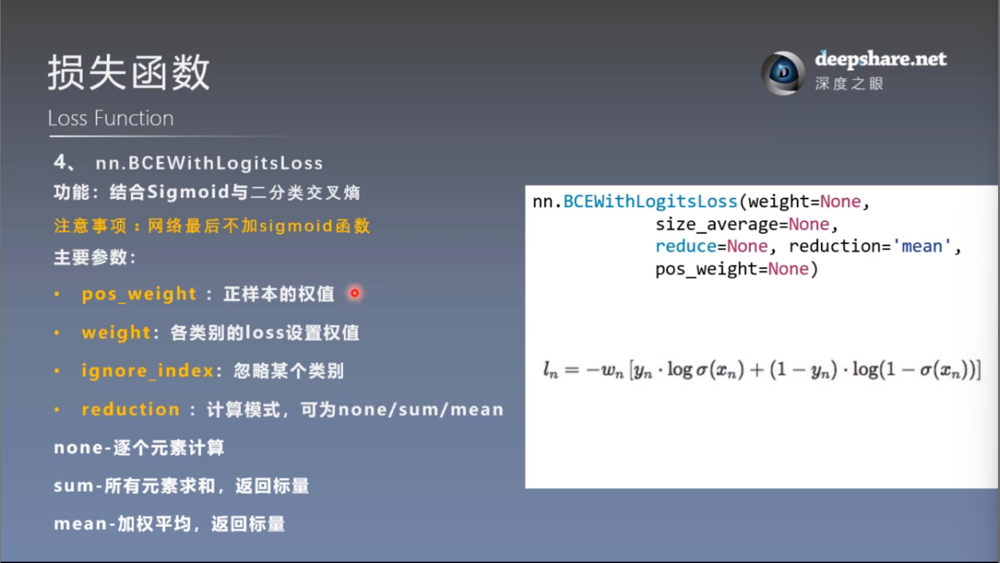

# 损失函数（1）
## 一. 损失函数概念

### 1. 损失函数是什么



不失一般性，我们以后研究问题时，损失函数都是指代价函数，即衡量模型输出与真实标签的差异时，都称为Loss

损失函数不是越小越好，因为可能会导致过拟合，所以在目标函数中除了Cost还要加一个Regularization，即正则项

### 2. _Loss类的基本形式



\_Loss类是pytorch中损失函数的基类，所有损失函数最终都继承于\_Loss类

而_Loss类又继承Module类，所以损失函数也可以看成是Module

### 实际使用方式

1. 通过一个损失函数类实例化损失函数对象，损失函数类一般pytorch会提供

    例

    ```
    loss_f_mean = nn.CrossEntropyLoss(weight=None, reduction='mean')
    ```
2. 用损失函数对象计算loss

    例

    ```
    loss_mean = loss_f_mean(inputs, target)
    ```

## 二. 交叉熵损失函数

$$\color{red}{切记本质：随机变量的函数的期望！！！}$$

### 1. 基本知识
#### （1）信息量
信息量来衡量一个事件的不确定性，一个事件发生的概率越大，不确定性越小，则其携带的信息量就越小。

**信息量的大小与信息发生的概率成反比**

设 $X$ 是一个离散型随机变量，其取值为集合 $X = x_0, x_1, \dots, x_n$ , 则其概率分布函数为 $p(x)=\Pr(X=x),x\in X$ , 则定义事件 $X=x_0$ 的信息量为：
```math
\mathbf{I}(x_0)=-\log{(p(x_0))}
```
这里 $\log$ 表示以 $\mathrm{e}$ 为底的自然对数，当 $p(x_0)=1$ 时，该事件必定发生，其信息量为0

#### （2）熵
熵用来衡量一个系统的混乱程度，代表系统中信息量的总和；熵值越大，表明这个系统的不确定性就越大。

信息量是衡量某个事件的不确定性，而熵是衡量一个系统（所有事件）的不确定性。

熵的计算公式
```math
\mathrm{H}(x)=-\sum\limits_{i=1}^{n}{p(x_i)\log(p(x_i))}
```
其中， $p(x_i)$ 为事件 $X=x_i$ 的概率， $-\log{(p(x_i))}$ 为事件 $X=x_i$ 的信息量。

可以看出，熵是信息量的期望值，是一个 **随机变量（一个系统，事件所有可能性）** 不确定性的度量。熵值越大，随机变量的取值就越难确定，系统也就越不稳定；熵值越小，随机变量的取值也就越容易确定，系统就越稳定


#### （3）相对熵（KL散度）
相对熵也称为KL散度(Kullback-Leibler divergence)，表示同一个随机变量的两个不同分布间的距离。
设 $p(x),q(x)$ 分别是离散随机变量 $X$ 的两个概率分布，则 $p$ 对 $q$ 的相对熵是：
```math
\mathrm{D}_{KL}(p||q)=\sum\limits_{i}{p(x_i)\log\Big(\frac{p(x_i)}{q(x_i)}\Big)}
```
相对熵具有以下性质：
- 如果 $p(x)$ 和 $q(x)$ 的分布相同，则其相对熵等于0
- $\mathrm{D}_{KL}(p||q) \neq \mathrm{D}_{KL}(q||p)$ 也就是说相对熵不具有对称性
- $\mathrm{D}_{KL}(p||q) \geq 0$

总的来说，相对熵是用来衡量同一个随机变量的两个不同分布之间的距离。 **在实际应用中，假如 $p(x)$ 是目标真实的分布，而 $q(x)$ 是预测得来的分布，为了让这两个分布尽可能的相同, 就需要最小化KL散度**

#### （4）交叉熵
设 $p(x), q(x)$ 分别是离散随机变量 $X$ 的两个概率分布，其中 $p(x)$ 是目标分布， $p$ 和 $q$ 的交叉熵可以看作是：使用分布 $q(x)$ 表示目标分布 $p(x)$ 的困难程度：
```math
\mathrm{H}(p,q)=-\sum\limits_{i}{p(x_i)\log(q(x_i))}
```
将熵，相对熵以及交叉熵的公式放到一起：
```math
\begin{align*}
\mathrm{H}(p)&=-\sum\limits_{i}{p(x_i)\log(p(x_i))}\\
\mathrm{D}_{KL}(p||q)&=\sum\limits_{i}{p(x_i)\log\Big(\frac{p(x_i)}{q(x_i)}\Big)}=\sum\limits_{i}{(p(x_i)\log{p(x_i)}-p(x_i)\log{q(x_i)})}\\
\mathrm{H}(p,q)&=-\sum\limits_{i}{p(x_i)\log(q(x_i))}&
\end{align*}
```
通过上面三个公式就可以得到：
```math
\mathrm{D}_{KL}(p||q)=\mathrm{H}(p,q)-\mathrm{H}(p)
```
在机器学习中，目标的分布 $p(x)$ 通常是训练数据的分布，是固定的，即 $H(p)$ 是一个常量。这样两个分布的交叉熵 $H(p,q)$ 也就等价于最小化这两个分布的相对熵 $D_{KL}(p||q)$ 。

设 $p(x)$ 是目标分布（训练数据的分布），我们的目标就让训练得到的分布 $q(x)$ 尽可能的接近 $p(x)$ ，这时候就可以最小化 $D_{KL}(p||q)$ ，等价于最小化交叉熵。

#### （5）从最大似然看交叉熵
设有一组训练样本 $X=\{x_1,x_2,\dots,x_m\}$ , 该样本的分布为 $p(x)$ 。假设使用 $\theta$ 参数化模型得到 $q(x;\theta)$ , 现用这个模型来估计 $X$ 的概率分布，得到似然函数
```math
L(\theta) = q(X; \theta) = \prod_i^mq(x_i;\theta)
```
最大似然估计就是求得 $\theta$ 使得 $L(\theta)$ 的值最大，也就是
```math
\theta_{ML} = arg \max_{\theta} \prod_i^mq(x_i;\theta)
```
对上式两边同时取 $\log$ ，等价优化 $\log$ 的最大似然估计即 `log-likelyhood` , 最大对数似然估计
```math
\theta_{ML} = arg \max_\theta \sum_i^m \log q(x_i;\theta)
```
对上式的右边进行缩放并不会改变 $arg \max$ 的解，上式的右边除以样本的个数 $m$ :
```math
\theta_{ML} = arg \max_\theta \frac{1}{m}\sum_i^m\log q(x_i;\theta)
```
**和相对熵等价**

上式的最大化 $\theta_{ML}$ 是和训练样本没有关联的，就需要某种变换使其可以用训练的样本分布来表示，因为训练样本的分布可以看作是已知的，也是对最大化似然的一个约束条件。

注意上式的
```math
\dfrac{1}{m}\sum\limits_{i}^{m}\log{q(x_i;\theta)}
```
相当于**求随机变量 $X$ 的函数 $\log(X;\theta)$ 的均值** ，根据大数定律， **随着样本容量的增加，样本的算术平均值将趋近于随机变量的期望** 。也就是说
```math
\frac{1}{m}\sum_i^m \log q(x_i;\theta) \rightarrow E_{x\sim P}(\log q(x;\theta))
```
其中 $E_{x\sim P}$ 表示符合样本分布 $P$ 的期望，这样就将最大似然估计使用真实样本的期望来表示，通过大数定律将预测分布与训练样本的真实分布联系起来，即样本的函数的均值 $\log{q(x)}$ 趋近于随机变量函数的期望 $E_{x \sim p}(\log q(x))$ 。
```math
\begin{aligned}
\theta_{ML} &= arg \max_{\theta} E_{x\sim P}({\log q(x;\theta)}) \\
&= arg \min_{\theta} E_{x \sim P}(- \log q(x;\theta))
\end{aligned}
```
对右边取负号，将最大化变成最小化运算

又:
```math
\begin{aligned}
D_{KL}(p \parallel q) &= \sum_i p(x_i) log(\frac{p(x_i)}{q(x_i)})\\
&= E_{x\sim p}(\log \frac{p(x)}{q(x)}) \\
&= E_{x \sim p}(\log p(x) - \log q(x)) \\
&= E_{x \sim p}(\log p(x)) - E_{x \sim p} (\log q(x))
\end{aligned}
```
由于 $E_{x \sim p} (\log p(x))$ 是训练样本的期望，是个固定的常数，在求最小值时可以忽略，所以最小化 $D_{KL}(p \parallel q)$ 就变成了最小化 $- E_{x \sim p} (\log q(x))$ ， 这和最大似然估计是等价的。

**和交叉熵等价**

最大似然估计，相对熵，交叉熵公式如下：
```math
\begin{aligned}
\theta_{ML}&= arg \min_{\theta} E_{x \sim p}(- \log q(x;\theta))\\
\mathrm{D}_{KL}(p||q)&=E_{x \sim p}(\log p(x)) - E_{x \sim p} (\log q(x))\\
\mathrm{H}(p,q)&=-\sum\limits_{i}^{m}{p(x_i)\log(q(x_i))}=-E_{x\sim p}(\log{q(x)})&
\end{aligned}
```
从上面可以看出，最小化交叉熵，也就是最小化 $D_{KL}$ 从而预测的分布 $q(x)$ 和训练样本的真实分布 $p(x)$ 最接近。而最小化 $D_{KL}$ 和最大似然估计是等价的。

#### （6）交叉熵的应用
在分类问题中常常使用交叉熵作为loss函数

一个batch的loss为：
```math
\mathrm{loss}=\displaystyle-\frac{1}{m}\sum\limits_{i=1}^{m}\sum\limits_{j=1}^{n}{p(x_{ij})\log{q(x_{ij})}}
```
此处：m 为一个batch的样本数，n为所有分类种类

注：
1. 交叉熵在分类问题中与softmax是标配，softmax将输出结果进行处理，使其多个分类的预测值和为1（为了满足概率的性质），再通过交叉熵来计算损失

2. softmax是一种常见的激活函数，主要用于多类别分类问题的输出层。它将一个向量（通常是模型的输出）转换为一个概率分布，保证输出的每个元素都在0和1之间，并且所有元素的和为1

    对于一个输入向量 $\mathbf{z}=[z_1,z_2,\dots,z_n]$ , Softmax输出 $\mathbf{y}=[y_1,y_2,\dots,y_n]$ 计算如下：
```math
    y_i=\displaystyle\frac{e^{z_i}}{\sum\limits_{j=1}^{n}{e^{z_j}}}
```
### 2. Cross Entropy Loss详细计算原理分析
使用**softmax**函数可以将特征向量映射为所属类别的概率，可以看作是预测类别的概率分布 $q(c_i)$ , 有
```math
q(c_i)=\displaystyle\frac{e^{z_i}}{\sum\limits_{i=1}^{n}{e^{z_i}}}
```
其中 $c_i$ 为某个类别, $z_i$ 为类别对应的特征向量的某个分量的值（见上面关于softmax函数的详解）

设训练数据中类别的概率分布为 $p(x_i)$ , 那么目标分布 $p(c_i)$ 和预测分布 $q(x_i)$ 的交叉熵为
```math
\mathrm{H}(p,q)=-\sum\limits_{i}{p(c_i)\log{q(c_i)}}
```
每个训练样本所属的类型是已知的，并且每个样本只会属于一个类别（概率为1），属于其他类别概率为0。具体的，可以假设有个三分类任务，三个类分别是：猫，猪，狗。现有一个训练样本类别为猫，则有：
```math
p(cat)=1\\
p(pig)=0\\
p(dog)=0
```
通过预测得到的三个类别的概率分别为：
```math
q(cat)=0.6\\
q(pig)=0.2\\
q(dog)=0.2
```
计算 $p$ 和 $q$ 的交叉熵为：
```math
\begin{align*}
\mathrm{H}(p,q)&=-(p(cat)\log{q(cat)}+p(pig)\log{q(pig)}+p(dog)\log{q(dog)})\\
&=-(1\cdot\log{0.6}+0\cdot\log{0.2}+0\cdot\log{0.2})\\
&=-\log{0.6}\\
&=-\log{q(cat)}&
\end{align*}
```
利用这种特性，可以将样本的类别进行重新编码，就可以简化交叉熵的计算，这种编码方式就是**one-hot 编码**。以上面例子为例 , 
```math
\mathrm{cat}=(100)\\
\mathrm{pig}=(010)\\
\mathrm{dog}=(001)
```
通过这种编码方式，在计算交叉熵时，只需要计算和训练样本对应的真实标签的类别预测概率的值，其他项都是 $0\cdot\log{q(c_i)}=0$ 。
    
具体的，交叉熵计算公式变成如下：
```math
\mathrm{Cross\_Entropy}(p,q)=-\log{q(c_i)}
```
其中 $c_i$ 为训练样本对应的真实标签的类别，上式也被称为**负对数似然（negative log-likelihood,nll）**。

再将Softmax函数代入，有：
```math
\mathrm{Cross\_Entropy}(p,q)=-\log{q(c_i)}=\displaystyle-\log{\frac{e^{z_i}}{\sum\limits_{i=1}^{n}{e^{z_i}}}}=-z_i+\log\Big(\sum\limits_{i=1}^{n}{e^{z_i}}\Big)
```
### 3. PyTorch中的Cross Entropy
PyTorch中实现交叉熵损失的有三个函数 `torch.nn.CrossEntropyLoss` , `torch.nn.LogSoftmax` 以及 `torch.nn.NLLLoss` 。

- `torch.nn.functional.log_softmax` 比较简单，输入为n维向量，指定要计算的维度 `dim` , 输出为 $\log(Softmax(x))$ 。其计算公式如下： 
    ```math
    \mathrm{LogSoftmax(x_i)=\displaystyle\log\Big(\frac{\exp(x_i)}{\sum_j{\exp(x_j)}}\Big)}
    ```
    没有额外的处理，就是对输入的n维向量的每个元素进行上述运算
- `torch.nn.functional.nll_loss` 负对数似然损失（Negative Log Likelihood Loss），用于多分类，其输入通常是 `torch.nn.functional.log_softmax` 的输出值。其函数如下：
    ```
    torch.nn.functional.nll_loss(input, target, weight=None, size_average=None, ignore_index=-100, reduce=None, reduction='mean')
    ```
    `input` 也就是 `log_softmax` 的输出值，各个类别的对数概率。 `target` 目标正确类别， `weight` 针对类别不平衡问题，可以为类别设置不同的权值； `ignore_index` 要忽略的类别，不参与loss的计算；比较重要的是 `reduction` 的值，有三个取值： `none` 不做处理，输出的结果为向量； `mean` 将 `none` 结果求均值后输出； `sum` 将 `none` 结果求和后输出。

    

- `torch.nn.CrossEntropyLoss` 就是上面两个函数的组合 `nll_loss(log_softmax(input))` 。


#### （1）torch.nn.CrossEntropyLoss
是 PyTorch 中用于 **单标签多类别分类任务(模型需要从多个类别中进行选择一个最优类别)** 的损失函数，广泛用于训练神经网络模型时评估模型预测的概率分布与实际标签之间的差异。它结合了 **Softmax** 激活函数和 负对数似然损失（Negative Log Likelihood Loss, **NLLLoss**）


使用示例
```
inputs = torch.tensor([[1, 2], [1, 3], [1, 3]], dtype=torch.float)
target = torch.tensor([0, 1, 1], dtype=torch.long)

loss_none = loss_f_none(inputs, target)
loss_sum = loss_f_sum(inputs, target)
loss_mean = loss_f_mean(inputs, target)

# 手动实现
idx = 0

input_1 = inputs.detach().numpy()[idx]  # [1,2]
target_1 = target.numpy()[idx]          # 0

# 第一项
x_class = input_1[target_1]

# 第二项
sigma_exp_x = np.sum(list(map(np.exp, input_1)))
log_sigma_exp_x = np.log(sigma_exp_x)

# 输出loss
loss_1 = -x_class + log_sigma_exp_x
print("第一个样本loss为: ", loss_1)
```
注：

1. 输入格式：

    - 输入（input）：它是模型的输出 logits，形状为 (batch_size, num_classes)，其中 batch_size 是样本数量，num_classes 是类别数量。注意，这里的 input 是未经过 Softmax 处理的**原始分数（logits）**

        Logits ：是神经网络中常用的术语，指的是模型的原始输出，即未经过激活函数（如 sigmoid 或 softmax）的值。它表示的是一个连续的数值，用来表示模型对某个样本属于某个类别的“置信度”或“倾向性”。在二分类任务中，logits 是模型的原始预测值，而在多分类任务中，它们是对每个类别的预测值。

    - 目标（target）：它是真实标签，形状为 (batch_size,)，其中每个元素是一个整数，表示类别的索引（非one-hot编码），标签的值范围是 [0, num_classes-1]，即类别0，类别1，类别2，.....

2. weight：可选的类别权重，用于给每个类别分配不同的权重。如果某些类别的重要性更高，可以使用该参数来增强它们对损失的贡献

    在计算均值的过程中，如果有weight，实际上是对每个样本的loss进行加权平均
    
    具体操作就是
    1. **首先计算每个样本的损失（无权重的损失）**：即计算每个样本的 **交叉熵损失**，这些损失是基于模型的输出 logits 和真实标签计算的。

    2. **根据每个样本的真实标签类别**，计算该类别的 **类别权重**，然后将这个权重应用到每个样本的损失上。

    3. **加权平均**：每个样本的损失通过对应类别的权重加权，然后对所有样本的加权损失求平均，得到最终的损失值。

## 三. 二分类交叉熵损失函数
### 1. 基本原理
多分类中使用 `softmax` 函数将最后的输出映射为每个类别的概率，而在二分类中则通常使用 `sigmoid` 将输出映射为正样本的概率。这是因为二分类中，只有两个类别：{正样本，负样本}，只需求得正样本的概率 $q$ ，则 $1-q$ 就是负样本的概率。这也是多分类和二分类不同的地方。

sigmoid函数的表达式如下：
```math
\sigma(z)=\dfrac{1}{1+e^{-z}}
```
sigmoid的输入为 $z$ ，其输出为 $(0, 1)$ ，可以表示分类为正样本的概率

二分类的交叉熵可以看作是交叉熵损失的一个特例，交叉熵为：
```math
\mathrm{Cross\_Entropy}(p,q)=-\sum\limits_{i}^{m}{p(x_i)\log{q(x_i)}}
```
这里只有两个类别 $x\in x_1,x_2$ ，则有：
```math
\mathrm{Cross\_Entropy}(p,q)=-(p(x_1)\log{q(x_1)}+p(x_2)\log{q(x_2)})
```
因为只有两个选择，则有 $p(x_1)+p(x_2)=1, q(x_1)+q(x_2)=1$ 。设，训练样本中 $x_1$ 的概率为 $p$ ，则 $x_2$ 的概率为 $1-p$ ; 预测的 $x_1$ 概率为 $q$ , 则 $x_2$ 的预测概率为 $1-q$ 。则上式可改写为：
```math
\mathrm{Cross\_Entropy}(p,q)=-(p\log{q}+(1-p)\log{(1-q)})
```
也就是二分类交叉熵损失函数。
### 1. nn.BCELoss 


注意：此处输入真实标签为one-hot编码

### 2. nn.BCEWithLogitsLoss


