# 损失函数（2）—— 介绍18种损失函数
## 总览
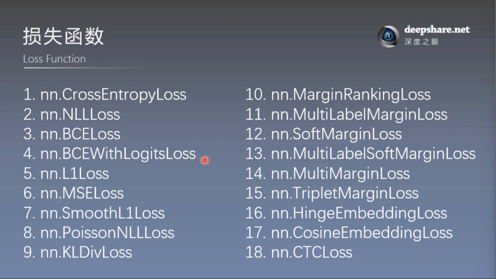

这些损失函数有些比较复杂的知道用法即可，以后再慢慢研究
## 18种损失函数
### 1-4. 前4个见损失函数（1）
### 5, 6. nn.L1Loss和nn.MSELoss
常用于回归

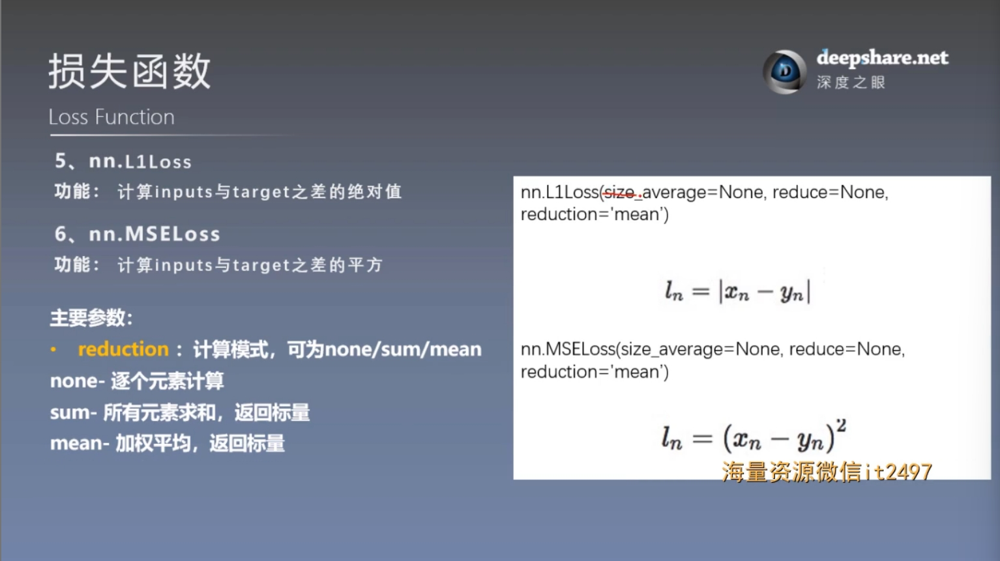

```
# --------------------------- L1 loss -----------------------------
flag = 0
# flag = 1
if flag:
    inputs = torch.ones((2, 2))
    target = torch.ones((2, 2)) * 3

    loss_f = nn.L1Loss(reduction='none')
    loss = loss_f(inputs, target)
    print(f"input:{inputs}\ntarget:{target}\nloss:{loss}")

# --------------------------- MSE loss -----------------------------
flag = 0
# flag = 1
if flag:
    inputs = torch.ones((2,2))
    target = torch.ones((2,2)) * 3

    loss_f_mse = nn.MSELoss(reduction='none')
    loss_mse = loss_f_mse(inputs, target)
    print(f"loss:{loss_mse}")
```

### 7. nn.SmoothL1Loss
常用于回归，它结合了 L1 损失 和 L2 损失 的优点。该损失函数在误差较小时使用 L2 损失（平滑的二次误差），在误差较大时则使用 L1 损失（绝对误差），从而提供了对异常值的鲁棒性，并且能够避免 L2 损失可能带来的梯度过大的问题。

特点：
- **平滑的 L2 损失** ：当误差小于 1 时，它表现为 L2 损失（平方损失），对于小误差，损失函数能够提供较平滑的梯度，这有助于更**精细**的优化。
- **鲁棒的 L1 损失**：当误差大于等于 1 时，损失变为 L1 损失，避免了大误差导致梯度过大的问题，使得优化过程对异常值更为鲁棒。

什么是**鲁棒性（Robustness）**？
指系统或模型在面对噪声、扰动、异常值、或不完全信息时，依然能够维持其性能和稳定性的能力。

在机器学习和深度学习的背景下，鲁棒性主要指的是模型对 数据噪声 和 异常值（outliers）等因素的耐受力。鲁棒的模型能够在实际应用中处理不完美或不规范的数据，而不会产生过大的误差或性能损失。

为什么 `SmoothL1Loss` 具有较好的鲁棒性：
- 在回归任务中，标准的 L2 损失函数（均方误差）会对异常值产生较大的影响，因为它对大的误差惩罚非常严格。比如，如果某个样本的预测值与真实值的差异非常大，L2 损失会惩罚这个差异的平方，可能导致模型过度关注这个异常值。
- 相比之下，L1 损失（绝对误差）对大的误差更加宽容，因为它只是惩罚误差的绝对值，不会像 L2 损失那样增加较大的梯度。
- SmoothL1Loss 则结合了 L1 和 L2 损失的优点，对于小误差使用平滑的二次损失，对于大误差使用绝对损失，这样可以同时保证对小误差的平滑处理和对异常值的鲁棒性。

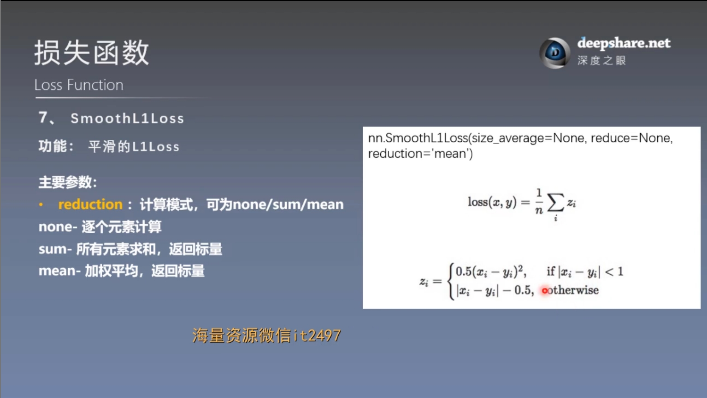

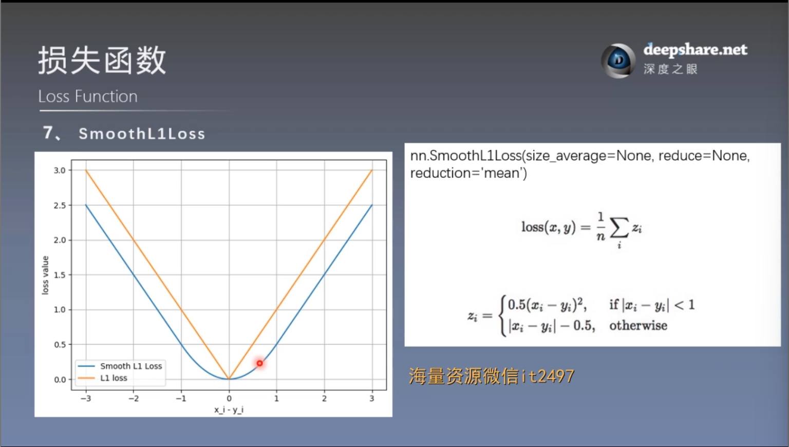

```
# --------------------------- Smooth L1 loss -----------------------------
flag = 0
# flag = 1
if flag:
    inputs = torch.linspace(-3, 3, steps=500)
    target = torch.zeros_like(inputs)

    loss_f = nn.SmoothL1Loss(reduction='none')

    loss_smooth = loss_f(inputs, target)

    loss_l1 = np.abs(inputs.numpy())

    plt.plot(inputs.numpy(), loss_smooth.numpy(), label='Smooth L1 Loss')
    plt.plot(inputs.numpy(), loss_l1, label='L1 loss')
    plt.xlabel('x_i - y_i')
    plt.ylabel('loss value')
    plt.legend()
    plt.grid()
    plt.show()
```

### 8. nn.PoissonNLLLoss
是 PyTorch 中用于处理 **泊松回归（Poisson regression）**任务的损失函数。它通常用于处理具有 **泊松分布** 的数据，特别适用于**目标变量是计数型数据的任务**，比如事件的发生次数、某段时间内的请求次数等

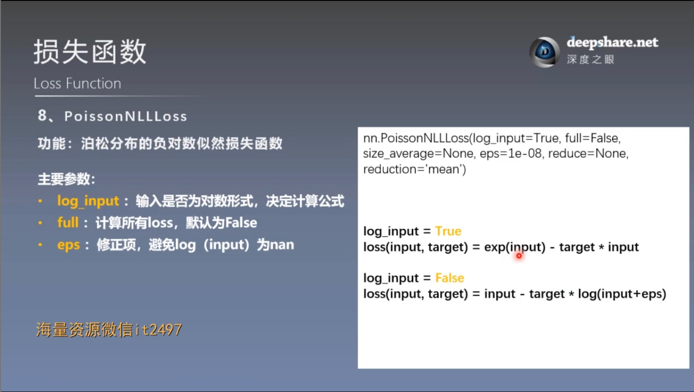

损失函数定义： `nn.PoissonNLLLoss` 的损失计算基于泊松分布的负对数似然（Negative Log-Likelihood, NLL）。给定一个目标值 $y$ 和模型的预测值 $\lambda$ , 损失计算公式如下：
```math
\mathrm{PoissonNLLLoss}(y,\lambda)=\lambda-y\log{(\lambda)}
```
这个损失的关键是预测值 $\lambda$ ，它应该是模型输出的一个正数，表示事件的期望发生次数
```
# --------------------------- Poisson NLL Loss ----------------------------
flag = 0
# flag = 1
if flag:
    inputs = torch.randn((2, 2))
    target = torch.randn((2, 2))

    loss_f = nn.PoissonNLLLoss(log_input=True, reduction='none')
    loss = loss_f(inputs, target)
    print("input:{}\ntarget:{}\nPoisson NLL loss:{}".format(inputs, target, loss))

    # compute by hand
    idx = 0
    loss_1 = torch.exp(inputs[idx, idx]) - target[idx, idx] * inputs[idx, idx]
    print("第一个元素loss:", loss_1)
```

### 9. nn.KLDivLoss
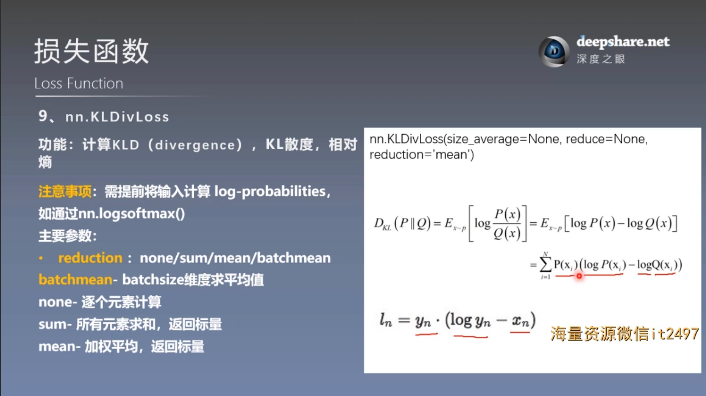

详细原理见：损失函数（1）
```
# --------------------------- KL Divergence Loss -----------------------------
flag = 0
# flag = 1
if flag:
    inputs = torch.tensor([[0.5, 0.3, 0.2], [0.2, 0.3, 0.5]])
    inputs_log = torch.log(inputs)  # TODO:为什么 需要提前将输入计算 log-probabilities，如通过nn.logsoftmax()
    target = torch.tensor([[0.9, 0.05, 0.05], [0.1, 0.7, 0.2]], dtype=torch.float)

    loss_f_none = nn.KLDivLoss(reduction='none')
    loss_f_mean = nn.KLDivLoss(reduction='mean')
    loss_f_bs_mean = nn.KLDivLoss(reduction='batchmean')

    loss_none = loss_f_none(inputs, target)
    loss_mean = loss_f_mean(inputs, target)
    loss_bs_mean = loss_f_bs_mean(inputs, target)

    print("loss_none:\n{}\nloss_mean:\n{}\nloss_bs_mean:\n{}".format(loss_none, loss_mean, loss_bs_mean))

    # compute by hand
    idx = 0
    loss_1 = target[idx, idx] * (torch.log(target[idx, idx]) - inputs[idx, idx])
    print("第一个元素loss:", loss_1)
```

### 10. nn.MarginRankingLoss
`n.MarginRankingLoss` 是 PyTorch 中的一种损失函数，通常用于处理 **排序问题** 或 **相对排序任务**

**功能** : `nn.MarginRankingLoss` 计算两个输入（通常为模型输出）之间的 **排序损失** ，它要求一个样本相对于另一个样本有 **更大的分值** 。该损失函数的目标是最小化模型输出中两个样本相对顺序的误差

**损失函数定义**
`nn.MarginRankingLoss` 的损失是基于输入的两个预测值和实际标签计算的，形式如下：
$$\mathrm{loss}(x_1,x_2,y)=\max{(0,-y\cdot (x_1-x_2)+margin)}$$
其中：
-  $x_1,x_2$ 是两个输入样本的模型输出（通常是标量值或向量，表示模型的预测分数）
-  $y$ 是标签，表示样本对的期望相对顺序，取值为 +1 或 -1：
    - 如果 $y=1$ , 表示 $x_1$ 应该比 $x_2$ 更大
    - 如果 $y=-1$ , 表示 $x_2$ 应该比 $x_1$ 更大
- margin 是一个可调的超参数，通常大于等于 0，用于设置损失的容忍度。
    
    如果 $\vert x_1-x_2 \vert$ 小于 margin, 损失为零

**形状**
- 输入1：( N, \* ) 或 ( \* ) , 其中 N 是批次大小 （即：N行\*列或者1行\*列, *表示任意）
- 输入2：( N, \* ) 或 ( \* ) , 与输入1的形状相同
- 目标： ( N, \* ) 或 ( \* ) , 与输入形状相同
- 输出：标量。如果 `reduction` 为 'none' 并且输入大小不为 ( \* ) , 那么为 ( N, * )
- 注意，当形状不匹配时，会进行广播机制至形状匹配

**使用场景**

`nn.MarginRankingLoss` 适用于 **排名** 或 **排序学习** 任务，典型应用场景包括：
- **排序学习** ：比如在搜索引擎中，对查询结果进行排序，使得相关性高的结果排在前面
- **排序模型训练**：例如在推荐系统中，给定一对物品（如电影、商品等），模型需要学习预测它们的相对偏好
- **二分类任务**：特别是在一些具有“顺序关系”的任务中，如文本相似度比较、样本匹配等

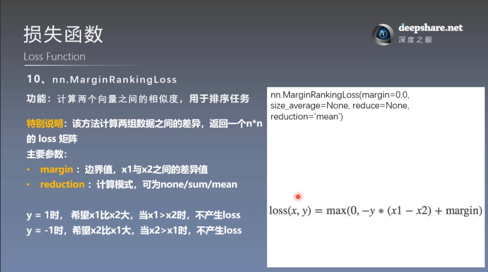
```
# --------------------------- Margin Ranking Loss -----------------------------
flag = 0
# flag = 1
if flag:
    x1 = torch.tensor([[1], [2], [3]], dtype=torch.float)
    x2 = torch.tensor([[2], [2], [2]], dtype=torch.float)

    target = torch.tensor([1, 1, -1], dtype=torch.float)

    loss_f_none = nn.MarginRankingLoss(margin=0, reduction='none')

    loss = loss_f_none(x1, x2, target)

    print(loss)
```

### 11. nn.MultiLabelMarginLoss
功能：主要用于多标签分类任务（multi-label classification），即一个样本有多个标签

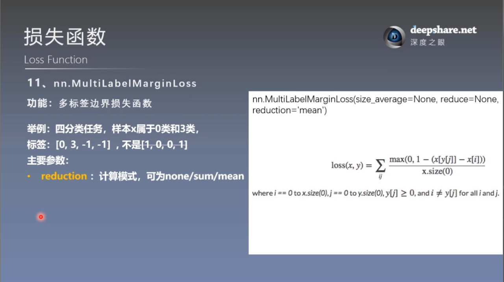

损失函数重述：
```math
\mathrm{loss}(x,y)=\sum\limits_j\sum\limits_i{\dfrac{\max{(0,1-(x[y[j]])-x[i])}}{x.size(0)}}
```
可以将计算过程成两个循环嵌套，外层循环 $j$ ,遍历 $y$ 中非负值，即样本所属的类别，内层循环 $i$ , 遍历 $x$ 中不是 $y[j]$ 类别的logits，即不是样本所属类别的logits.

这允许不同的样本具有可变数量的目标类别。
```
# --------------------------- Multi Label Margin Loss -----------------------------
flag = 0
# flag = 1
if flag:
    x = torch.tensor([[0.1, 0.2, 0.4, 0.8]])
    y = torch.tensor([[0, 3, -1, -1]], dtype=torch.long)

    loss_f = nn.MultiLabelMarginLoss(reduction='none')
    loss = loss_f(x, y)
    print(loss)

    # compute by hand
    x = x[0]
    item_1 = (1-(x[0] - x[1])) + (1 - (x[0] - x[2]))    # [0]
    item_2 = (1-(x[3] - x[1])) + (1 - (x[3] - x[2]))    # [3]
    loss_h = (item_1 + item_2) / x.shape[0]
    print(loss_h)
```

### 12. nn.SoftMarginLoss
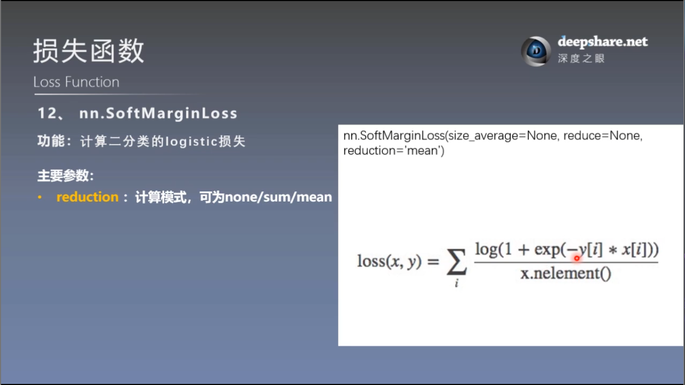

样本标签采用：-1，1，正负类

nn.SoftMarginLoss与BCEWithLogisticLoss二维交叉熵损失函数数学上是等价的，区别在于：

- SoftMarginLoss 直接基于 logits 来计算损失，而不需要显式应用 sigmoid 激活。
- BCEWithLogitsLoss 会将模型输出（logits）通过 sigmoid 转换为概率，再计算交叉熵损失。

可以自行推导一下为什么数学等价,从BCE推导出SoftMargin
```
# --------------------------- SoftMargin Loss -----------------------------
flag = 0
# flag = 1
if flag:
    inputs = torch.tensor([[0.3, 0.7], [0.5, 0.5]])
    target = torch.tensor([[-1,1],[1,-1]], dtype=torch.float)

    loss_f = nn.SoftMarginLoss(reduction='none')
    loss = loss_f(inputs, target)
    print("SoftMargin: ", loss)

    # compute by hand
    idx = 0

    inputs_i = inputs[idx, idx]
    target_i = target[idx, idx]
    loss_h = np.log(1 + np.exp(-target_i * inputs_i))
    print(loss_h)
```

### 13. nn.MultiLabelSoftMarginLoss
SoftMarginLoss多标签版本

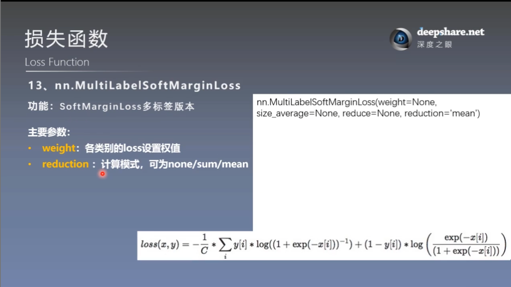

样本标签采用独热编码

**输入格式**
- 模型输出： $x$ 是一个 $N\times C$ 的张量，表示模型的输出(logits), 其中 $N$ 是批量大小， $C$ 是标签数量。每个元素 $x_{ij}$ 表示模型对样本 $i$ 在标签 $j$ 上的预测分数(logits),未经过 Sigmoid 激活
- 目标标签： $y$ 是一个 $N\times C$ 的张量，表示目标标签，每个 $y_{ij}$ 取值为0或1，表示该样本是否属于标签 $y$
```
# --------------------- MultiLabel SoftMargin Loss -------------------------
flag = 0
# flag = 1
if flag:
    inputs = torch.tensor([[0.3, 0.7, 0.8]])
    target = torch.tensor([[0, 1, 1]], dtype=torch.float)

    loss_f = nn.MultiLabelSoftMarginLoss(reduction='none')
    loss = loss_f(inputs, target)
    print("MultiLabel SoftMargin: ", loss)

    # compute by hand
    i_0 = torch.log(torch.exp(-inputs[0, 0]) / (1 + torch.exp(-inputs[0, 0])))
    i_1 = torch.log(1 / (1 + torch.exp(-inputs[0, 1])))
    i_2 = torch.log(1 / (1 + torch.exp(-inputs[0, 2])))
    loss_h = (i_0 + i_1 + i_2) / -3
    print(loss_h)
```

### 14. nn.MultiMarginLoss
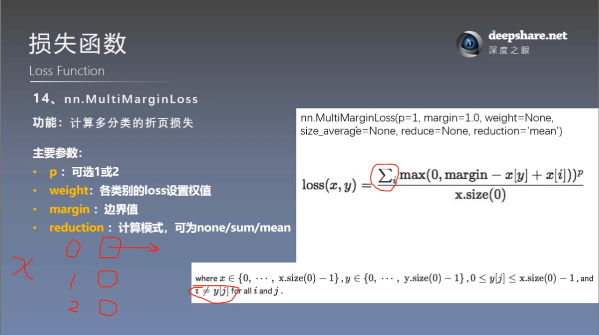

功能：计算多分类的折页损失

**折页损失**：是一种常用于支持向量机（SVM）的损失函数，通常用于二分类任务，但它也可以扩展到多分类任务。它的目标是增强正确类别的得分，并且减少其他类别的得分，从而使正确类别与其他类别之间有一个较大的边际。

- 损失的计算是通过比较每个非正确类别的得分与正确类别的得分之差，并确保这个差异大于一定的边际（通常是 1）。

**输入格式**
- 输入： $(N,C)$ 或 $(C)$ , 其中 $N$ 是批次大小， $C$ 是类别数
- 目标： $(N)$ 或 $()$ , 其中每个值是 $0\leq targets[i]\leq C-1$ .
- 输出：标量。 `none` 除外
```
# --------------------------- Multi Margin Loss -----------------------------
flag = 0
# flag = 1
if flag:
    x = torch.tensor([[0.1, 0.2, 0.7], [0.2, 0.5, 0.3]])
    y = torch.tensor([1, 2], dtype=torch.long)

    loss_f = nn.MultiMarginLoss(reduction='none')
    loss = loss_f(x, y)
    print("Multi Margin Loss: ", loss)

    # compute by hand
    x = x[0]
    margin = 1
    i_0 = margin - (x[1] - x[0])
    # i_1 = margin - (x[1] - x[1])
    i_2 = margin - (x[1] - x[2])
    loss_h = (i_0 + i_2) / x.shape[0]
    print(loss_h)
```

### 15. nn.TripletMarginLoss
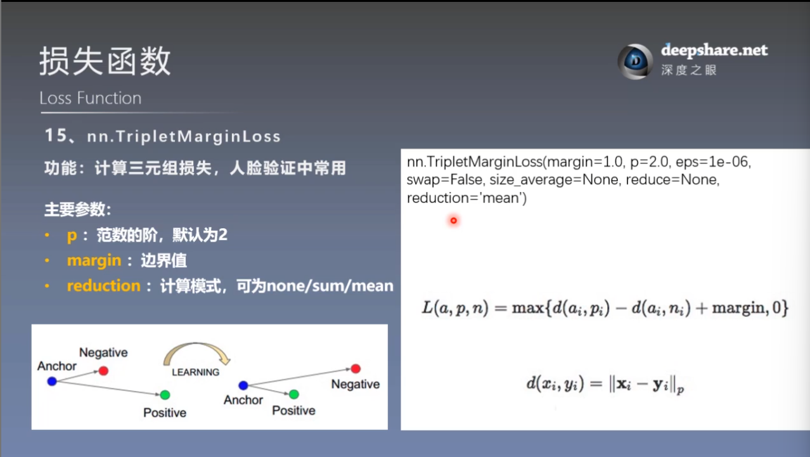

损失函数的意义：使正例相比于负例更接近 $a_i$ ，且不能只是更接近一点点，正例与负例的距离要大于margin
```
# --------------------------- Triplet Margin Loss -----------------------------
flag = 0
# flag = 1
if flag:
    anchor = torch.tensor([[1.]])
    pos = torch.tensor([[2.]])
    neg = torch.tensor([[0.5]])

    loss_f = nn.TripletMarginLoss(margin=1.0, p=1)
    loss = loss_f(anchor, pos, neg)
    print("Triplet Margin Loss", loss)

    # compute by hand
    margin = 1
    a, p, n = anchor[0], pos[0], neg[0]
    d_ap = torch.abs(a-p)
    d_an = torch.abs(a-n)
    loss = d_ap - d_an + margin
    print(loss)
```

### 16. nn.HingeEmbeddingLoss
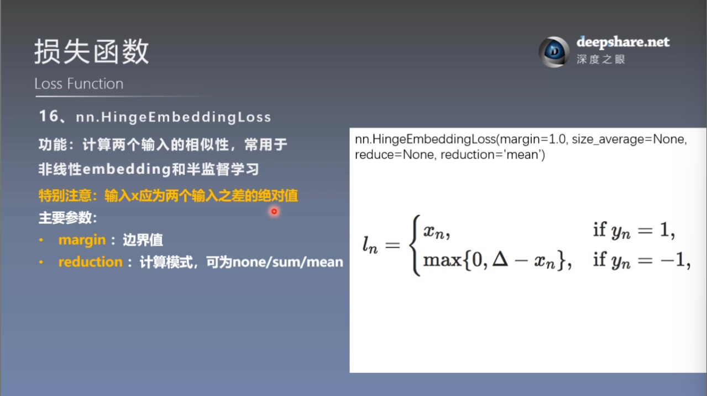

 $\Delta$ 为 margin

给定输入张量 $x$ 和标签张量 $y$（包含 1 或 -1）测量损失。这通常用于测量两个输入是否相似或不相似，例如使用 L1 对间距作为 ，并且 **通常用于学习非线性嵌入或半监督学习** 。
```
# --------------------------- Hinge Embedding Loss -----------------------------
flag = 0
# flag = 1
if flag:
    inputs = torch.tensor([[1., 0.8, 0.5]])
    target = torch.tensor([[1, 1, -1]])

    loss_f = nn.HingeEmbeddingLoss(margin=1, reduction='none')
    loss = loss_f(inputs, target)
    print("Hinge Embedding Loss", loss)

    # compute by hand
    margin = 1.
    loss = max(0, margin - inputs.numpy()[0, 2])
    print(loss)
```

### 17. nn.CosineEmbeddingLoss
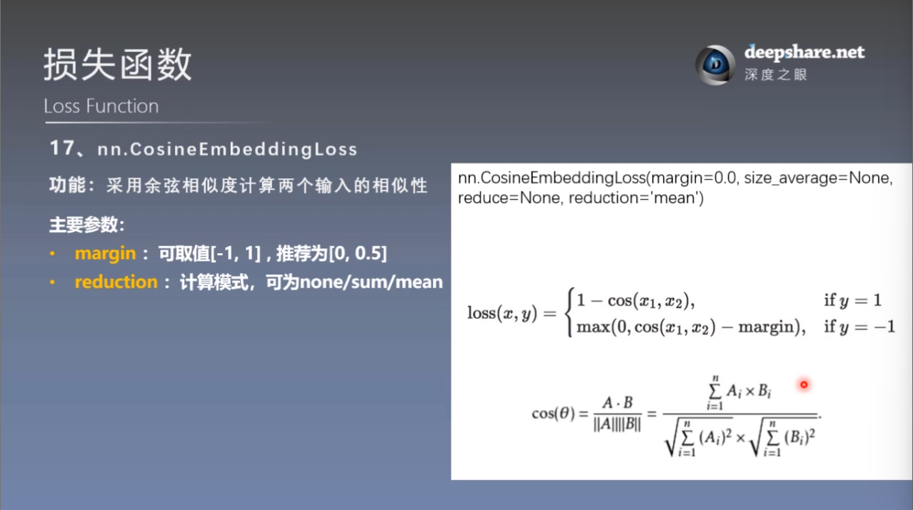

使用场景与上一个函数相同

为什么用cos : 主要关注的是 $x_1$ 和 $x_2$ 在方向上的差异，而不是去关注这两个数据距离或者长度上的差距
```
# --------------------------- Cosine Embedding Loss -----------------------------
flag = 0
# flag = 1
if flag:
    x1 = torch.tensor([[0.3, 0.5, 0.7], [0.3, 0.5, 0.7]])
    x2 = torch.tensor([[0.1, 0.3, 0.5], [0.1, 0.3, 0.5]])

    target = torch.tensor([[1, -1]], dtype=torch.float)
    loss_f = nn.CosineEmbeddingLoss(margin=0., reduction='none')
    loss = loss_f(x1, x2, target)
    print("Cosine Embedding Loss", loss)

    # compute by hand
    margin = 0.
    def cosine(a, b):
        numerator = torch.dot(a, b)
        denominator = torch.norm(a, 2) * torch.norm(b, 2)
        return float(numerator/denominator)
    l_1 = 1 - (cosine(x1[0], x2[0]))
    l_2 = max(0, cosine(x1[0], x2[0]))
    print(l_1, l_2)
```

### 18. nn.CTCLoss
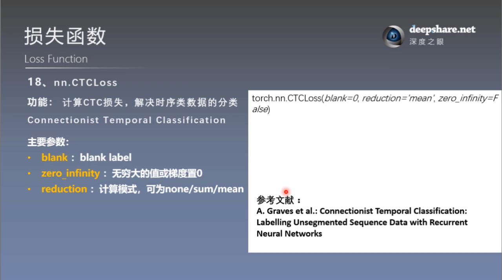

实现原理很复杂，现在只要知道用在哪里即可
```
# -------------------------------- CTC Loss ---------------------------------
flag = 0
# flag = 1
if flag:
    T = 50      # Input sequence length
    C = 20      # Number of classes (including blank)
    N = 16      # Batch size
    S = 30      # Target sequence length of longest target in batch
    S_min = 10  # Minimum target length, for demonstration purposes

    # Initialize random batch of input vectors, for *size = (T,N,C)
    inputs = torch.randn(T, N, C).log_softmax(2).detach().requires_grad_()

    # Initialize random batch of targets (0 = blank, 1:C = classes)
    target = torch.randint(low=1, high=C, size=(N, S), dtype=torch.long)

    input_lengths = torch.full(size=(N,), fill_value=T, dtype=torch.long)
    target_lengths = torch.randint(low=S_min, high=S, size=(N,), dtype=torch.long)

    ctc_loss = nn.CTCLoss()
    loss = ctc_loss(inputs, target, input_lengths, target_lengths)
    print("CTC loss: ", loss)
```