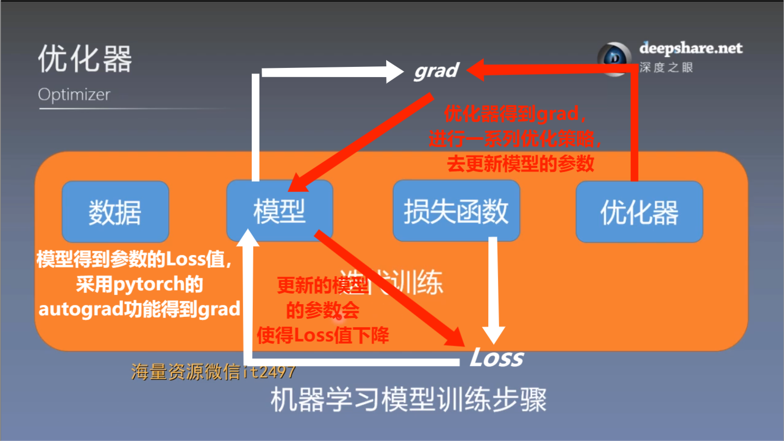
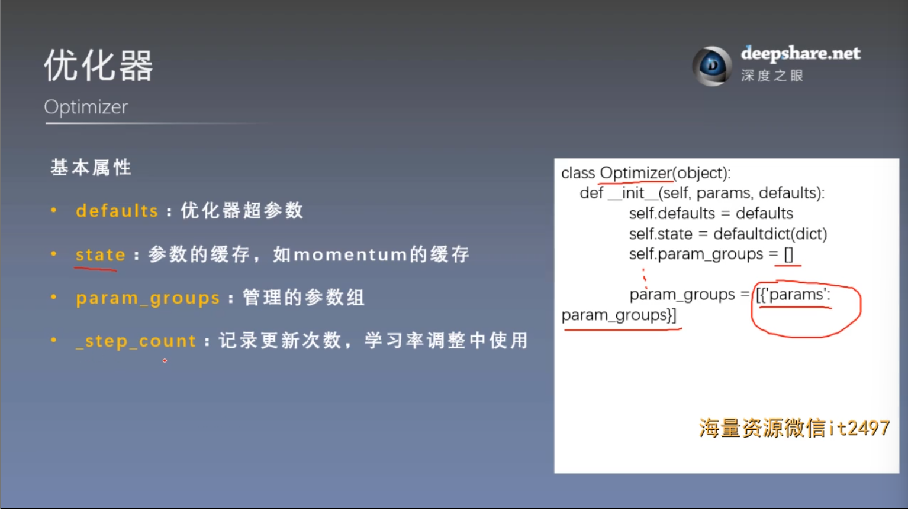
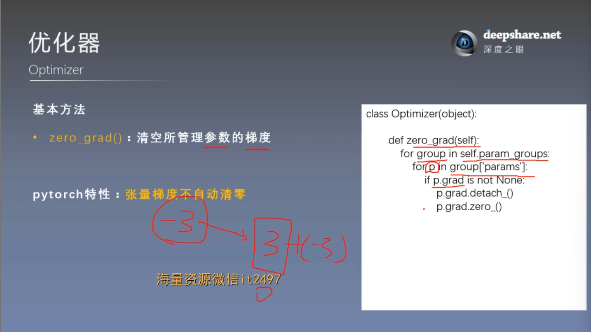
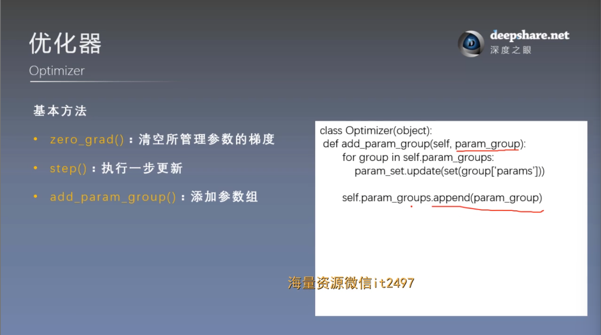
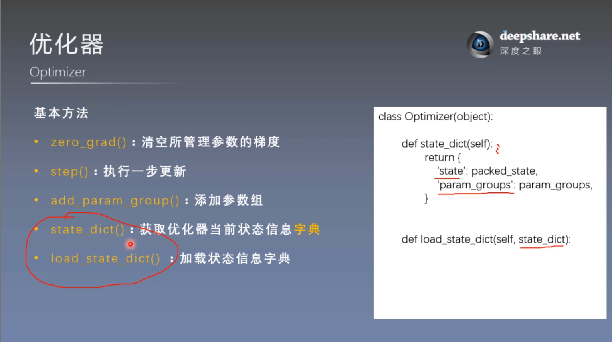

# 优化器 Optimizer
## 一. 什么是优化器
**基本流程**



### 1. 概念
pytorch的优化器： **管理** 并 **更新** 模型中可学习参数的值，使得模型输出更接近真实标签

### 2. 常用优化策略——梯度下降
梯度下降法看待问题的方式：虽然不能一次性看到整个函数，但可以通过任意一个点开始去评估函数，并通过反向传播过程，计算该点处函数的负梯度，然后朝该方向迈出一小步 **（是怎样的一小步？——学习率）**

梯度下降以迭代的方式计算新点的负梯度，并朝该方向迈出一小步，以此类推

梯度指向函数增长最快的方向，所以沿着相反的方向迈出一小步，就可以在每次迭代后使得函数下降。
```math
\begin{align*}
\theta^1&=\theta^0-\eta \nabla f(\theta^0)\\
\theta^{k+1}&=\theta^k-\eta \nabla f(\theta^k)&
\end{align*}
```

## 二. optimizer的属性
1. 基本属性



最重要的属性： **param_groups** : 是一个列表，列表每个元素是一个字典

## 三. optimizer的方法
### 1. 基本方法


张量梯度不自动清零，对于一个参数的梯度，更新是直接将新值加在旧值上的





state_dict() 和 load_state_dict() 用于模型断点的续训练

防止因为模型终止，而从头开始重新训练

因此在模型训练中，每个一定的间隔，比如10个epoch或者50个epoch就保存一下