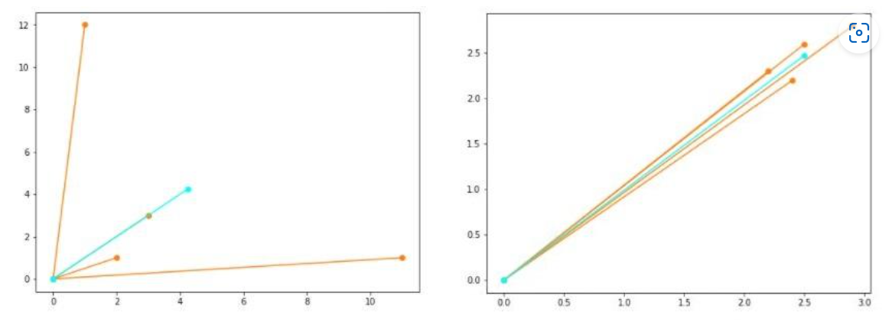
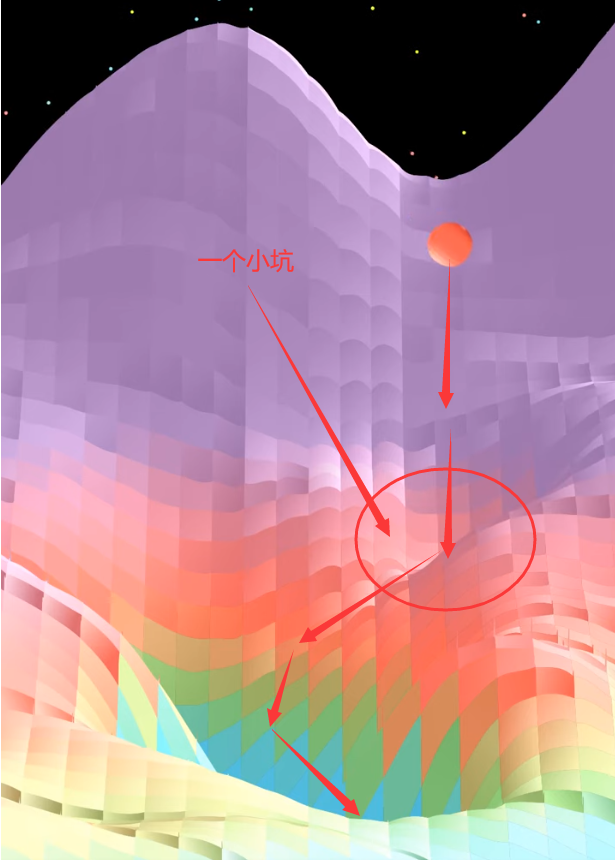
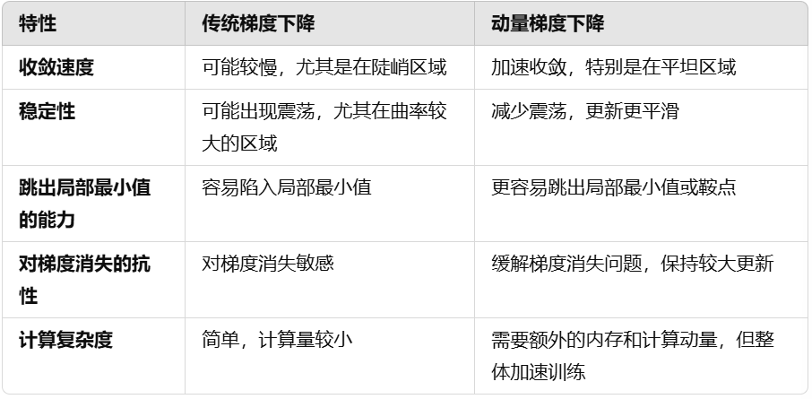
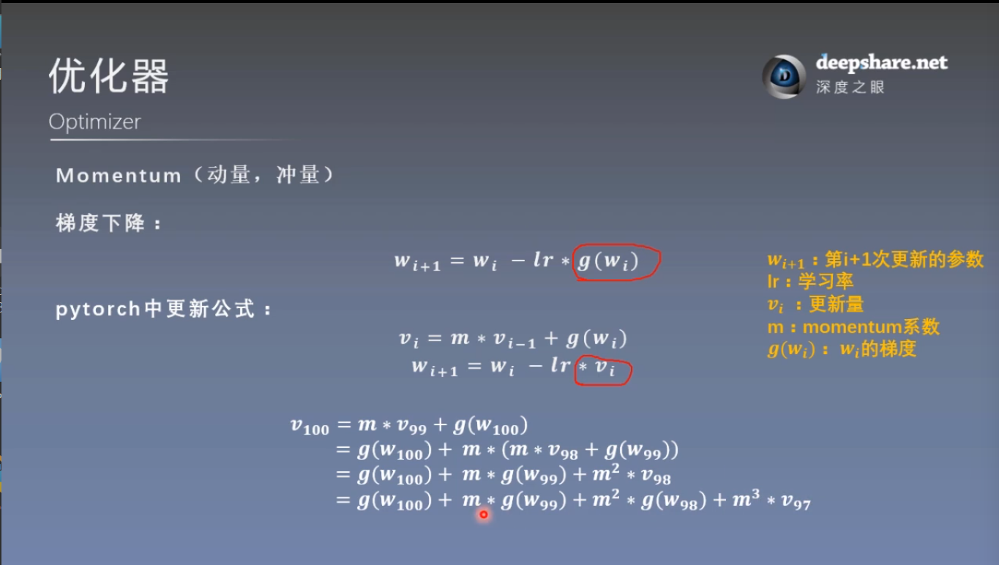
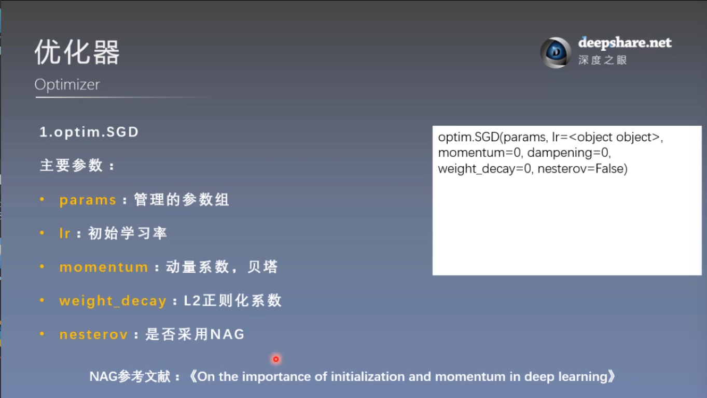
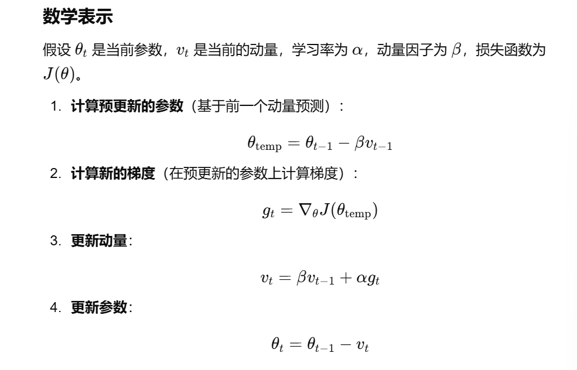
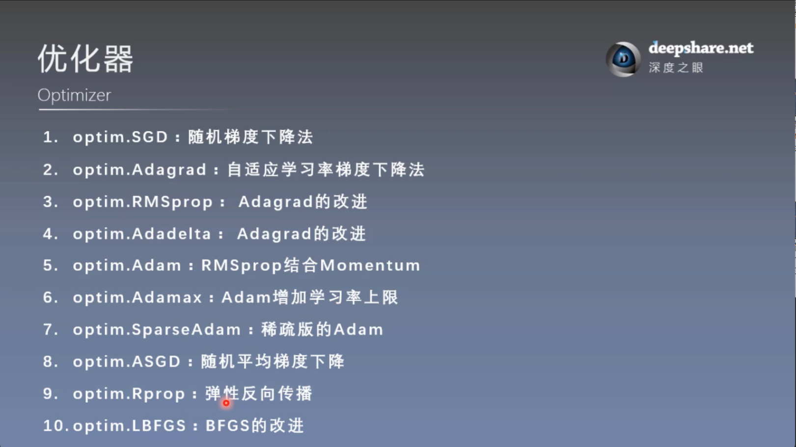

# 优化器（2）
## 1. learning rate 学习率
梯度下降法看待问题的方式：虽然不能一次性看到整个函数，但可以通过任意一个点开始去评估函数，并通过反向传播过程，计算该点处函数的负梯度，然后朝该方向迈出一小步 **（是怎样的一小步？——学习率）**

梯度下降以迭代的方式计算新点的负梯度，并朝该方向迈出一小步，以此类推

梯度指向函数增长最快的方向，所以沿着相反的方向迈出一小步，就可以在每次迭代后使得函数下降。
```math
\begin{align*}
\theta^1&=\theta^0-\eta \nabla f(\theta^0)\\
\theta^{k+1}&=\theta^k-\eta \nabla f(\theta^k)&
\end{align*}
```

**学习率选取不好的影响**
1. 学习率太大

    - 如果学习率 $\eta$ 设置得太大，每次参数更新的步长也会很大，这可能导致在优化过程中越过最小值，甚至发散。
    - 过大的学习率会使得损失函数的值不稳定，导致训练过程无法收敛，模型的参数可能在误差较大的位置徘徊。
    - 例如，梯度下降可能会在损失函数的最小值附近震荡，而无法找到最佳的解。

2. 学习率太小

    - 如果学习率 $\eta$ 太小，参数更新的步长就非常小，可能导致收敛速度过慢，需要更多的迭代才能找到合适的解。
    - 尽管较小的学习率通常不会导致发散，但训练时间会显著增加，可能在实际应用中变得不可接受。
    - 如果步长太小，甚至可能陷入局部最优解，而无法逃脱。


## 2. momentum 动量
首先从基本梯度下降公式出发，一般的，如下：
```math
\begin{align*}
\theta_{k+1}&=\theta_k+v_k\\
v_k&=-\eta \nabla f(\theta_k)
\end{align*}
```
动量梯度下降原理：结合当前梯度与上一次更新信息，用于当前更新
### （1）从指数加权移动平均来理解
指数加权移动平均算法（Exponentially Weighted Moving-Average, EWMA），是通过历史值和当前时间的观测值来估计一个时间序列的方法。给定一个超参数 $\gamma$ 属于区间 $[0, 1]$，算法表示如下：

对于时间序列， $\mathbf{x}=[x_0,x_1,\dots,x_t]$

有，估计序列， $\mathbf{\hat{x}}=[\hat{x_0},\hat{x_1},\dots,\hat{x_t}]$

其中： $\hat{x_t}=\gamma \hat{x_{t-1}}+(1-\gamma) x_t$

也就是说，时刻 t 的估计值由t-1时刻的估计值和时刻t的观测值加权平均得到。我们来更直观地看一下EWMA算法的作用，将时刻 t 估计值的转移方程展开：
```math
\begin{align*}
\hat{x_t}&=(1-\gamma) x_t + \gamma \hat{x_{t-1}}\\
&=(1-\gamma) x_t+(1-\gamma) \gamma x_{t-1}+\gamma^2 \hat{x_{t-2}}\\
&\dots\\
&\approx (1-\gamma) x_t+(1-\gamma)\gamma x_{t-1} + (1-\gamma)\gamma^2 x_{t-2}+\dots+(1-\gamma)\gamma^n x_{t-n} + o[(1-\gamma)\gamma^n x_{t-n}]&
\end{align*}
```
上式中，最后一个等式右边最后一项表示比倒数第二项更高阶的项。此处，我们令 $n=\frac{1}{1-\gamma}$ ，并且假设 $\gamma$ 趋近于1，分析上述展开式倒数第二项的系数：

当 $n \rightarrow \infty$ ,即，当 $\gamma \rightarrow 1$ 时， $(1-\gamma)\gamma^n \approx 0$ 

求该极限，我们可以得出该系数在上述条件下趋近于0，所以我们忽略倒数第二项和后面的高阶项，有：

```math
\begin{align*}
\hat{x_t}&=(1-\gamma) x_t + \gamma \hat{x_{t-1}}\\
&\approx (1-\gamma) x_t+(1-\gamma)\gamma x_{t-1} + (1-\gamma)\gamma^2 x_{t-2}+\dots+(1-\gamma)\gamma^{n-1} x_{t-n+1}&
\end{align*}
```
所以，在实际使用时，我们可以将EWMA的在时刻t的估计值看成 **是对最近 $n=\frac{1}{1-\gamma}$ 个时间步的观测值的加权平均，并且时间距当前时刻越近的权重越高，时间越远的权重越低； $γ=0$ 时只使用当前时刻的观测值更新估计序列， $γ$  越接近 1 其使用的过去时刻越多。** 比如，当我们设置 $γ=0.9$ 时，可以看成使用最近 $n=\frac{1}{1-0.9}= 10$ 步观测值的加权平均；当我们设置 $γ=0.96$ 时，可以看成使用最近25步观测值的加权平均。

接下来，给出动量法的迭代公式。以广义的SGD算法为基础，动量法引入一个超参 $\gamma$ ，用于调节梯度下降的过程：
```math
\begin{align*}
v_{t-1} &\leftarrow \gamma v_{t-2} + \eta_{t-1} \nabla f_{t-1} ;where,\gamma \in [0,1]\\
\vec{x_t} &\leftarrow \vec{x_{t-1}}-v_{t-1}
\end{align*}
```
上式中 $\gamma$ 就是引入的动量超参，当 $\gamma = 0$ 时，等价于SGD算法。假设 $\gamma \neq 1$ , 我们对上式的一个式子进行变形，使其编程EWMA算法的表观形式：
```math
v_{t-1} \leftarrow \gamma v_{t-2} + (1-\gamma)\frac{\eta_{t-1} \nabla f_{t-1}}{1-\gamma}
```
按照上面对EWMA的解释，可以看出，这个速度变量 $v_{t-1}$ 实际上可以认为是对时间序列 $\frac{\eta_{t-1} \nabla f_{t-1}}{1-\gamma}$ 的最近 $n=\frac{1}{1-\gamma}$ 项的指数加权移动平均，时间越近的权重越高。同样，当 $γ=0.95$ 时，我们可以认为这个加权平均使用的该时间序列最近20项的梯度、学习率的观测值。这样做的一个直观表现就是，如果目标函数最近 n 个时间步的梯度方向比较一致，那么 t-1 时刻的梯度加上t-2时刻的速度会让 t-1 时刻的速度变量较大，则模型参数的改变量就大；若这几个时间步内梯度方向变化较大，会造成其加权平均值较小，则模型参数的改变量就相对小。

关于梯度的几何意义，它具有幅值和方向。就像向量一下，我们举两个例子。虽然几个向量的幅值比较大，但如果他们的方向相差比较大，其平均值（例子用的是算术平均，但加权平均也同理）会相对衰减； 而当梯度方向相近时，其幅度不太会衰减。



### （2）从物理意义去理解
动量梯度下降的过程可以看成一个质量为m的粒子在势函数所形成的有阻力势场中的运动

假设是势函数为 $f(x)$ ,粒子所受场力为 $F=-\nabla f(x_t)$,则场力产生的加速度为 $a_{F}=-\frac{1}{m}\nabla f(x_t)$

设受到的阻力 $f_{r}=kv$ ，则阻力产生的加速度为 $a_r=\frac{k}{m} v$

则 $a=a_F-a_r$ , 即 $\frac{\mathrm{d}v}{\mathrm{d}t}=a_F-a_r$

在 $\Delta T=1$ 的小时间段积分

有加速度速度关系： 
```math
\begin{align*}
v_t-v_{t-1} &= a_F-a_r\\
v_t&=v_{t-1}+a_F-a_r=v_{t-1}-\frac{1}{m}\nabla f(x_t)-\frac{k}{m} v_{t-1}\\
\end{align*}
```
同时，有位移关系：
```math
x_{t+1}=x_t+v_t
```
将上述式子参数化，有：
```math
\begin{align*}
x_{t+1}&=x_t+v_t\\
v_t&=\alpha v_{t-1}-\eta\nabla f(x_t)&
\end{align*}
```
从物理意义上去理解，需要优化的参数是 $x$ ，通过 $v$ 来更新它的值，而 $v$ 与之前的v有关，即式 $v_t=\alpha v_{t-1}-\eta\nabla f(x_t)$ 中， $\alpha$ 为动量系数，描述的是例子的惯性，即粒子保持原有动量的性质

优势：例如如图情况



当小球沿梯度负方向下降时遇到一个小坑，一般的梯度下降方法可能会使小球陷在坑里不动，即落入局部最优解，然而动量梯度下降法可以使小球保持一定的向下的动量，使它可以冲出小球，进而达到全局最优。

总结：


### （3）pytorch中的表示形式


## 3. torch.optim.SGD


NAG是一种对传统动量梯度下降算法的改进，基本思想是：先使用当前的动量预测一个更新后的“预期参数”，再计算该位置的梯度，并根据梯度调整参数。通过这种方式，NAG能够“提前知道”参数更新后的状态，从而减少震荡和提高收敛速度。


## 4. Pytorch的十种优化器
