# 学习率调整策略
## 一. 为什么要调整学习率
梯度下降： $w_{i+1}=w_i-LR\cdot g(w_i)$

学习率（Learning rate）控制更新的步伐

就像打高尔夫一样，先使劲打远，接近洞时，再慢慢打

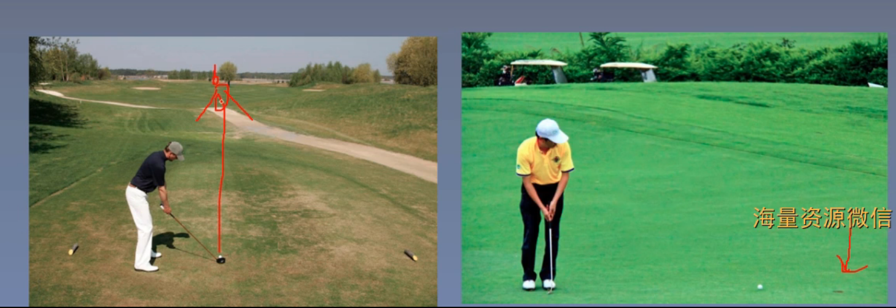
## 二. pytorch的六种学习率调整策略
### 1. 学习率调整基类
pytorch提供的六种学习调整策略方法都继承于这个基类

**主要属性**

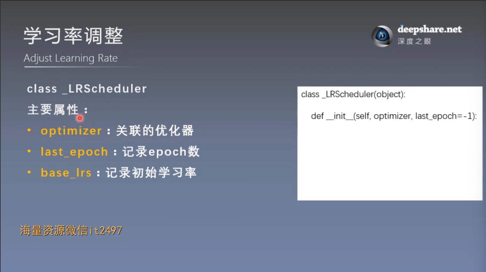

base_lrs属性的存储形式是一个列表

在基类初始化方式：
```
self.base_lrs = [group['initial_lr'] for group in optimizer.param_groups]
```

**主要方法**

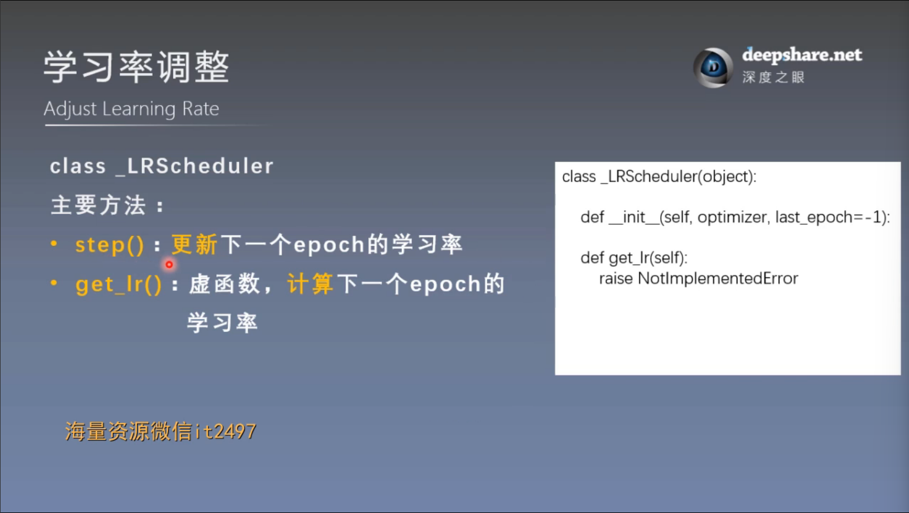

step()方法是给用户提供的一个接口，用户在使用过程中，调用step()方法，进行更新，
而在更新过程中会涉及很多其他方法，其中比较重要的是 get_lr()方法，它是一个“虚函数”，在基类的定义中并没有任何操作，
用来给子类overwrite

**注意！！！**：step()方法要放在epoch的循环中，不能放在iteration的循环中

### 2. 六种学习率调整策略方式
#### （1）StepLR
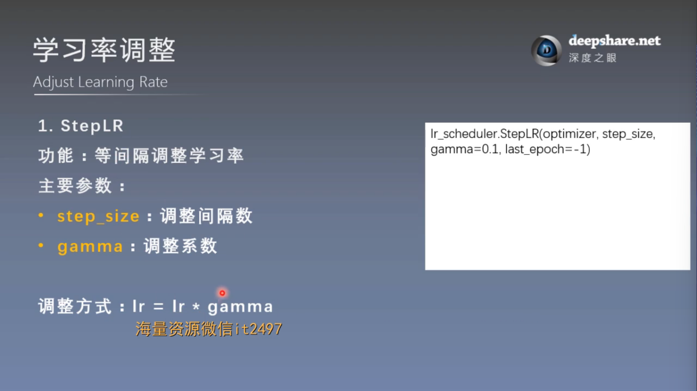

用法举例：
```
scheduler = torch.optim.lr_scheduler.StepLR(optimizer, step_size=10, gamma=0.1)     # 设置学习率下降策略
....
scheduler.step()  # 更新学习率
```

其他策略的使用类似，先实例化再使用，甚至很多其他的模块也类似

#### （2）MultiStepLP

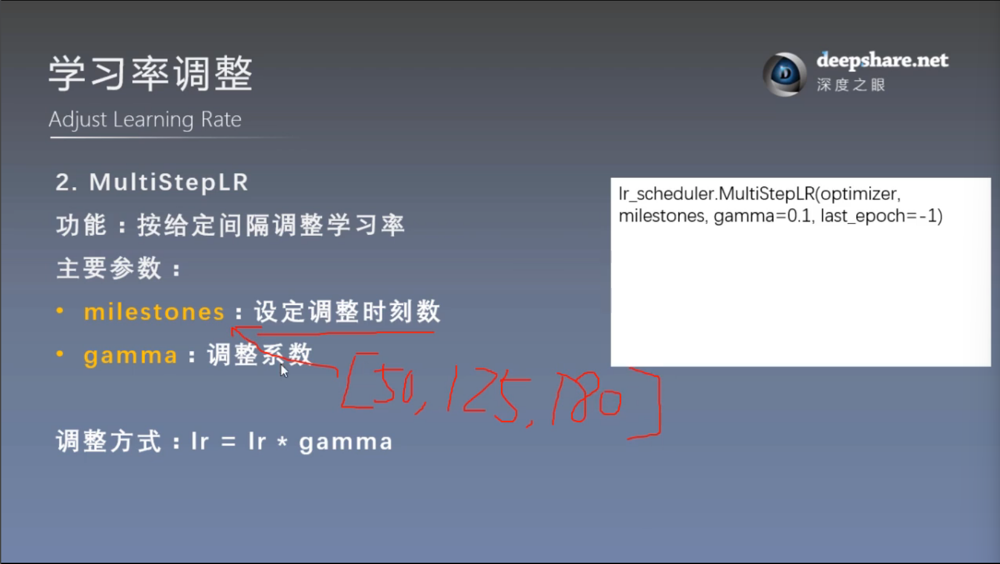

#### （3）ExponentialLR

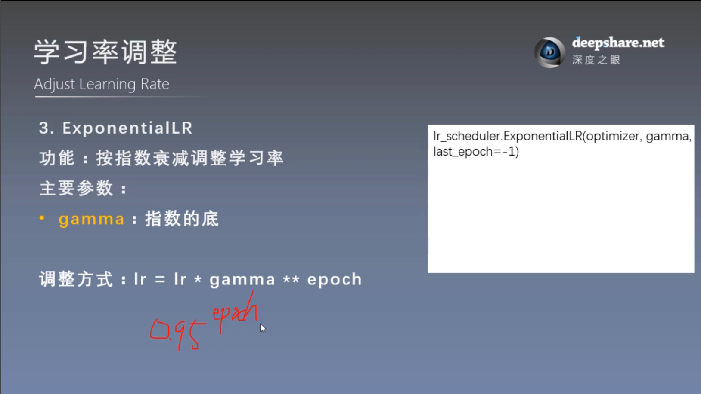

#### （4）CosineAnnealingLR

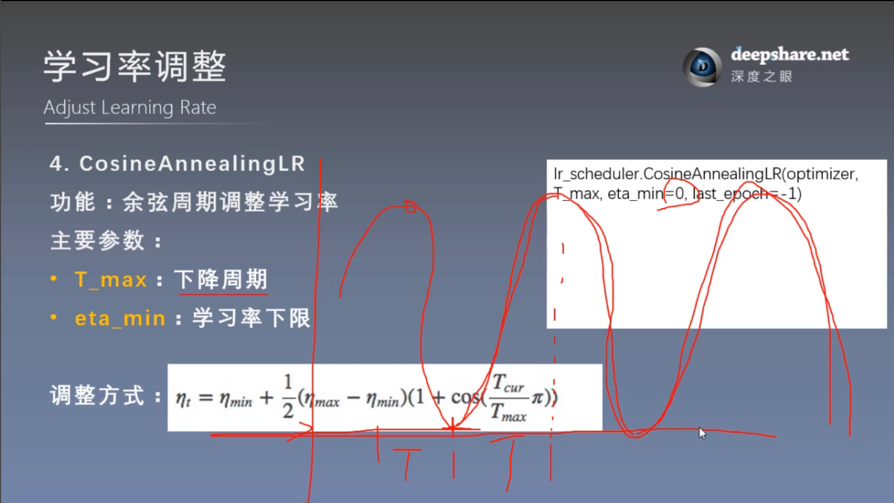

#### （5）ReduceLRonPlateau

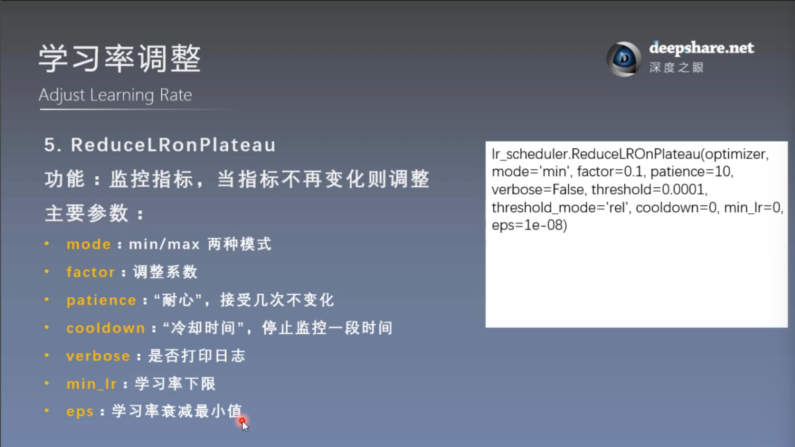

#### （6）LambdaLR

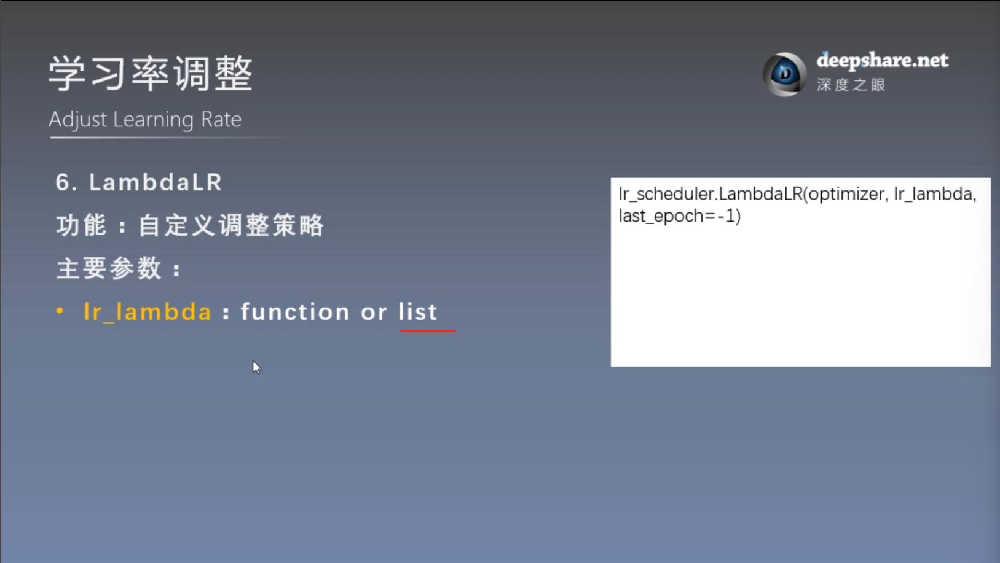

函数的get_lr方法：
```
return [base_lr * lmbda(self.last_epoch) for lmbda, base_lr in zip(self.lr_lambdas, self.base_lrs)]
```

故注意：lmbda只会接受last_epoch

## 三. 学习率调整小结

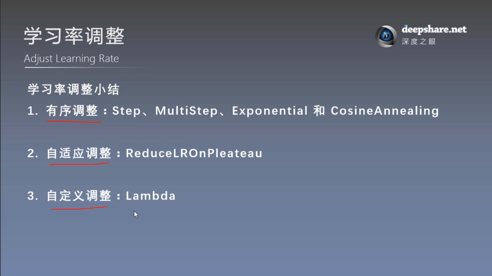

**学习率初始化**

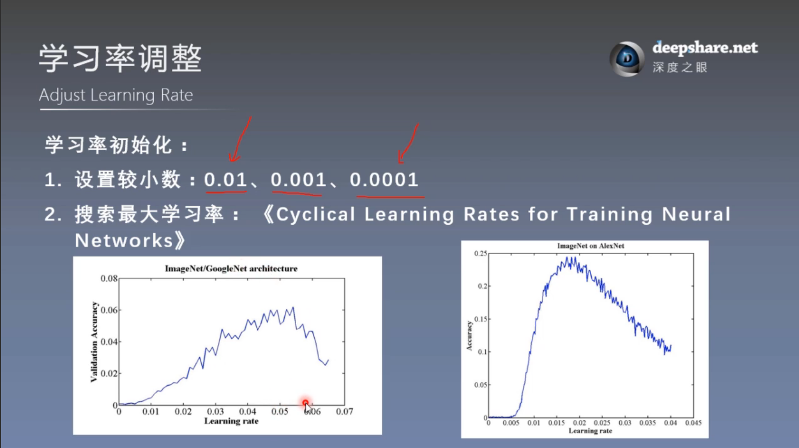


