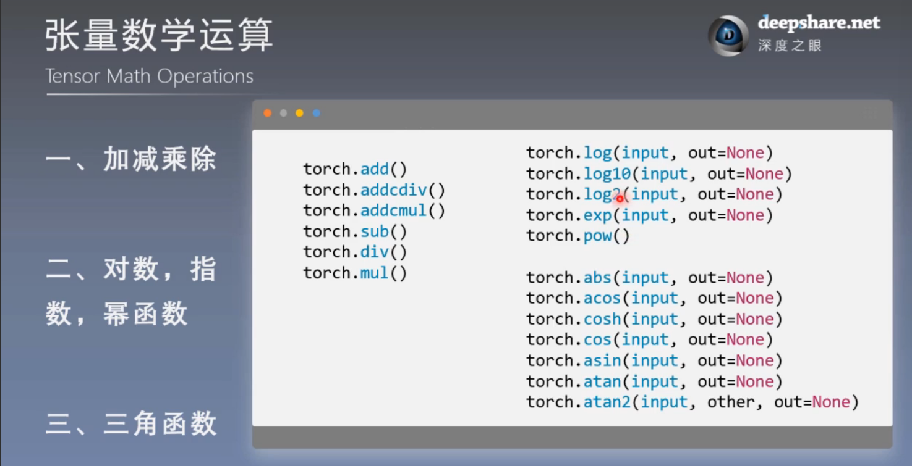
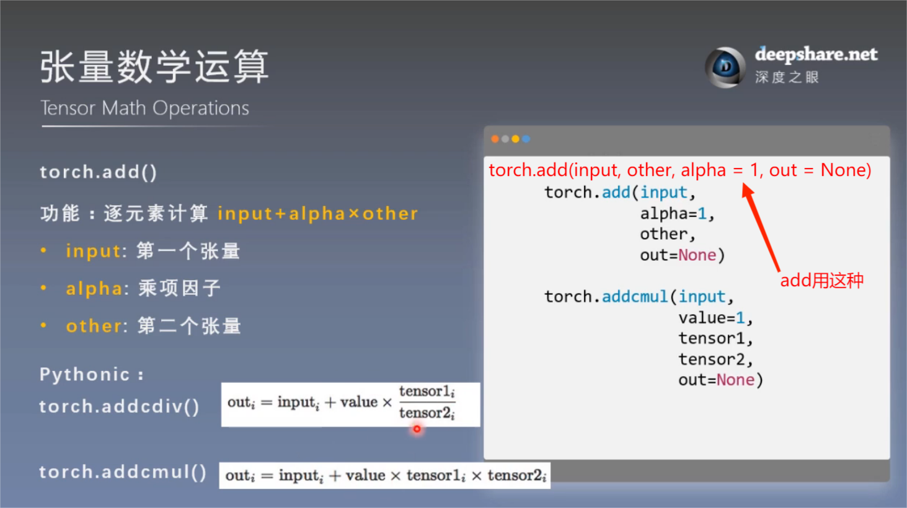
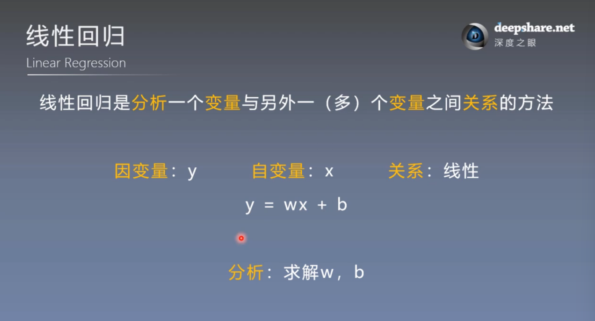
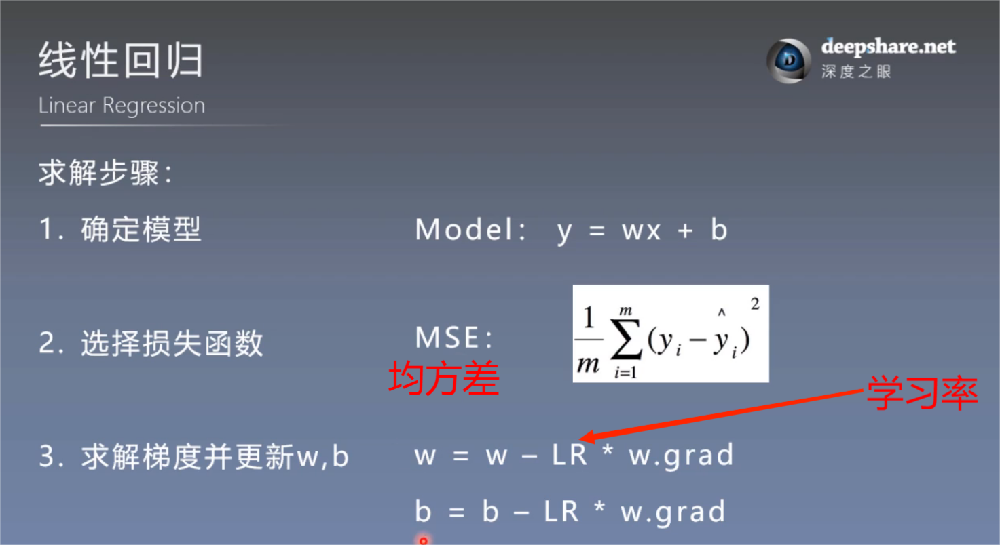

# 张量操作与线性回归
## 一. 张量的操作：拼接，切分，索引和变换
### 1. 张量的拼接与切分
1.1. torch.cat()

功能：将张量按维度dim进行拼接

注意：不会拓展维度，在指定维度上进行拼接（shape——其他维度不变，指定维度相加）

1.2. torch.stack()

功能：在**新创建的维度**dim上进行拼接

注意：如果新创建的维度是已有的维度

例: (2, 2) 的 tensor

    t_stack1 = torch.stack([t, t, t], dim = 0)

则拼接后变成(3, 2, 2)的tensor

将指定dim以及后面的dim往后移一位，空出指定dim来拼接

1.3. torch.chunk()

功能：将张量按维度dim进行平均切分

返回值：张量列表

**注意**：若不能整除，最后一份张量小于其他张量

1.4. torch.split()

功能：将张量按维度dim进行平均切分

返回值：张量列表
### 2. 张量的索引

2.1. torch.index_select()

功能：在维度dim上，按index索引数据返回值：依index索引数据拼接的张量

2.2. torch.masked_select()

功能：按mask中的True进行索引

返回值：一维张量
### 3. 张量变换

3.1. torch.reshape()

功能：变换张量形状

**注意事项：当张量在内存中是连续时，新张量与input共享数据内存**

3.2. torch.transpose()

功能：交换张量的两个维度

3.3. torch.t()

功能：2维张量转置，对矩阵而言，等价于

    torch.transpose(input, 0, 1)

3.4. torch.squeeze()

功能：压缩长度为1的维度（轴）

**dim**：若为None，移除所有长度为1的轴，若指定维度，当且仅当该轴长度为1时，可以被移除

3.5. torch.unsqueeze()

功能：依据dim**扩展**维度

**dim**：扩展的维度

## 二. 张量的数学运算

分为三大类：
- 加减乘除
- 对数指数幂函数
- 三角函数

### 1. torch.add()

功能：逐元素计算 **input + alpha * other**

## 三. 线性回归

### 1. 基本概念

### 2. 求解步骤

