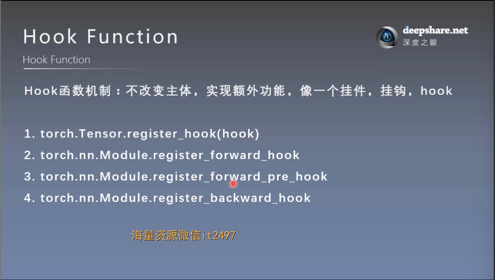
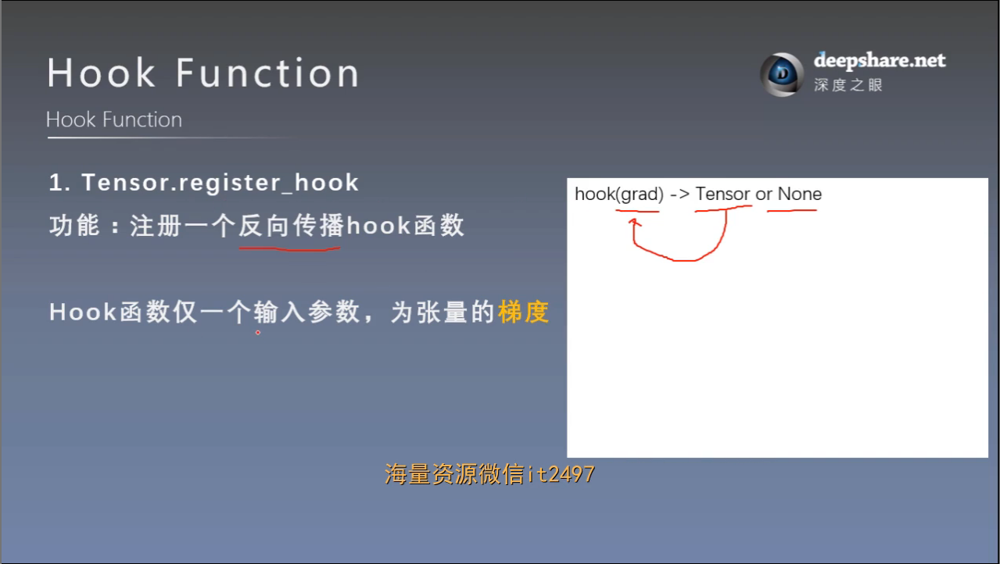
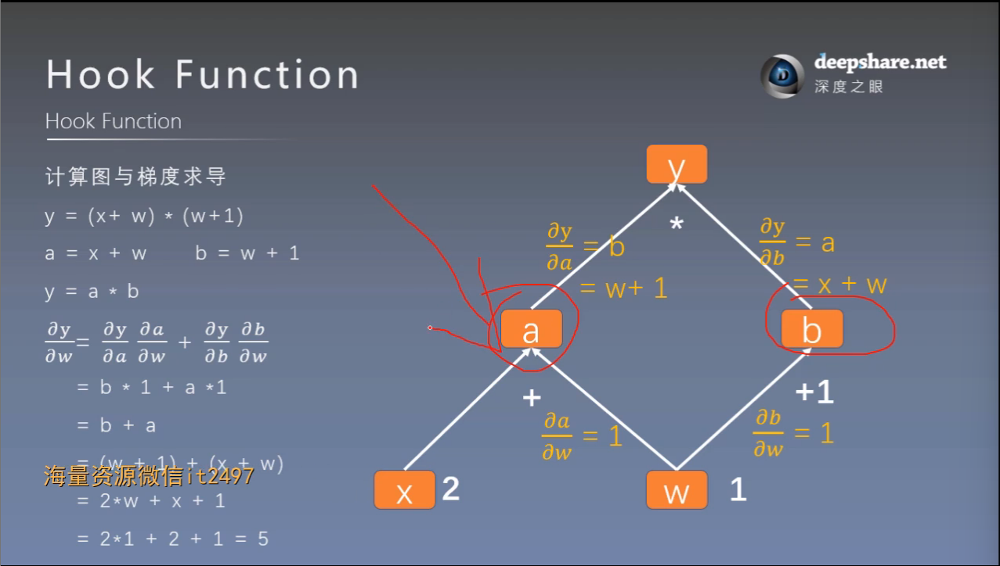
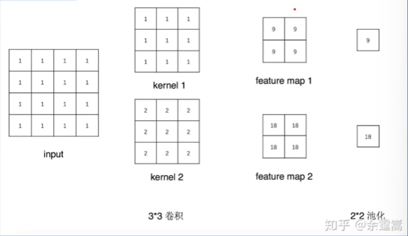
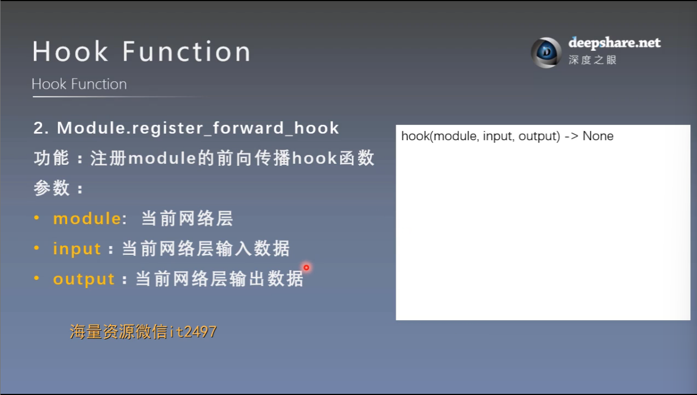
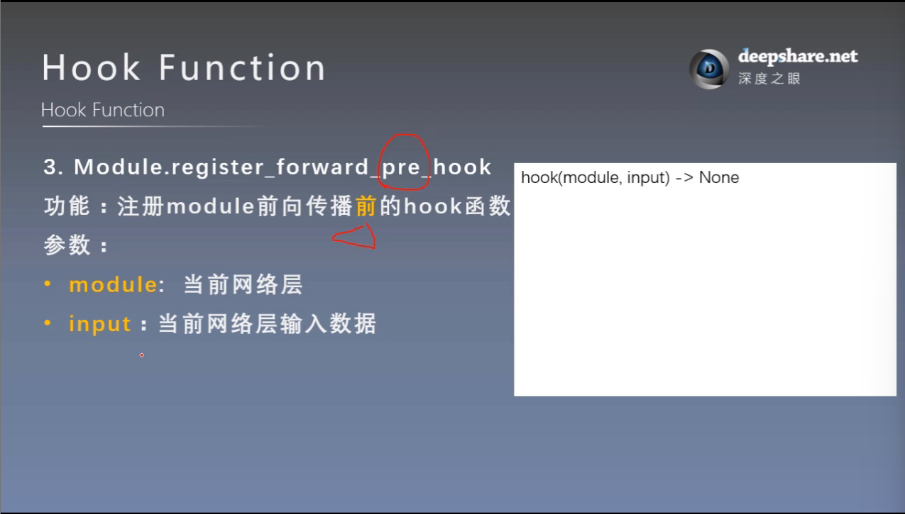
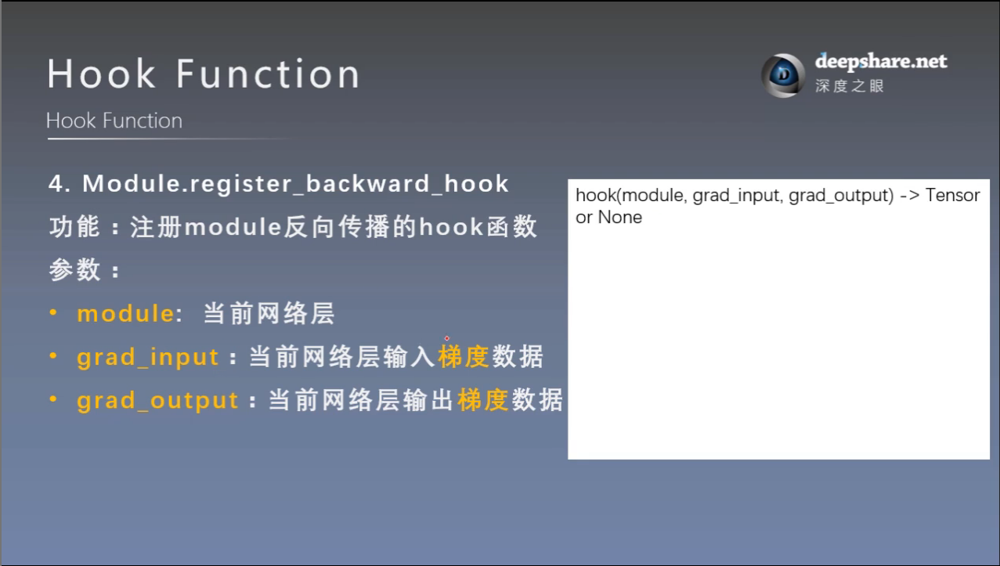

# hook函数与CAM可视化
## 一. hook函数概念

## 二. hook函数与特征图提取
### 1. 针对tensor的hook函数


例：如下计算图



代码：不改变a的梯度
```
# ----------------------------------- 1 tensor hook 1 -----------------------------------
flag = 0
# flag = 1
if flag:
    w = torch.tensor([1.], requires_grad=True)
    x = torch.tensor([2.], requires_grad=True)
    a = torch.add(w, x)
    b = torch.add(w, 1)
    y = torch.mul(a, b)

    a_grad = list()

    def grad_hook(grad):
        a_grad.append(grad)  # 先定义

    handle = a.register_hook(grad_hook) # 再使用

    y.backward()

    # 查看梯度
    print("gradient:", w.grad, x.grad, a.grad, b.grad, y.grad)
    print("a_grad[0]: ", a_grad[0])
    handle.remove()
```

代码：改变a的梯度
```
# ----------------------------------- 1 tensor hook 1 -----------------------------------
# flag = 0
flag = 1
if flag:
    w = torch.tensor([1.], requires_grad=True)
    x = torch.tensor([2.], requires_grad=True)
    a = torch.add(w, x)
    b = torch.add(w, 1)
    y = torch.mul(a, b)

    a_grad = list()

    def grad_hook(grad):
        # a_grad.append(grad)
        grad *= 2                # 原位操作
        return grad * 3         # hook函数如果有return，将会覆盖被hook的tensor的梯度

    handle = a.register_hook(grad_hook)

    y.backward()

    # 查看梯度
    print("gradient:", w.grad, x.grad, a.grad, b.grad, y.grad)
    # print("a_grad[0]: ", a_grad[0])
    handle.remove()
```
### 2. 针对module的hook函数
示例：如下图



#### （1）Module.register_forward_hook


#### （2）Module.register_forward_pre_hook


#### （3）Module.register_backward_hook


**hook函数相关原理与Module基类\_\_call\_\_方法功能：**
1. \_\_call\_\_方法的功能：
    - 执行前向传播：
        - 内部会调用用户定义的 forward 方法，用来计算模型的输出
        - 这是 \_\_call\_\_ 函数的核心作用。
    - 处理钩子（hooks）：
        - 在执行 forward 方法之前和之后，\__call__ 会检查是否注册了钩子，并调用这些钩子。
        - 钩子分为以下几种：
            - forward_pre_hook：在 forward 执行前触发。
            - forward_hook：在 forward 执行后触发。
            - backward_hook：在反向传播时触发。
    - 支持递归调用子模块：
        - 如果模型包含子模块，__call__ 会确保这些子模块的 forward 方法也被正确调用。
    - 保证计算图的构建：
        - 处理输入张量，确保在执行 forward 方法时构建正确的计算图。
2. \__call__函数的执行顺序：

    调用一个 nn.Module 实例（如 output = model(input)）时，执行的顺序如下：
    1. 调用 forward_pre_hooks（如果有）：
        
        如果你注册了前向钩子（forward_pre_hooks），这些钩子会在 forward 方法之前被调用。

    2. 调用用户定义的 forward 方法：

        \_\_call\__ 会将输入传递给 forward，并计算模型的输出。

    3. 调用 forward_hooks（如果有）：

        如果你注册了前向钩子（forward_hooks），这些钩子会在 forward 方法之后被调用。
    
    4. 返回结果：

        forward 的返回值作为 \_\_call\_\_ 的返回值。

3. backward钩子触发时机：backward 钩子会在反向传播过程中，梯度计算完成后立即触发

### 3. 特征图提取，使用hook
```
# --------------------- feature map visualization --------------------
# flag = 0
flag = 1
if flag:
    writer = SummaryWriter(comment='test_your_comment', filename_suffix="_test_your_filename_suffix")

    # 数据
    path_img = "./lena.png"     # your path to image
    normMean = [0.49139968, 0.48215827, 0.44653124]
    normStd = [0.24703233, 0.24348505, 0.26158768]

    norm_transform = transforms.Normalize(normMean, normStd)
    img_transforms = transforms.Compose([
        transforms.Resize((224, 224)),
        transforms.ToTensor(),
        norm_transform
    ])

    img_pil = Image.open(path_img).convert('RGB')
    if img_transforms is not None:
        img_tensor = img_transforms(img_pil)
    img_tensor.unsqueeze_(0)    # chw --> bchw

    # 模型
    alexnet = models.alexnet(pretrained=True)

    # 注册hook
    fmap_dict = dict()
    for name, sub_module in alexnet.named_modules():

        if isinstance(sub_module, nn.Conv2d):
            key_name = str(sub_module.weight.shape)
            fmap_dict.setdefault(key_name, list())

            n1, n2 = name.split(".")

            def hook_func(m, i, o):
                key_name = str(m.weight.shape)
                fmap_dict[key_name].append(o)

            alexnet._modules[n1]._modules[n2].register_forward_hook(hook_func)

    # forward
    output = alexnet(img_tensor)

    # add image
    for layer_name, fmap_list in fmap_dict.items():
        fmap = fmap_list[0]
        fmap.transpose_(0, 1)

        nrow = int(np.sqrt(fmap.shape[0]))
        fmap_grid = vutils.make_grid(fmap, normalize=True, scale_each=True, nrow=nrow)
        writer.add_image('feature map in {}'.format(layer_name), fmap_grid, global_step=322)
```
## 三. CAM（class activation map, 类激活图）和 Grad_CAM
