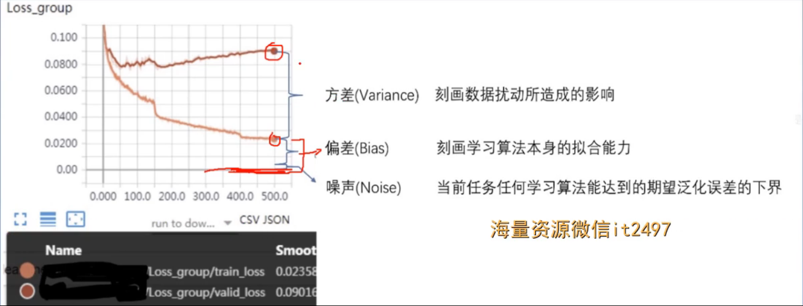
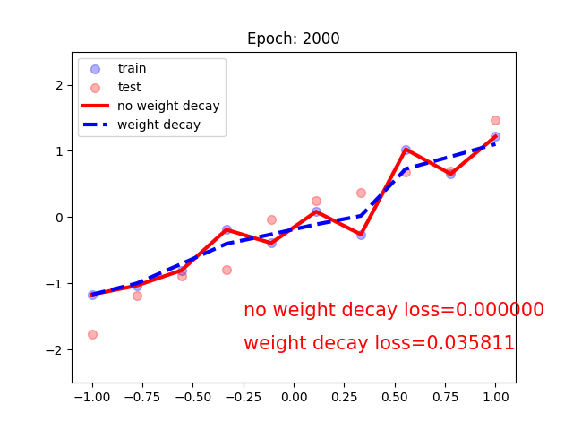
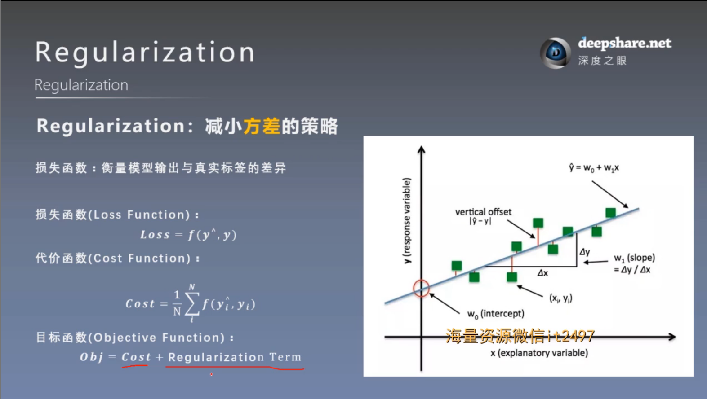
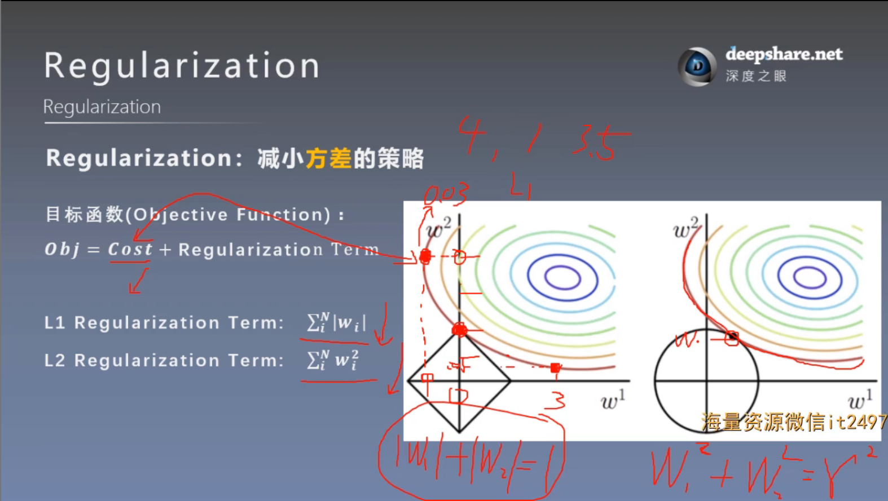
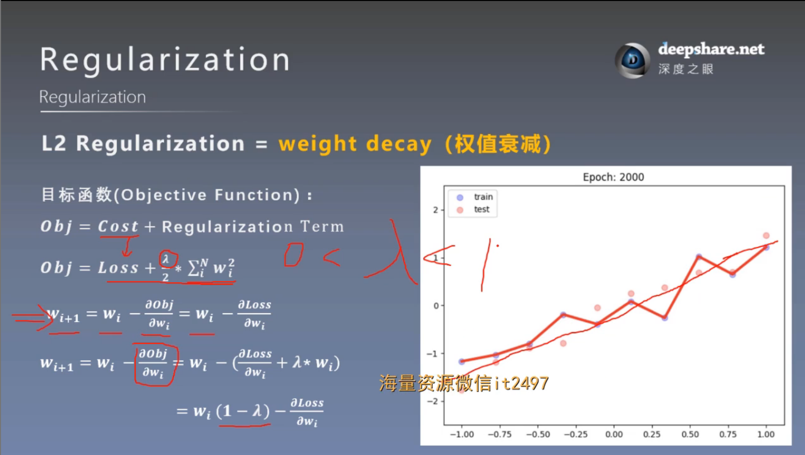
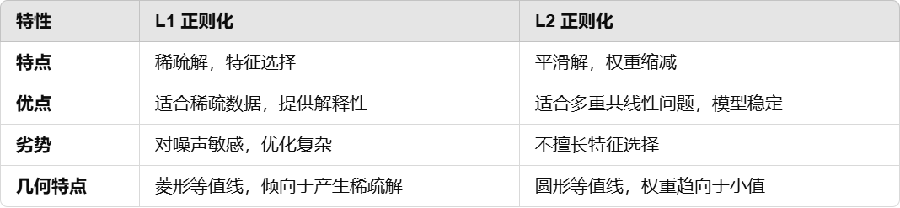

# 正则化之weight decay
## 一. 正则化与偏差-方差分解
### 1. 基本概念
Regularization：减小 **方差** 的策略

误差可分解：偏差，方差与噪声之和。即 **误差 = 偏差 + 方差 + 噪声** 之和

**偏差** 度量了学习算法的期望预测与真实结果的偏离程度，即刻画了学习算法本身的拟合能力

**方差** 度量了同样大小的训练集的变动所导致的学习性能的变化，即刻画了数据扰动所造成的影响

**噪声** 则表达了在当前任务上任何学习算法所能达到的期望泛化误差的下界

如图：



正则化可以减小方差，即可以防止模型过拟合增强泛化能力


### 2. 基本公式与 L1 L2 正则项






### 3. L1 和 L2 正则项的区别


## 二. pytorch中的L2正则项——weight decay
Pytorch中底层实现代码：
```
if weight_decay != 0:
    grad = grad.add(param, alpha=weight_decay) 
```
数学表示为：
```math
\mathrm{grad} \leftarrow \mathrm{grad} + \lambda \cdot \mathrm{param}
```
与图片中的表达式等价