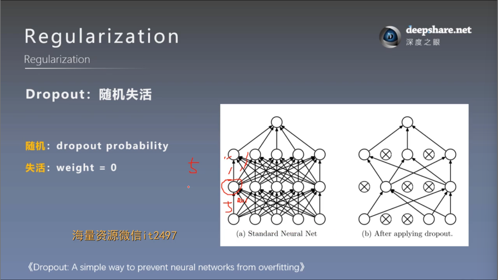
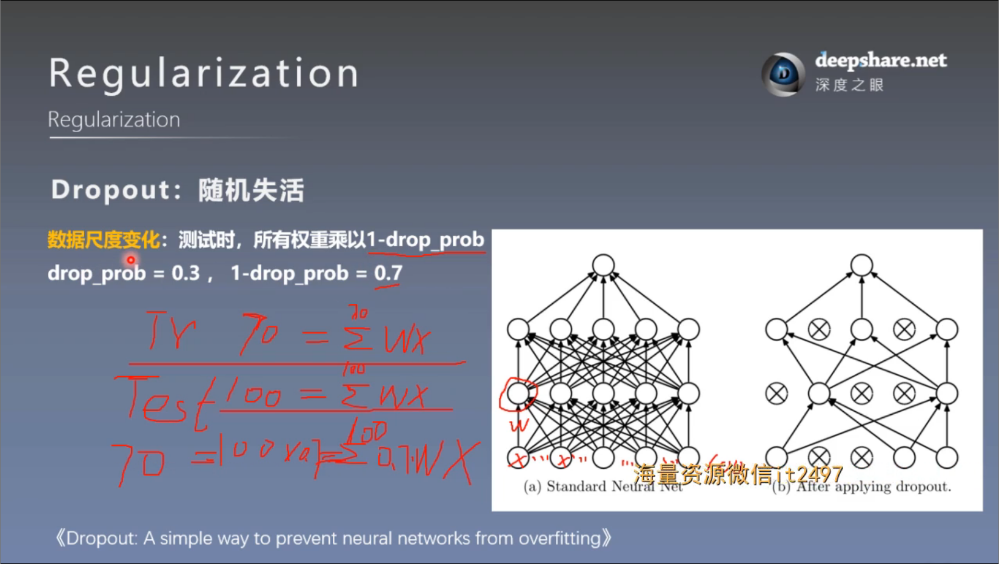
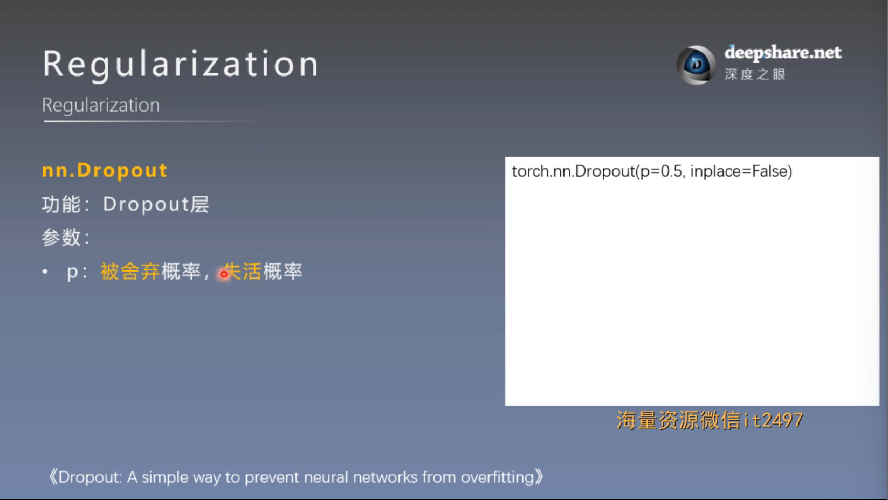

# 正则化之Dropout
## 一. Dropout的概念




数据尺度变化说明：假设有一百个神经元，且假设一个w乘一个x值为1，
则一百个神经元整个数据的尺度为100左右，但训练时，随机dropout百分之三十的神经元
则整个数据的数据尺度为70。然而在测试集，我们测试用的神经元是未经失活的100个完整神经元，因此我们在测试时所有权重
要乘以1-drop_prob来统一数据尺度

**核心思想**
- 在每次前向传播时，以一定的概率 $p$ 将神经网络中的部分神经元 随机置零（屏蔽）。
- 被置零的神经元在该次训练中不参与计算，其对应的权重也不进行更新。
- 测试阶段取消 Dropout，并对权重进行缩放，以保证预测的稳定性。

**优势**


还有一个类似于L2正则项的优势，可以缩减方差，减少对特定神经元的依赖，防止过拟合

## 二. Dropout注意事项
### 1. 在Pytorch中使用——构建


在构建模型时，在要dropout的网络层前构建dropout层
```
class MLP(nn.Module):
    def __init__(self, neural_num, d_prob=0.5):
        super(MLP, self).__init__()
        self.linears = nn.Sequential(

            nn.Linear(1, neural_num),
            nn.ReLU(inplace=True),

            nn.Dropout(d_prob),
            nn.Linear(neural_num, neural_num),
            nn.ReLU(inplace=True),

            nn.Dropout(d_prob),
            nn.Linear(neural_num, neural_num),
            nn.ReLU(inplace=True),

            nn.Dropout(d_prob),
            nn.Linear(neural_num, 1),
        )

    def forward(self, x):
        return self.linears(x)
```
### 2. 在Pytorch中使用——训练集与测试集
因为对于训练集和测试集，一个要dropout一个不要dropout，因此我们在测试时所有权重
我们要及时转换模型的状态。
```
net_prob_0.eval()
net_prob_05.eval()  # 将模型状态转换为测试集

net_prob_0.train()
net_prob_05.train() # 将模型状态转换为训练集
```

实现细节：Pytorch中，训练时权重乘以 $\frac{1}{1-p}$ ，即除以 $1-p$ ，
这样操作，等价于在测试集上对权重进行缩放，更方便，测试更快


