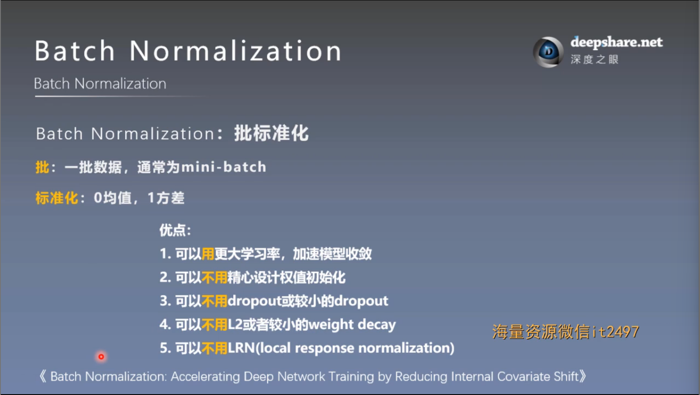
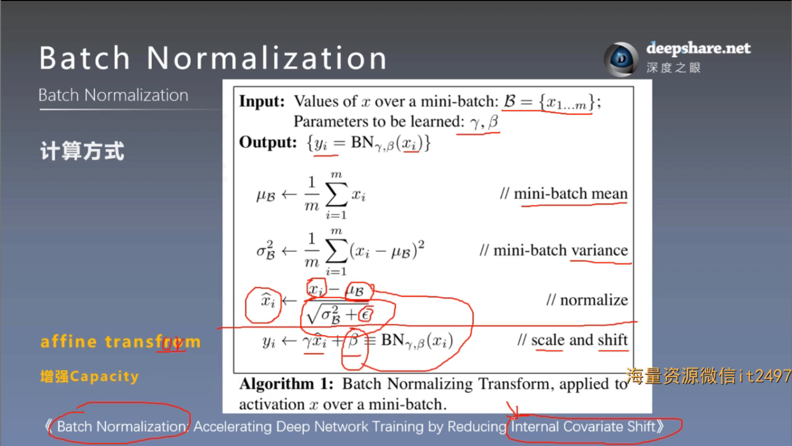
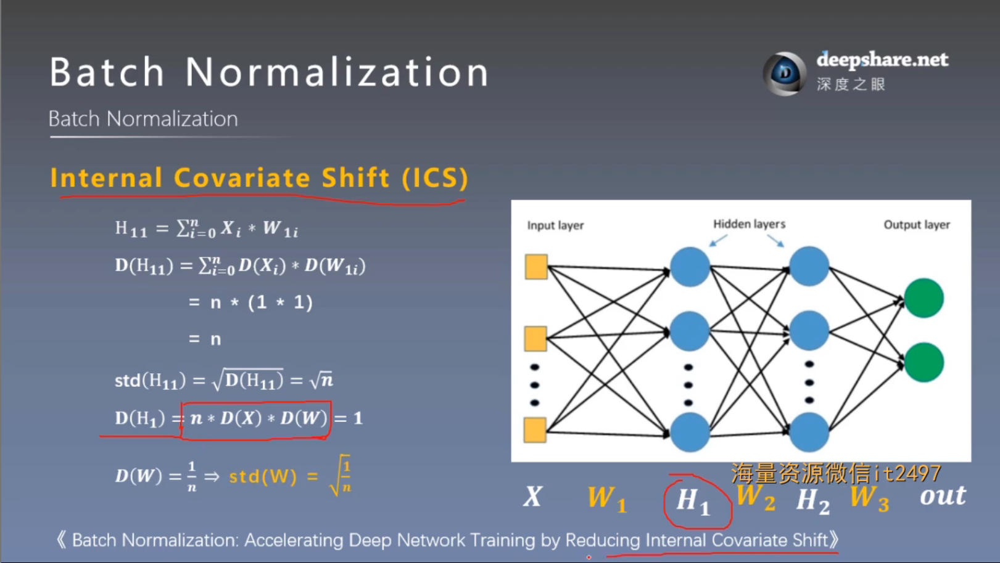
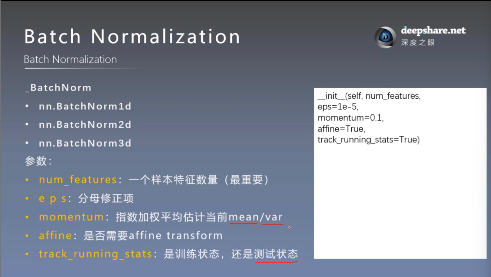
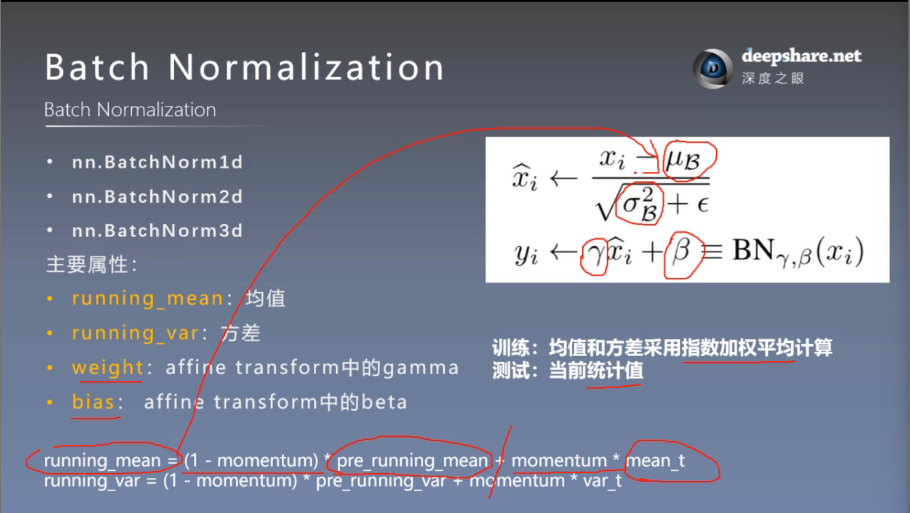
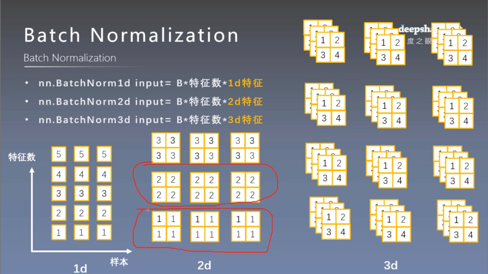

# Batch Normalization
## 一. Batch Normalization概念
 



### 1. 完整流程：

给定一个小批量的输入 $\mathrm{x}={x_1,x_2,\dots,x_m}$ （例如神经网络的中间层输出），BN的具体操作包括：

（1） **计算批量均值和方差**
```math
\begin{align*}
\mu &= \dfrac{1}{m}\sum\limits_{i=1}^{m}{x_i}\\
\sigma &= \dfrac{1}{m}\sum\limits_{i=1}^{m}{x_i-\mu}^2 &
\end{align*}
```
（2） **标准化输入**

将输入值标准化为零均值和单位方差
```math
\hat{x_i} = \dfrac{x_i-\mu}{\sqrt{\sigma^2+\epsilon}}
```
其中， $\epsilon$ 是一个小正值，用于避免分母为零

（3） **仿射变换（Affine Transform）**
通过两个可学习参数 $\lambda$ 和 $\beta$ 进行缩放和平移
```math
y_i=\lambda\hat{x_i}+\beta
```
-  $\lambda$ 控制标准化输出的尺度（scale）
-  $\beta$ 控制标准化输出的偏移（shift）

$\lambda$ 和 $\beta$ 的引入使 BN 能够适应不同的任务需求，不再限制标准化输出为零均值和单位方差。

***Affinr Transform的意义***
1. 恢复 **网络表达能力**
    - 在没有 $\lambda$ 和 $\beta$ 时，BN 强制输出为零均值、单位方差，可能限制网络的表达能力。
    - 通过仿射变换，BN 能够恢复网络的原始表达能力，甚至增强网络对不同分布的适应性。
2. 增加 **可学习性**
    - $\lambda$ 和 $\beta$ 是可学习参数，它们可以被优化以适应数据分布和网络任务。
    - 在训练过程中，网络自动调整这两个参数，使得 BN 不会对网络性能产生负面影响。
3. 灵活性
    - 不同任务可能需要不同的数据分布。Affine Transform 使 BN 具备灵活性，可以适配多样化的分布需求。
### 2. Internal Covariate Shift (ICS)
Batch Normalization最初是解决 ICS 问题



即：随着神经网络的训练过程进行，网络中某一层的输入分布不断发生变化。这种变化会导致训练过程变得不稳定，从而增加模型收敛的难度

如图，如果画圈式中，方差呈减小趋势，则随着网络加深，会产生梯度消失，同理也会产生梯度爆炸，使收敛更难

## 二. PyTorch的Batch Normalization 1d/2d/3d 实现
### 1. 基类：_BatchNorm


### 2. 实现：nn.BatchNorm1/2/3d




**注意**
- 1d/2d/3d 指的是特征的维度，也就是一个神经元中特征数据的维度
- 因此，1d/2d/3d 的输入张量维度分别为：3维/4维/5维

例：3d特征
```
# ======================================== nn.BatchNorm3d
flag = 1
# flag = 0
if flag:

    batch_size = 3
    num_features = 4
    momentum = 0.3

    features_shape = (2, 2, 3)

    feature = torch.ones(features_shape)  # 3D
    feature_map = torch.stack([feature * (i + 1) for i in range(num_features)], dim=0)  # 4D
    feature_maps = torch.stack([feature_map for i in range(batch_size)], dim=0)  # 5D

    print("input data:\n{} shape is {}".format(feature_maps, feature_maps.shape))

    bn = nn.BatchNorm3d(num_features=num_features, momentum=momentum)

    running_mean, running_var = 0, 1

    for i in range(2):
        outputs = bn(feature_maps)

        print("\niter:{}, running_mean.shape: {}".format(i, bn.running_mean.shape))
        print("iter:{}, running_var.shape: {}".format(i, bn.running_var.shape))

        print("iter:{}, weight.shape: {}".format(i, bn.weight.shape))
        print("iter:{}, bias.shape: {}".format(i, bn.bias.shape))
```
