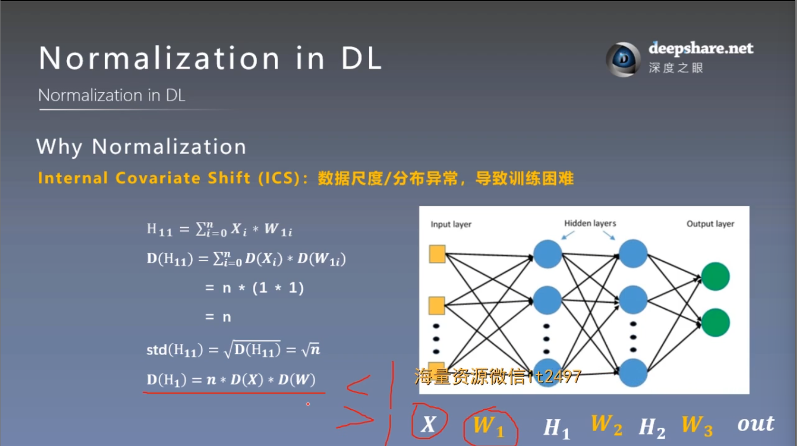
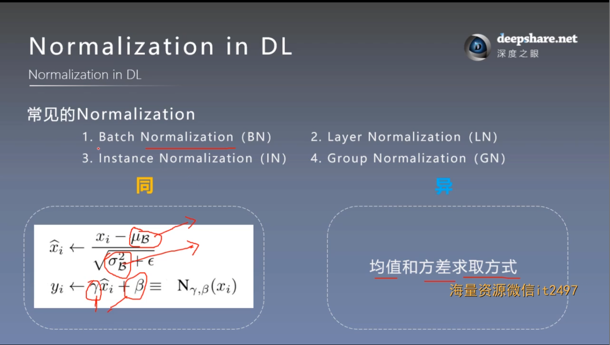
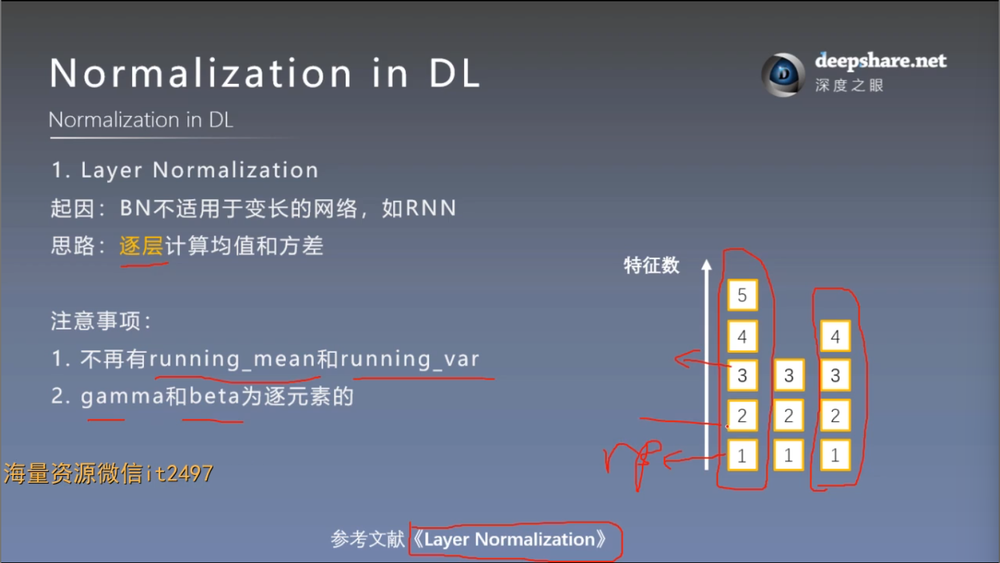
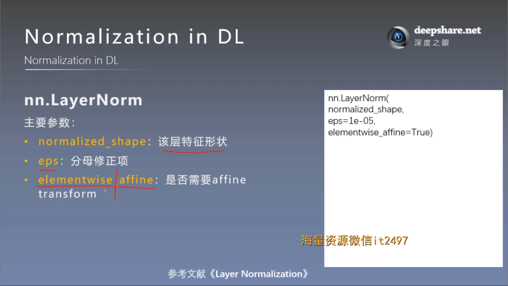
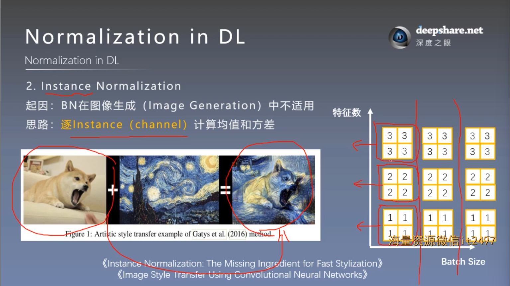
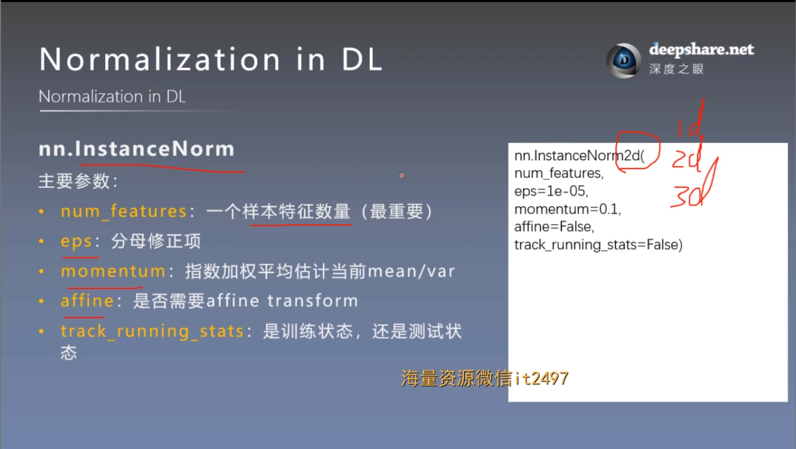
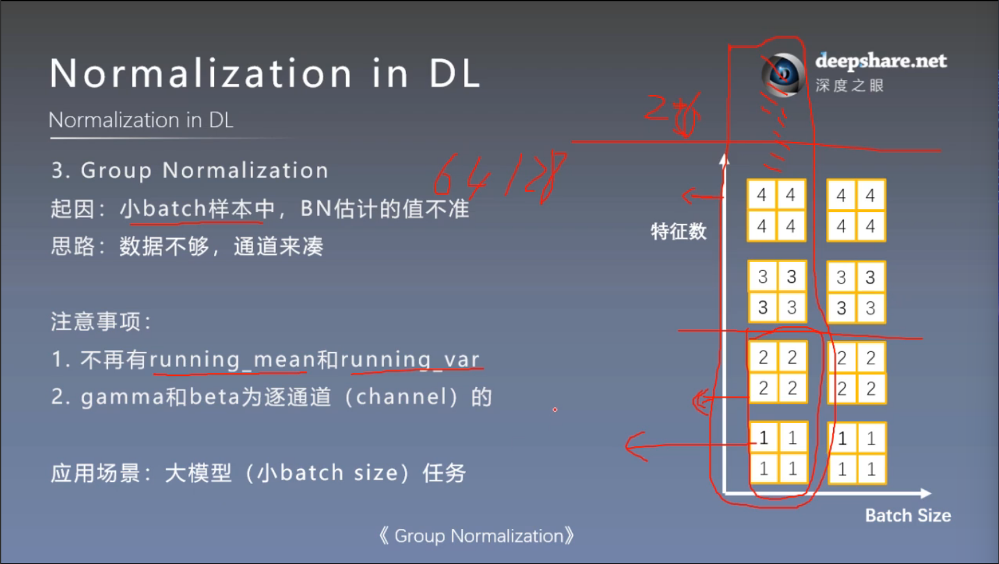
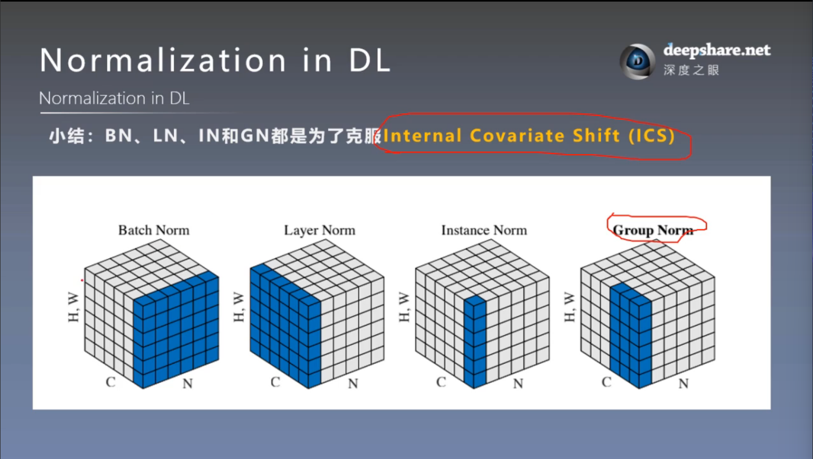
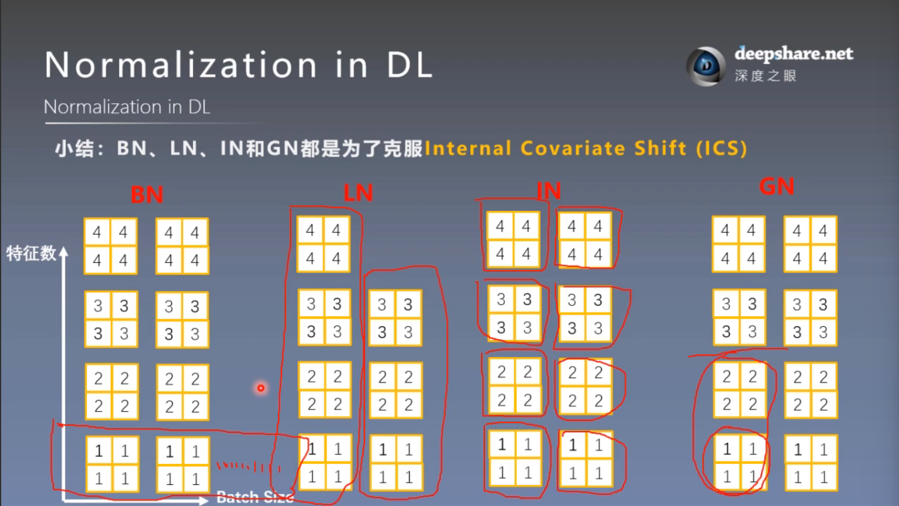

# 更多Normalization方法
## 一. 为什么要Normalization


更多解释见23节

## 二. 常见的Normalization——BN、LN、IN and GN


### 1. Layer Normalization




```
# ======================================== nn.layer norm
flag = 1
# flag = 0
if flag:
    batch_size = 8
    num_features = 6

    features_shape = (3, 4)

    feature_map = torch.ones(features_shape)  # 2D
    feature_maps = torch.stack([feature_map * (i + 1) for i in range(num_features)], dim=0)  # 3D
    feature_maps_bs = torch.stack([feature_maps for i in range(batch_size)], dim=0)  # 4D

    # feature_maps_bs shape is [8, 6, 3, 4],  B * C * H * W
    ln = nn.LayerNorm(feature_maps_bs.size()[1:], elementwise_affine=True)
    # ln = nn.LayerNorm(feature_maps_bs.size()[1:], elementwise_affine=False)
    # ln = nn.LayerNorm([6, 3, 4])    # 可以自己对网络层指定需要标准化的维度
    # ln = nn.LayerNorm([6, 3])    # 但是只能从低维到高维按顺序指定，比如该行这样指定是错位的

    output = ln(feature_maps_bs)

    print("Layer Normalization")
    print(ln.weight.shape)
    print(feature_maps_bs[0])
    print(output[0])
```
### 2. Instance Normalization



```
# ======================================== nn.instance norm 2d
# flag = 1
flag = 0
if flag:

    batch_size = 3
    num_features = 3
    momentum = 0.3

    features_shape = (2, 2)

    feature_map = torch.ones(features_shape)    # 2D
    feature_maps = torch.stack([feature_map * (i + 1) for i in range(num_features)], dim=0)  # 3D
    feature_maps_bs = torch.stack([feature_maps for i in range(batch_size)], dim=0)  # 4D

    print("Instance Normalization")
    print("input data:\n{} shape is {}".format(feature_maps_bs, feature_maps_bs.shape))

    instance_n = nn.InstanceNorm2d(num_features=num_features, momentum=momentum)

    for i in range(1):
        outputs = instance_n(feature_maps_bs)

        print(outputs)
        # print("\niter:{}, running_mean.shape: {}".format(i, bn.running_mean.shape))
        # print("iter:{}, running_var.shape: {}".format(i, bn.running_var.shape))
        # print("iter:{}, weight.shape: {}".format(i, bn.weight.shape))
        # print("iter:{}, bias.shape: {}".format(i, bn.bias.shape))
```

### 3. Group Normalization



```
# ======================================== nn.grop norm
# flag = 1
flag = 0
if flag:

    batch_size = 2
    num_features = 4
    num_groups = 2   # 3 Expected number of channels in input to be divisible by num_groups 特征数要能被分组数整除

    features_shape = (2, 2)

    feature_map = torch.ones(features_shape)    # 2D
    feature_maps = torch.stack([feature_map * (i + 1) for i in range(num_features)], dim=0)  # 3D
    feature_maps_bs = torch.stack([feature_maps * (i + 1) for i in range(batch_size)], dim=0)  # 4D

    gn = nn.GroupNorm(num_groups, num_features)
    outputs = gn(feature_maps_bs)

    print("Group Normalization")
    print(gn.weight.shape)
    print(outputs[0])
```
## Normalization 小结
BN, LN, IN, GN 都是为了克服 Internal Covariate Shift (ICS)






