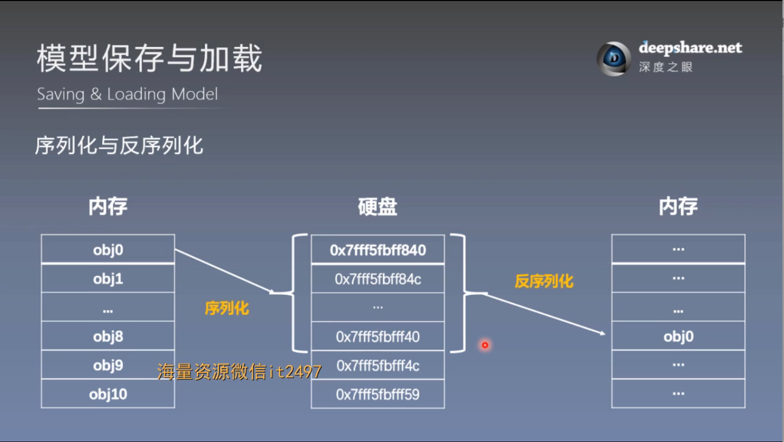
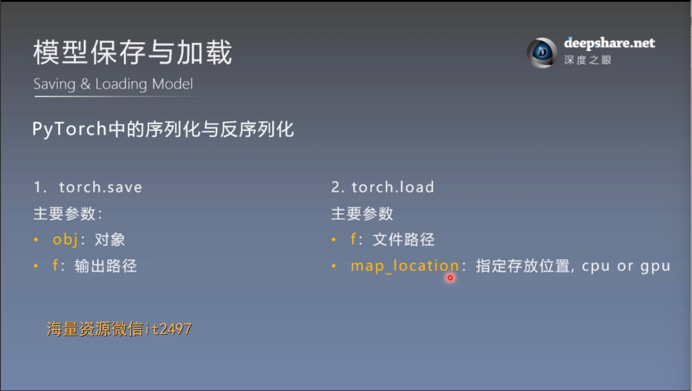
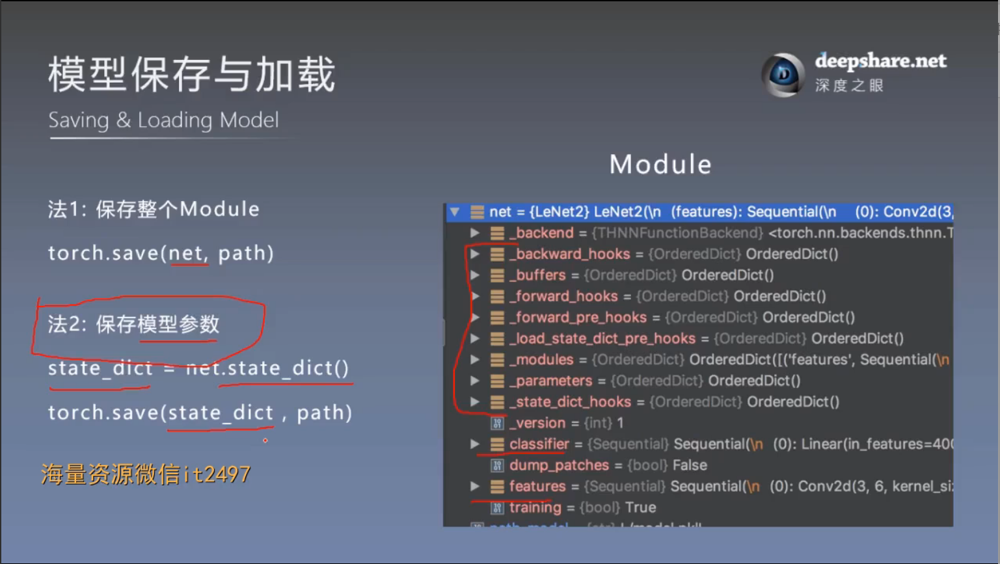
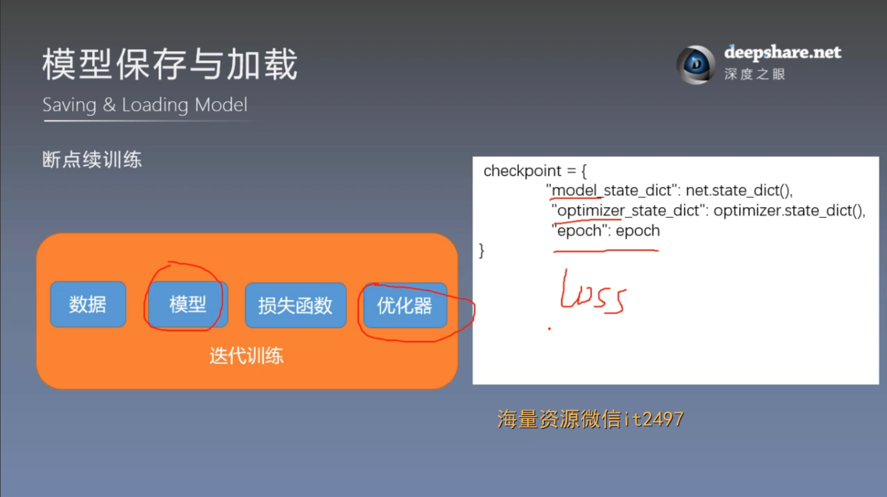

# 模型保存与加载
## 一. 序列化与反序列化


序列化：将内存中的某个对象以二进制序列的形式保存在硬盘中

反序列化：将硬盘中二进制序列存储的数据转换为内存中的对象形式

## 二. 模型保存与加载的两种方式




保存
```
path_model = "./model.pkl"
path_state_dict = "./model_state_dict.pkl"

# 保存整个模型
torch.save(net, path_model)

# 保存模型参数
net_state_dict = net.state_dict()
torch.save(net_state_dict, path_state_dict)
```
加载
```
# ================================== load net ===========================
flag = 1
# flag = 0
if flag:

    path_model = "./model.pkl"
    net_load = torch.load(path_model)

    print(net_load)

# ================================== load state_dict ===========================

# flag = 1
flag = 0
if flag:

    path_state_dict = "./model_state_dict.pkl"
    state_dict_load = torch.load(path_state_dict)
    print(state_dict_load.keys())

# ================================== update state_dict ===========================
# flag = 1
flag = 0
if flag:

    net_new = LeNet2(classes=2019)

    print("加载前: ", net_new.features[0].weight[0, ...])
    net_new.load_state_dict(state_dict_load)
    print("加载后: ", net_new.features[0].weight[0, ...])
```
注意：推荐使用保存模型参数的方法，读取参数后要及时更新到模型中
## 三. 模型断点续训练


模拟代码：

保存：
```
if (epoch+1) % checkpoint_interval == 0:

    checkpoint = {"model_state_dict": net.state_dict(),
                  "optimizer_state_dict": optimizer.state_dict(),
                  "epoch": epoch}
    path_checkpoint = "./checkpoint_{}_epoch.pkl".format(epoch)
    torch.save(checkpoint, path_checkpoint)

if epoch > 5:
    print("训练意外中断...")
    break
```
加载：
```
# ============================ step 5+/5 断点恢复 ============================

path_checkpoint = "./checkpoint_4_epoch.pkl"
checkpoint = torch.load(path_checkpoint)

net.load_state_dict(checkpoint['model_state_dict'])

optimizer.load_state_dict(checkpoint['optimizer_state_dict'])

start_epoch = checkpoint['epoch']

scheduler.last_epoch = start_epoch
```


