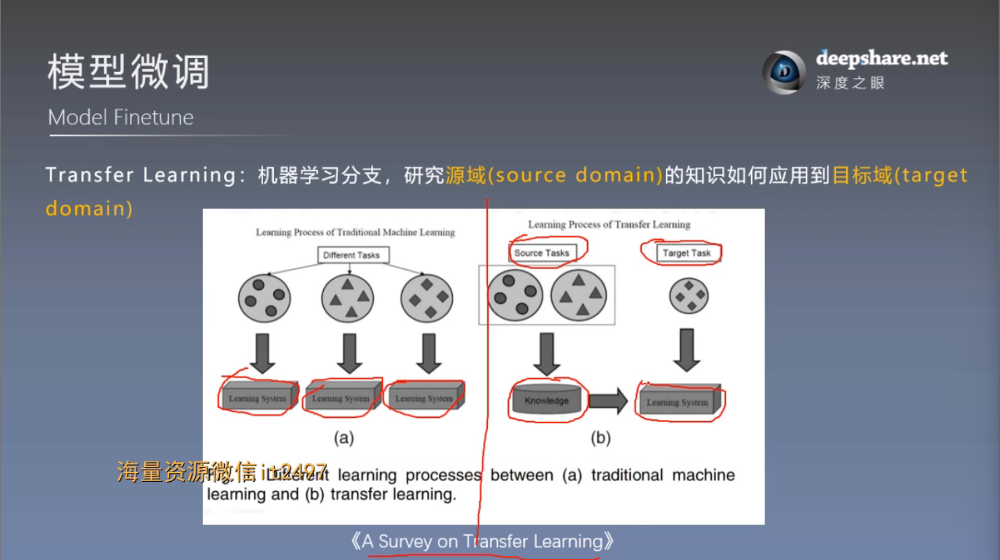
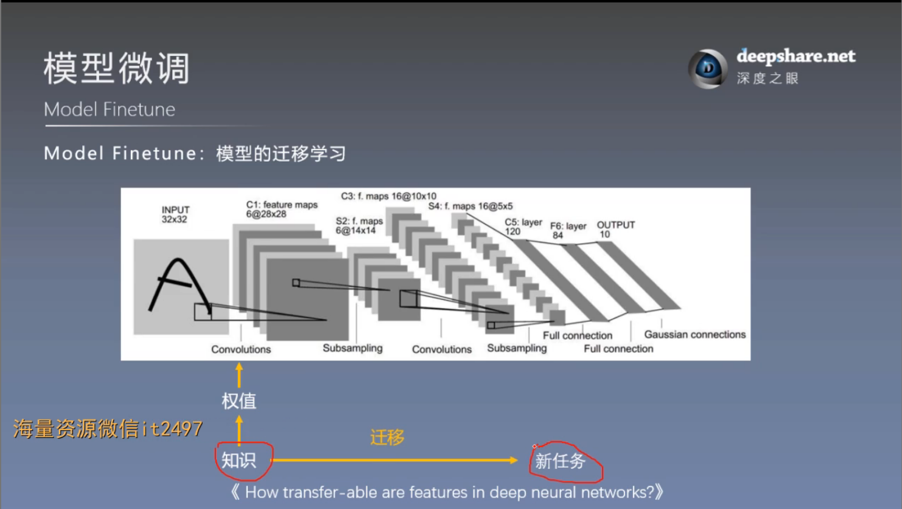
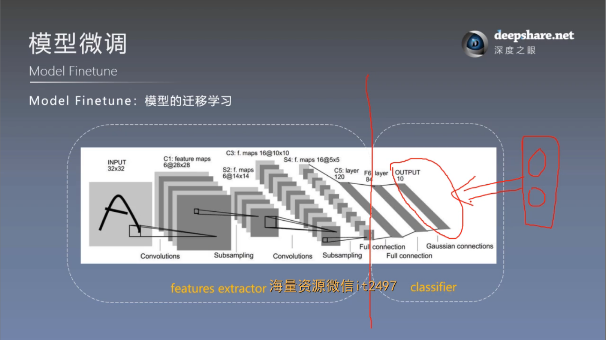
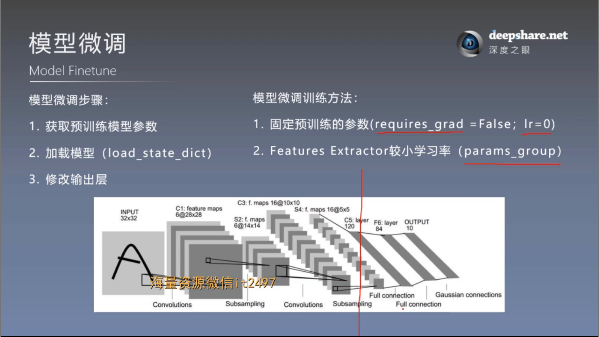
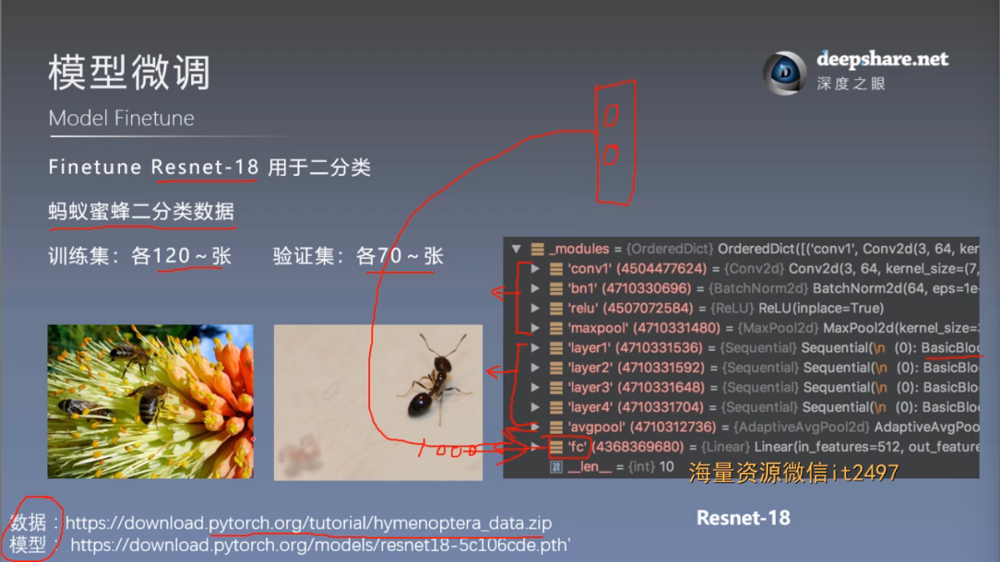

# 模型finetune——模型微调
## 一. Transfer Learning & Model Finetune
### 1. 为什么要Model Finetune
#### （1）Transfer Learning




Transfer Learning 原因：新任务的数据太少，不足以支持重新训练一个新模型——因此可以将已经训练好的，已经有的知识迁移到新任务领域中
#### （2）怎么Model Finetune




## 二. PyTorch中的Finetune
Finetune Resnet-18 用于二分类



模型微调构建关键代码：
```
# ============================ step 2/5 模型 ============================
# 1/3 构建模型
resnet18_ft = models.resnet18()

# 2/3 加载参数
# flag = 0
flag = 1
if flag:
    path_pretrained_model = os.path.join(hello_pytorch_dir, "data", "resnet18-5c106cde.pth")
    state_dict_load = torch.load(path_pretrained_model)
    resnet18_ft.load_state_dict(state_dict_load)

# 法1 : 冻结卷积层
# flag_m1 = 0
flag_m1 = 1
if flag_m1:
    for param in resnet18_ft.parameters():
        param.requires_grad = False
    print("conv1.weights[0, 0, ...]:\n {}".format(resnet18_ft.conv1.weight[0, 0, ...]))


# 3/3 替换fc层
num_ftrs = resnet18_ft.fc.in_features
resnet18_ft.fc = nn.Linear(num_ftrs, classes)

resnet18_ft.to(device)

# ============================ step 3/5 损失函数 ============================
criterion = nn.CrossEntropyLoss()

# ============================ step 4/5 优化器 ============================
# 法2 : conv 小学习率
flag = 0
# flag = 1
if flag:
    fc_params_id = list(map(id, resnet18_ft.fc.parameters()))     # 返回的是parameters的 内存地址
    base_params = filter(lambda p: id(p) not in fc_params_id, resnet18_ft.parameters())
    optimizer = optim.SGD([
        {'params': base_params, 'lr': LR*0},   # 0
        {'params': resnet18_ft.fc.parameters(), 'lr': LR}], momentum=0.9)

else:
    optimizer = optim.SGD(resnet18_ft.parameters(), lr=LR, momentum=0.9)               # 选择优化器

scheduler = torch.optim.lr_scheduler.StepLR(optimizer, step_size=lr_decay_step, gamma=0.1)     # 设置学习率下降策略
```


