# GPU的使用
## 一. CPU与GPU
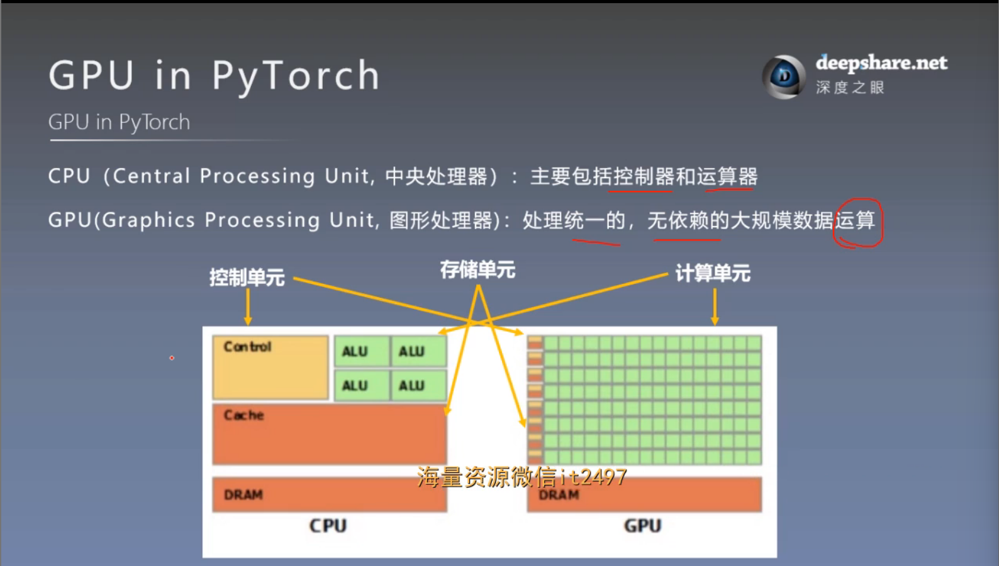
## 二. 数据迁移至GPU
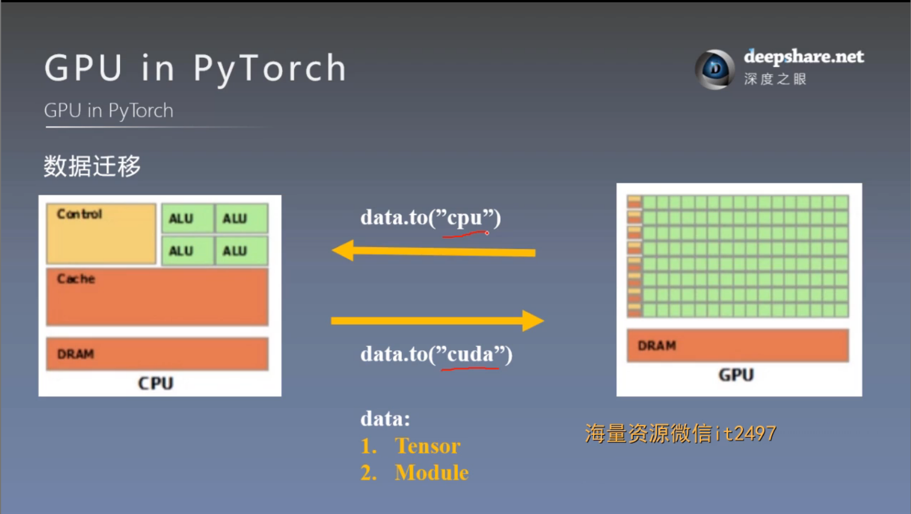

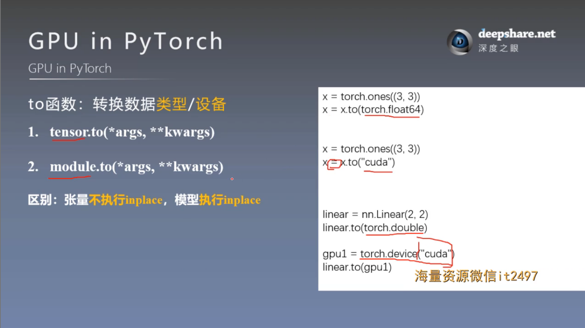

**注意**：所有的计算数据必须在相同的设备上

### 1. torch.cuda常用方法
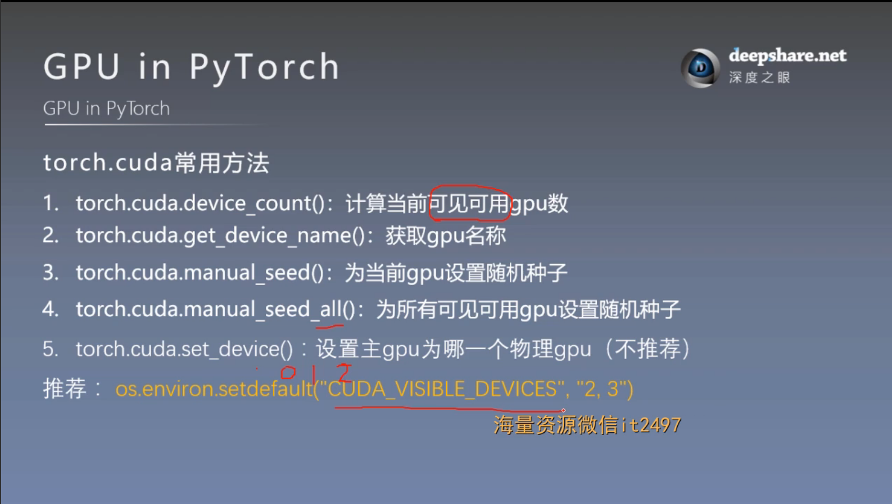

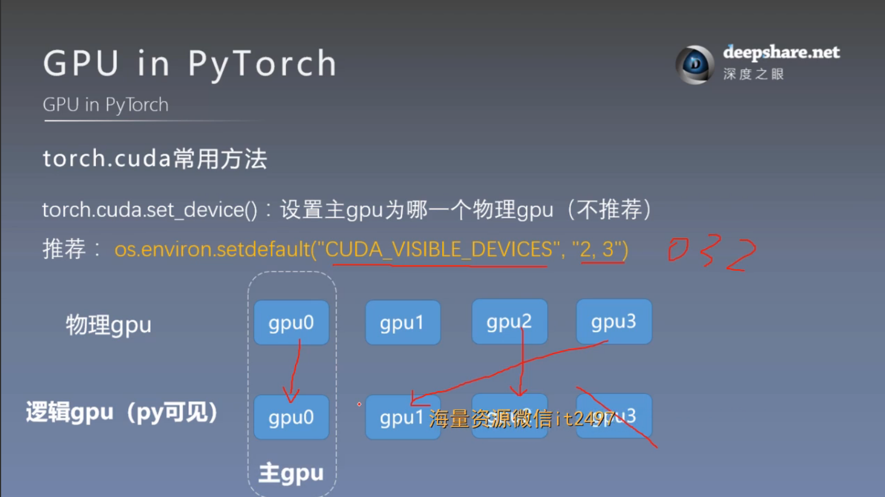

## 三. 多GPU并行运算
### 1. 分发并行机制
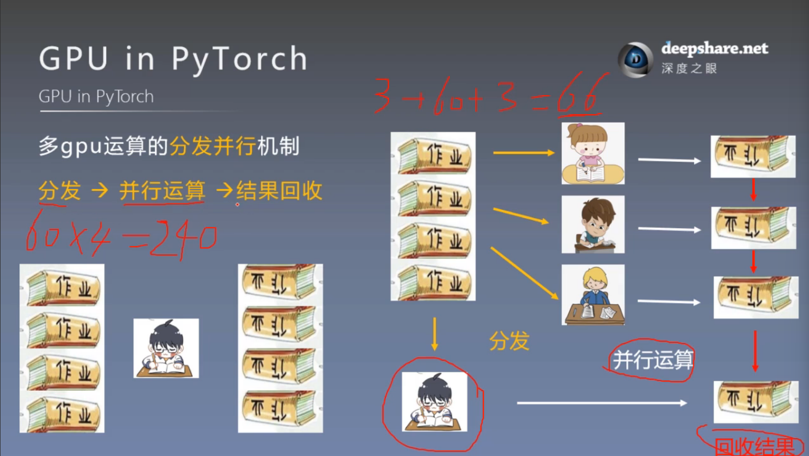

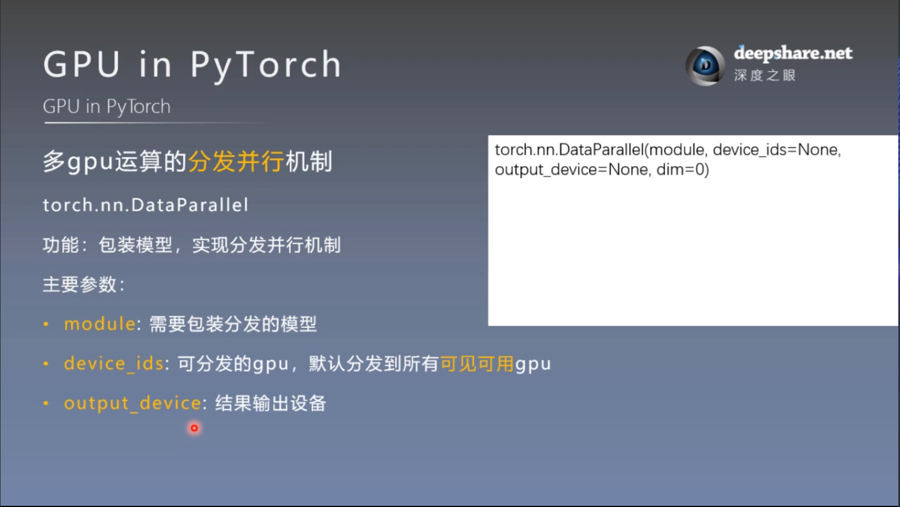

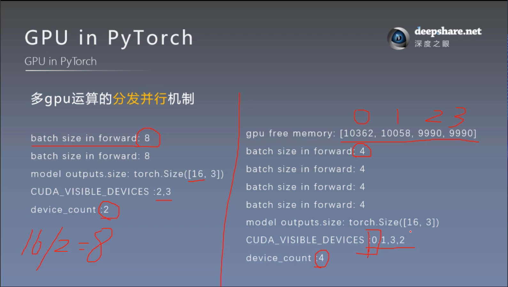

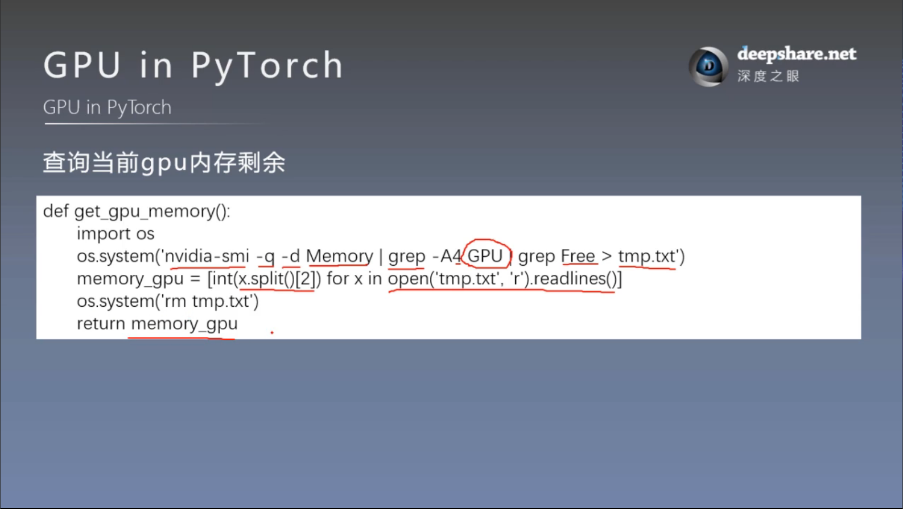

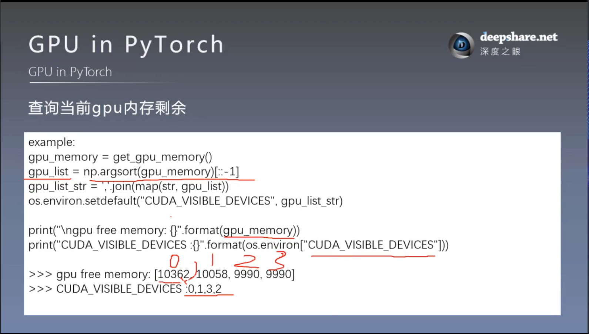

### 2. 常见报错
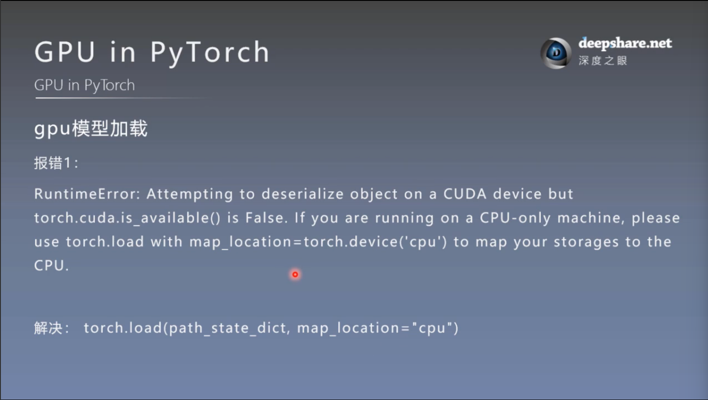

模型在gpu上进行训练保存之后，在不可用gpu的设备上加载，则报错

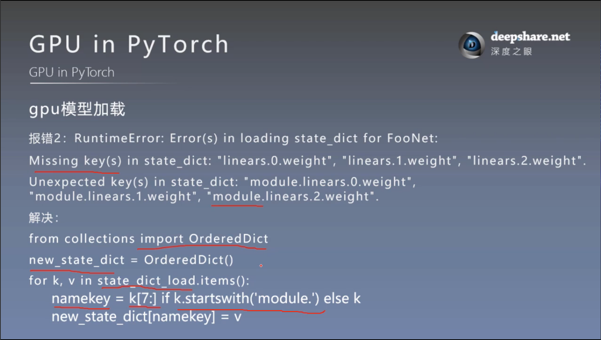

训练时采用多gpu并行运算，模型被DataParallel进行包装，使得模型网络层的命名会多一个 "module" 使加载 state_dict的时候命名不匹配，导致加载失败，报错