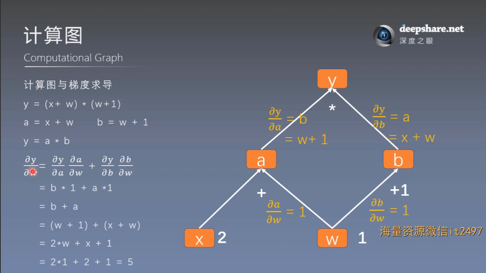
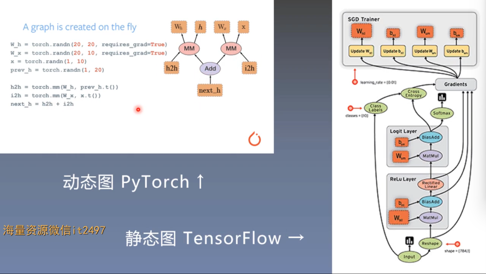

# 计算图与动态图机制
## 一. 计算图 (Computational Graph)
### 1. 基本概念

计算图是用来**描述运算**的有向无环图

计算图有两个主要的元素：**结点** (Node) 和**边** (Edge)

结点表示数据，如向量，矩阵，张量；边表示运算，如加减乘除卷积等

例：用计算图表示：y = (x + w) * (w + 1)

令 a = x + w, b = w + 1, y = a * b

**用计算图表示计算的优点**：使梯度求导更加方便

### 2. 重要属性

#### 1. 叶子结点

用户创建的结点称为叶子结点，如 x 和 w

    is_leaf
指示张量是否为叶子节点

非叶子结点在反向传播结束之后，梯度会被释放掉，节省内存开销
可以使用

    retain_grad()
保存相应张量的梯度

#### 2. grad_fn

记录创建该张量时所用的方法（函数）

例如：

y.grad_fn = \< MulBackward0 \>  
a.grad_fn = \< AddBackward0 \>  
b.grad_fn = \< AddBackward0 \>

## 二. 动态图（Dynamic Graph）

### 1. 动态图 VS 静态图

动态图：运算与搭建同时进行（自驾游）———— 灵活易调节

静态图：先搭建图，后运算（跟团旅游）———— 高效不灵活

Pytorch : 动态图

TensorFlow : 静态图

