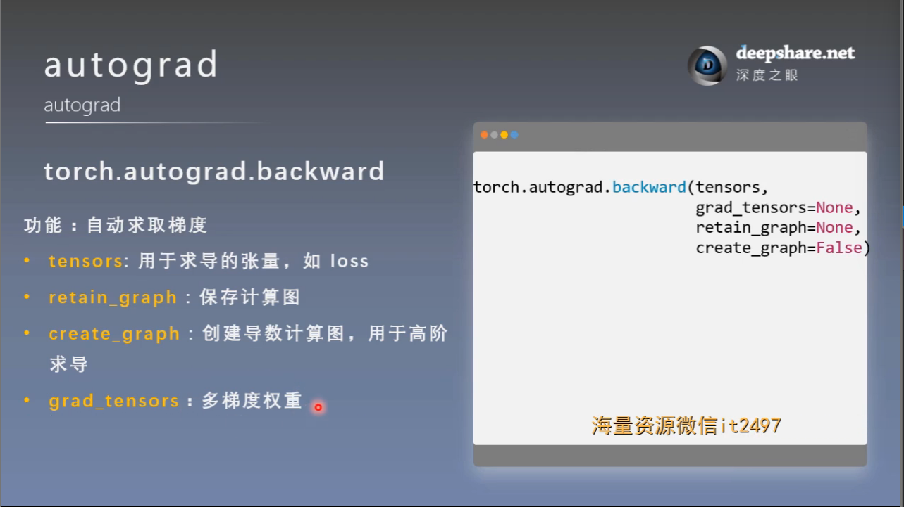
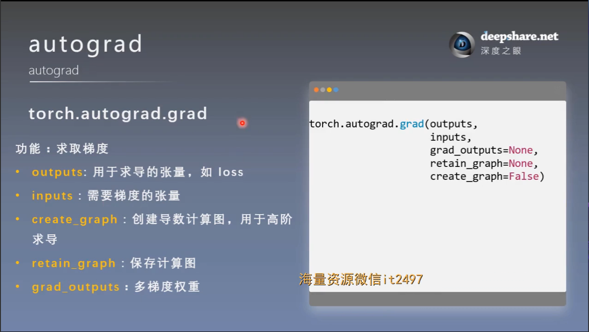
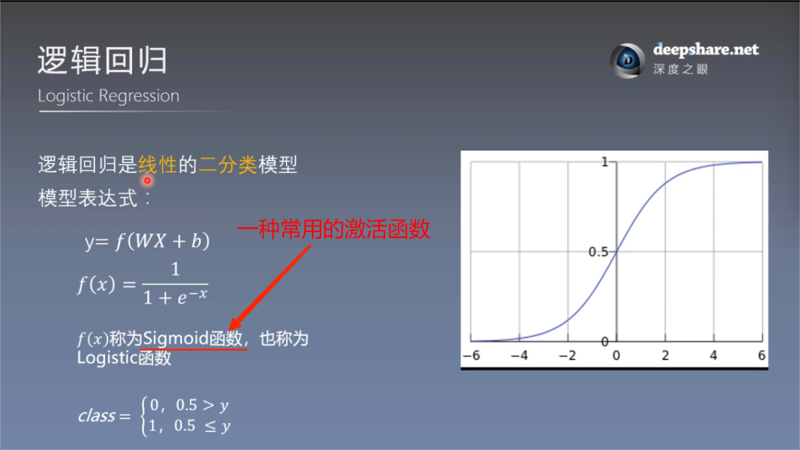
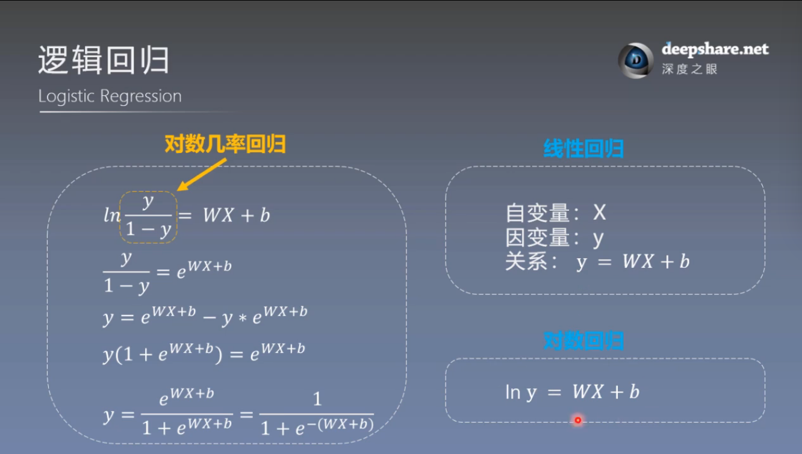

# autograd与逻辑回归
## 一. torch.autograd ———— 自动求导系统
### 1. torch.autograd.backward

功能：自动求取梯度

注意：
1. 实际上 y.backward() 就是调用的 torch.autograd.backward 方法

2. pytorch在进行一次反向传播后，计算图会被释放掉，想直接再进行一次反向传播程序会报错

解决方法：使用 
    
    y.backward(retain_graph = True)

3. loss.backward(grandient = grad_tensors) 传入一个张量设置梯度

### 2. torch.autograd.grad

功能：求取梯度

注意：

1. outputs：用于求导的张量，被微分的张量

2. inputs：需要梯度的张量, 微分的微元张量

实现高阶导数

### 3. 注意
- 梯度不自动清零

- 依赖于叶子结点的结点，requires_grad 默认为 True

- 叶子结点不可执行 in-place操作

    原位(in-place)操作就是在原始内存中去改变数据，可以看代码中的小例子

    为什么叶子结点不能in-place操作：前向传播时，会记录叶子结点的地址，反向传播时根据地址去找叶子结点的值，如果进行了in-place操作，会使得梯度计算错误

## 二. 逻辑回归（Logitic Regression）
### 1. 基本概念

逻辑回归是**线性**的**二分类**模型

**逻辑回归 VS 线性回归**

逻辑回归也叫对数几率回归

几率：**几率（odds）** 是一个概率的比值，表示事件发生与不发生的相对可能性。

### 2. 机器学习模型的训练步骤

- 数据：

    数据的采集  
    数据清洗  
    数据划分  
    数据预处理  
