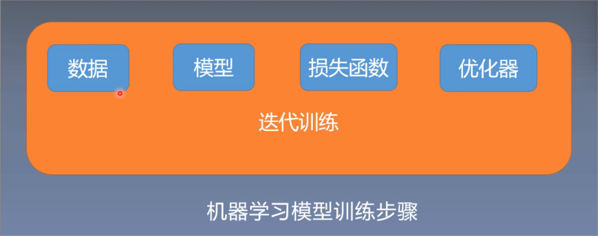
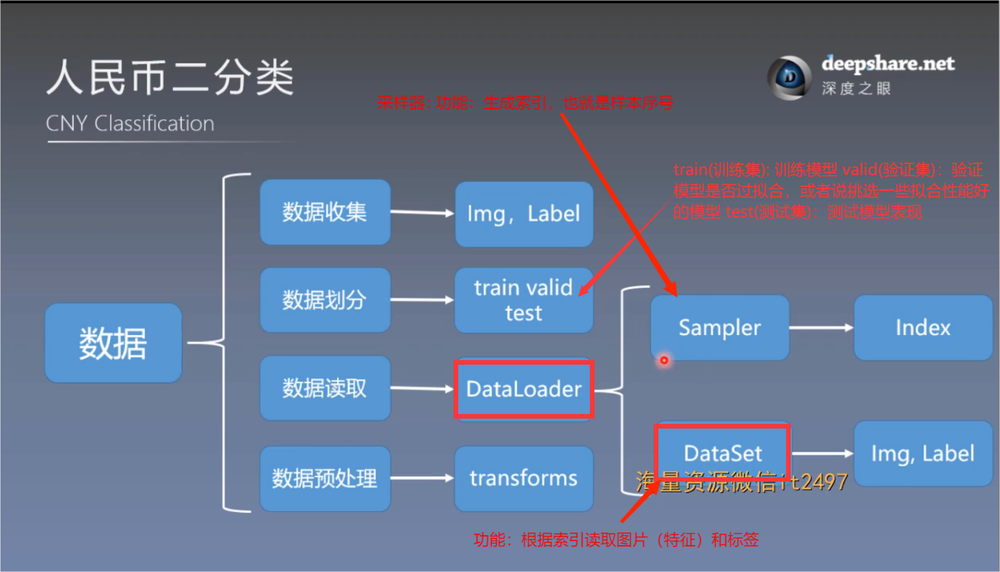
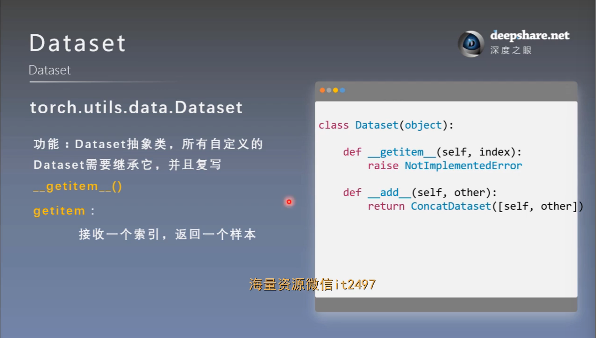

# 数据读取机制：Dataloader 与 Dataset

## 一. 人民币二分类

### 1. 回顾机器学习模型训练的步骤

这次主要学习数据步骤的数据读取部分

## 二. 数据读取的核心——DataLoader 与 Dataset
### 1. DataLoader
功能：构建可迭代的数据装载器

- Epoch：将所有训练样本都已输入到模型中，称为一个Epoch
- Iteration：一批样本输入到模型中，称之为一个Iteration
- Batchsize：批大小，决定一个Epoch有多少个训练样本

例

1. 样本总数：80，Batchsize：8

    1 Epoch = 10 Iteration

2. 样本总数：87，Batchsize：8

    1 Epoch = 10 Iteration ? drop_last = True

    1 Epoch = 11 Iteration ? drop_last = False

### 2. Dataset

功能：Dataset抽象类，所有自定义的Dataset需要继承它，并且复写 **\_\_getitem()\_\_**（核心）

### 3. 三个问题

### 4. 数据读取流程图

