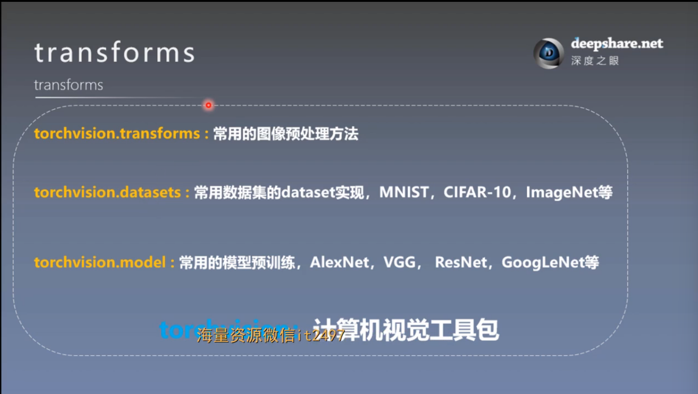

# 数据预处理：transforms模块机制
## 一. torchvision：计算机视觉工具包

torchvision.transforms：常用的图像预处理方法

**作用**：提高模型的泛化能力，类似于五年高考三年模拟，高考卷就是原始数据，三年模拟就是做的数据增强丰富的数据

## 二. 结合transforms的数据读取流程
思考：transform模块在数据读取流程中会出现在哪里？

数据步骤的三个关键Dataloader，Dataset，transform的关系

（1）先再次明确三者的概念
- Dataloader：是一个批量加载数据的**工具类**，是一个**包装类**，它提供了批量加载数据、打乱数据、并行加载数据、自动生成批次等多种功能。
- Dataset：Dataset 是 PyTorch 中用于表示数据集的一个类。它是一个**抽象类**，我们在实际使用中会写一个mydataset类来继承它并实现 **\_\_len\_\_() 和 \_\_getitem\_\_() 方法**，来定义如何访问数据集中的单个数据样本。

    **\_\_len\_\_()**：返回数据集的总长度。

    **\_\_getitem\_\_()**：返回一个数据样本，通常是一个元组（如图像和标签）
- transform：是数据预处理的**方法**，可以是一个方法或者很多方法，一般由 torchvision.transform 库提供，也可以自定义transform方法

（2）三者的关系

- Dataloader与Dataset的关系：DataLoader 接受一个 Dataset **对象**，并通过它来获取数据。DataLoader 会在后台调用 Dataset 的 \_\_getitem\_\_() 方法来获取数据项，并按设定的批次大小将这些数据项组织成批次。

- Dataset 与 transform 的关系：执行transform的对象（compose类的实例化对象）通常作为一个参数传递给dataset，用于在获取数据样本时对数据进行变换，即dataset接受transform参数（也就是compose类的实例化对象）后，会在\_\_getitem()\_\_方法中对数据进行transform，即取得数据后马上进行预处理

- DataLoader 与 transform 的关系：DataLoader 不直接进行数据变换。transform 实际上是在 Dataset 的 \_\_getitem\_\_() 中完成的，DataLoader 只是负责批量加载。

（3）总结

核心是 **\_\_getitem\_\_() 方法**

三大部分都是围绕其展开的

在实际实现流程中：

1. 定义dataset，并在dataset类中重新实现\_\_getitem\_\_() 方法
2. dataset接受transfoem参数并在\_\_getitem\_\_() 方法中使用
    
    以上是单个数据的取得与预处理部分
3. DataLoader 按照 batch_size 批量加载，并在每个批次中通过调用 \_\_getitem\_\_() 获取处理后的样本数据，并实现多个加载数据的功能。

All in all :

Dataset + transform : 处理单个样本数据（微观上的处理）

Dataloader : 加载多批次数据（宏观上的整理）

（4）最后注意

- 在 PyTorch 中，for 循环中的每次迭代对应着一个批次（batch）。每次迭代时，DataLoader 会根据 batch_size 参数从 Dataset 中提取指定数量的数据样本，形成一个批次返回。然后，可以在训练过程中使用这些批次的数据进行模型的前向传播和反向传播。
- 再说说compose类，Compose 是一个方便的工具类，用于将多个数据变换（transform）操作组合在一起，以顺序执行多个转换操作，Compose 接收一个列表，其中包含多个变换操作对象，并将它们按顺序组合成一个变换流水线。通过这种方式，可以将数据变换的步骤集中管理，使代码更简洁易读。

    Compose类中的一部分实现

        def __init__(self, transforms):   # 接受transforms列表参数
        self.transforms = transforms

        def __call__(self, img):    # 在__call__函数中，用for循环依次调用transforms操作
        for t in self.transforms:
            img = t(img)
        return img

    附：\_\_call\_\_ 方法是一种特殊方法，允许类的实例像函数一样被调用。当一个类实现了 \_\_call\_\_ 方法后，可以使用实例名加括号（即 instance()）的形式调用它。这样使得类的实例可以表现得像一个函数，而不仅仅是一个对象