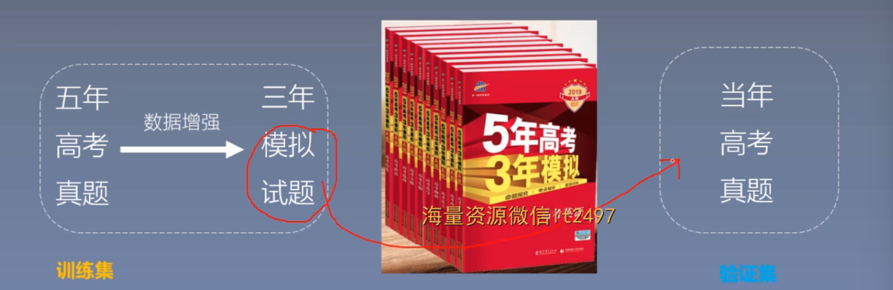
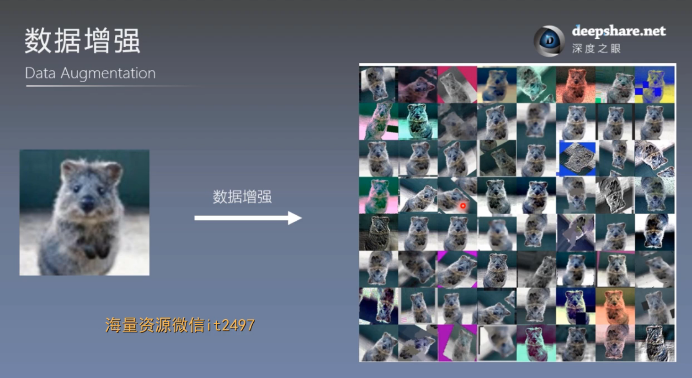
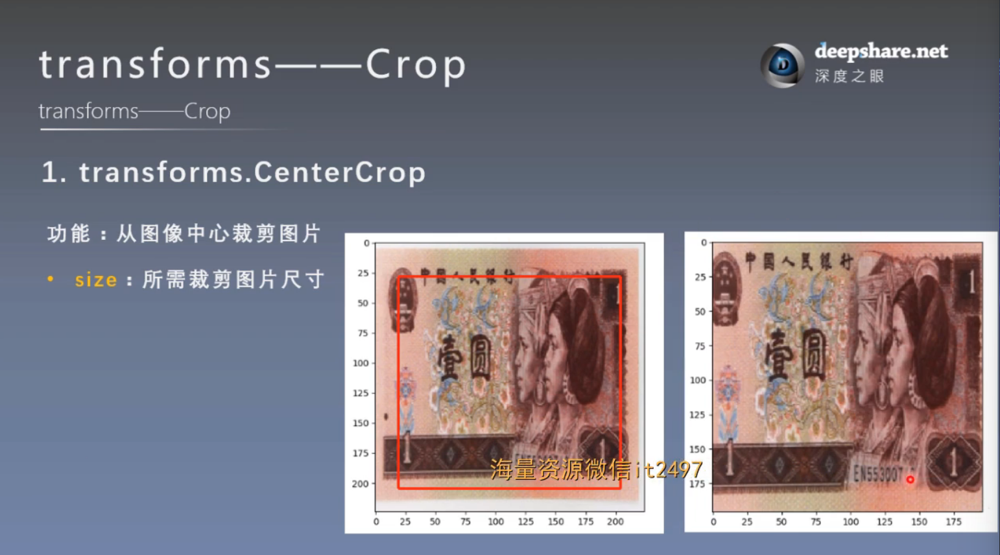
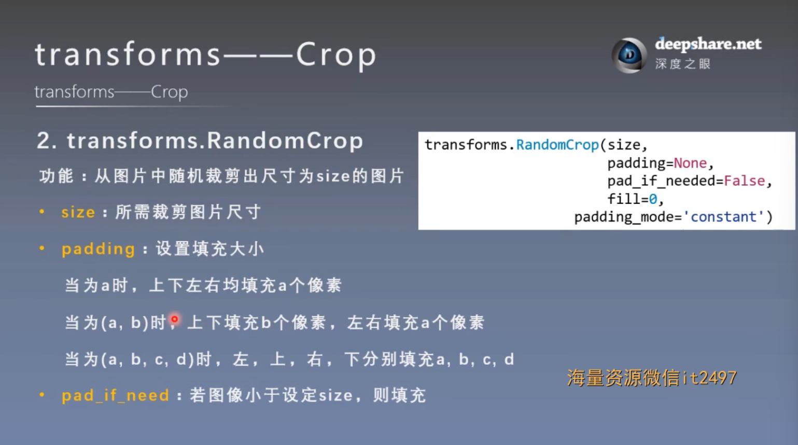
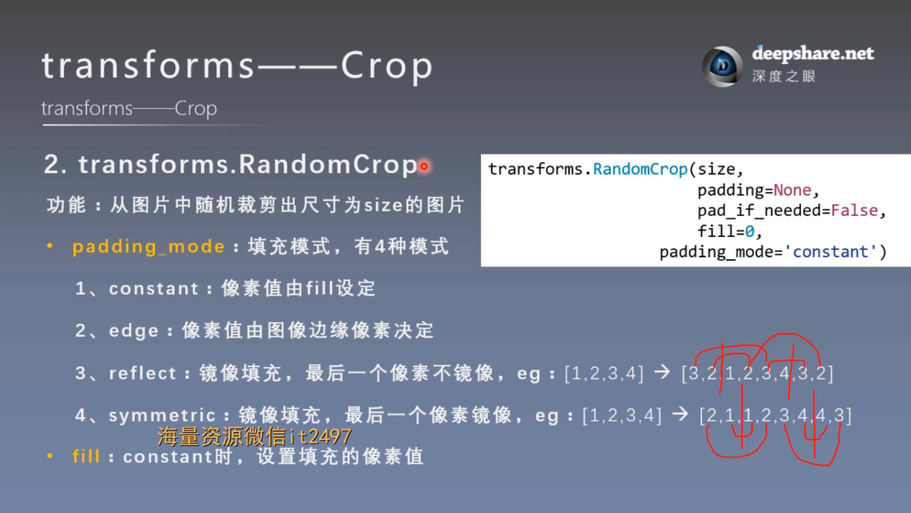
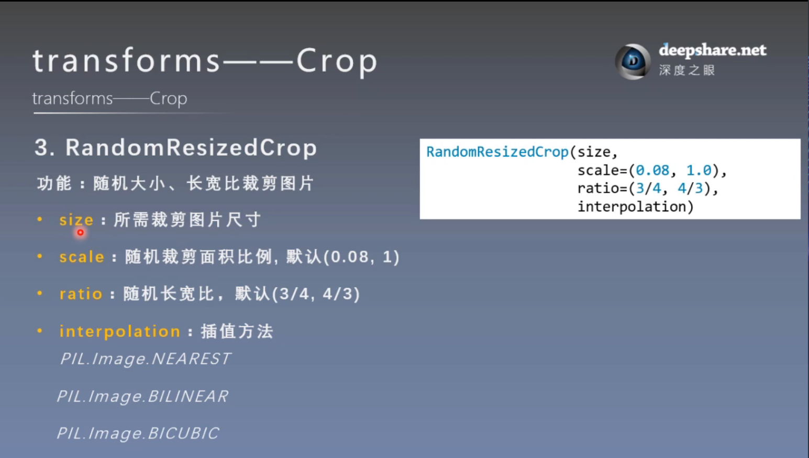
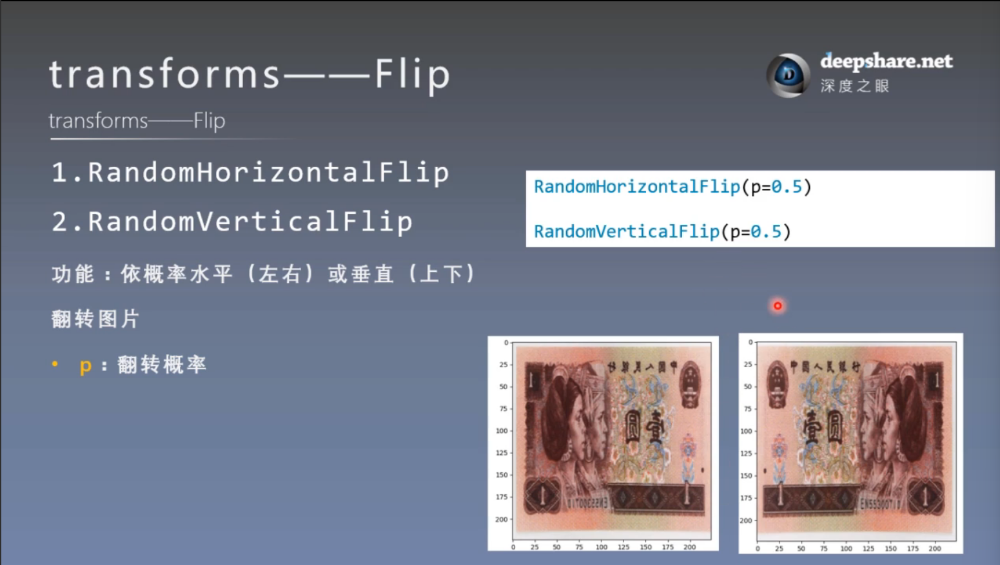
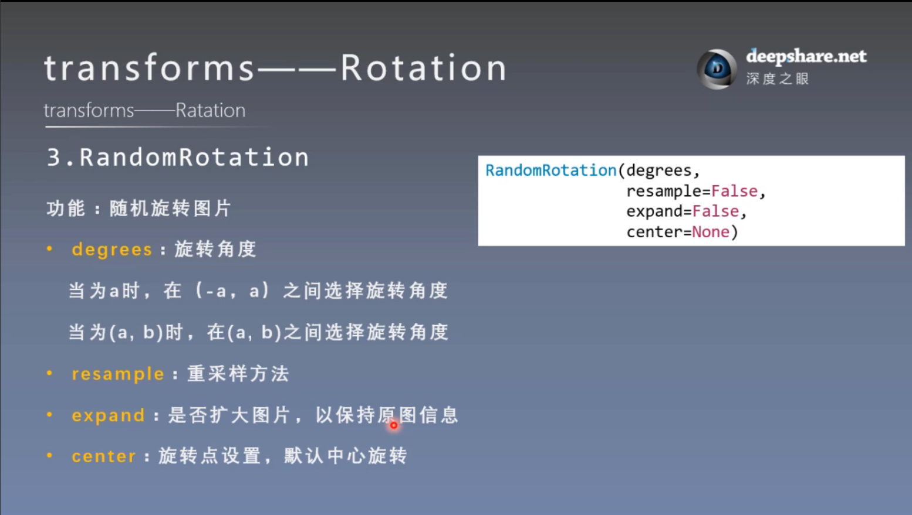

# transforms图像增强（一）
## 一. 什么是数据增强
数据增强又称为数据增广，数据扩增，它是对**训练集**进行变换，使训练集更丰富，从而让模型更具**泛化能力**

类比

例子：

## 二. transforms————裁剪
### 1. transforms.CenterCrop

### 2. transforms.RandomCrop

### 3. transforms.RandomResizedCrop

### 4. transforms.Five(Ten)Crop

## 三. transforms————翻转，旋转
### 1. RandomHorizontalFlip 和 RandomVerticalFlip

### 2. RandomRotation

