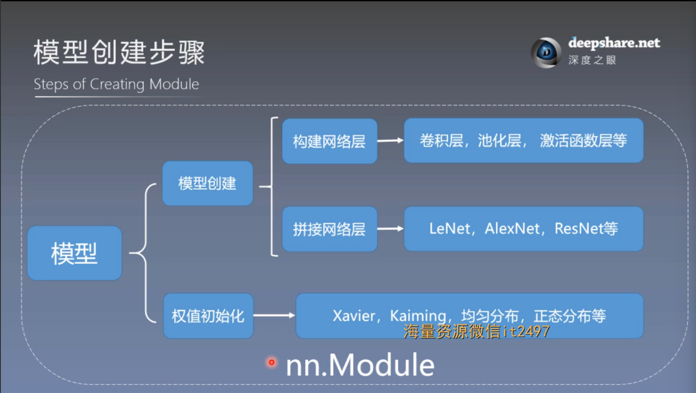
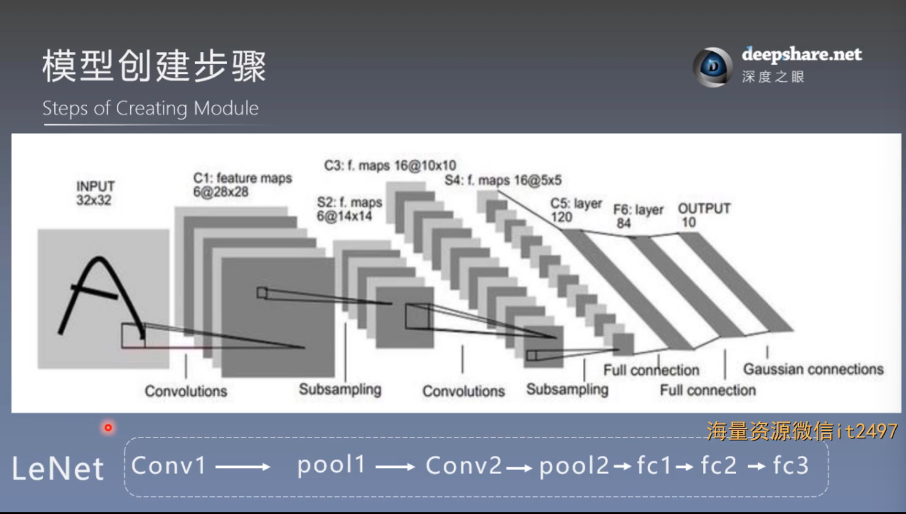
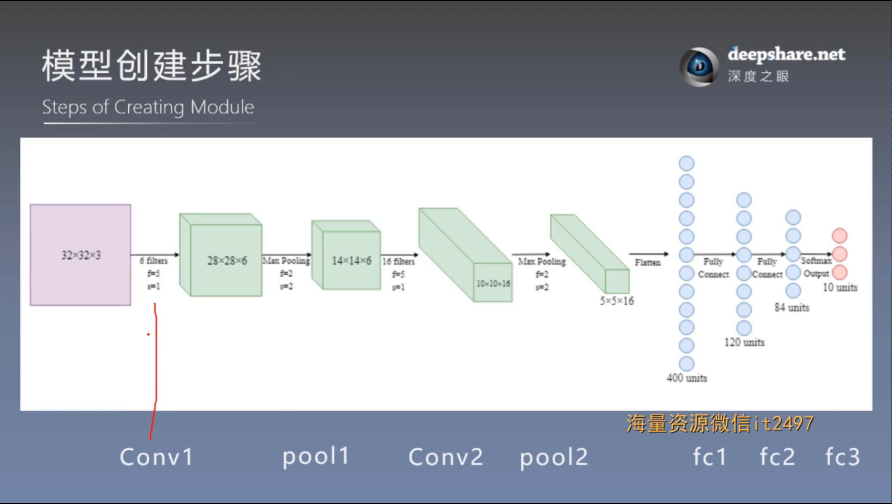
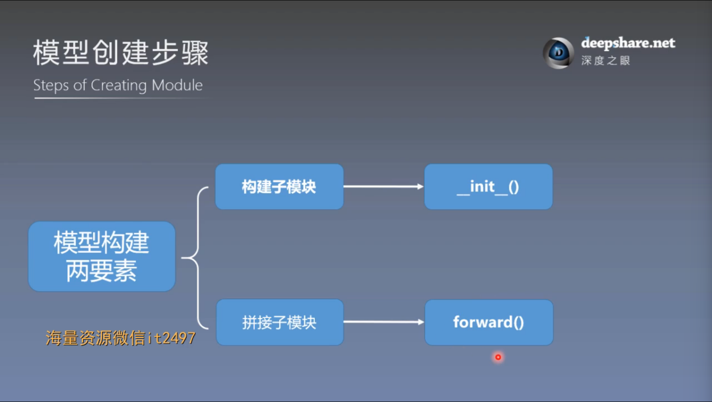
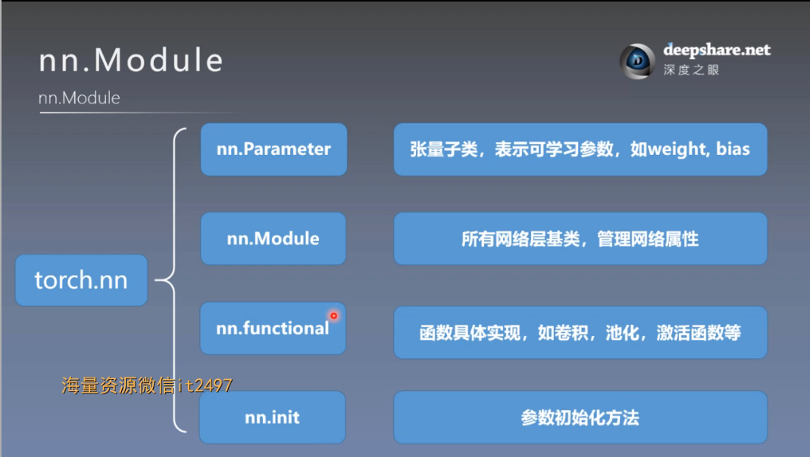
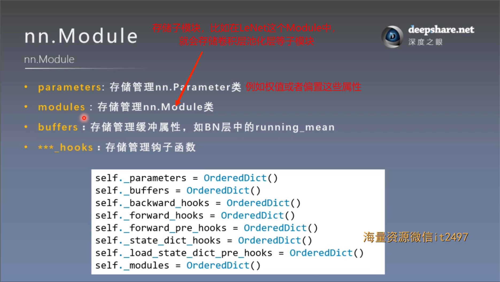
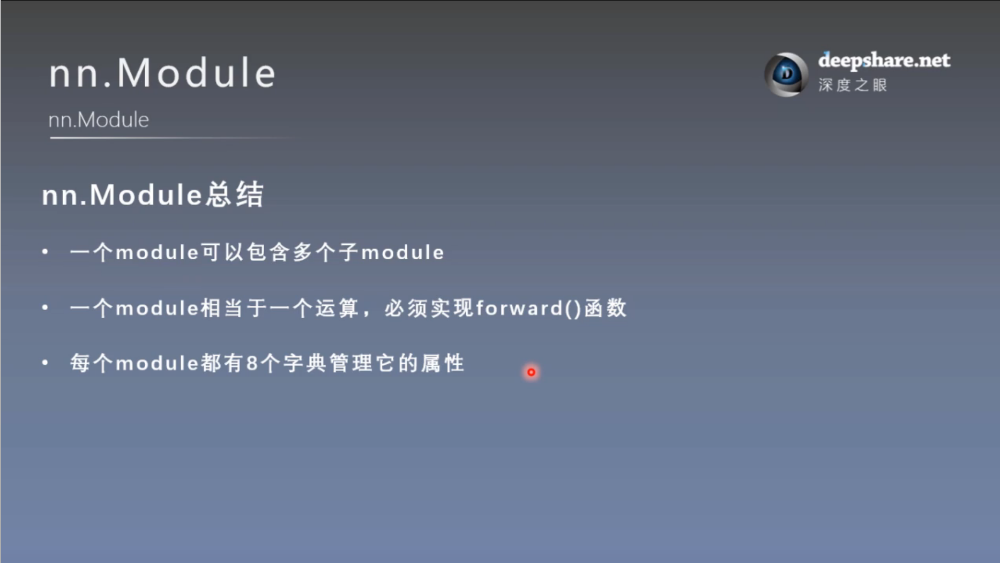

# 模型创建与nn.Module
## 一. 网络模型创建步骤
### 1. 基本步骤



一个nn.Module可以包含很多个子Module, 比如LeNet这个模块，包含了两个卷积层，两个池化层，以及三个全连接层



计算图如下，计算图中两个概念要注意，一个是结点，也就是数据，另一个是边，也就是运算



### 2. 模型构建两要素



（1）构建子模块在\_\_init()\_\_方法中

（2）拼接子模块在\_\_forward()\_\_方法中

LeNet模块构建部分示例

```json
class LeNet(nn.Module):  # 所有的神经网络组件模块最终都要继承nn.Module类
    def __init__(self, classes):  # 在__init()__方法中构建子模块
        super(LeNet, self).__init__()  # 继承父类nn.Module初始化方法，初始化nn.Module的属性
        self.conv1 = nn.Conv2d(3, 6, 5)  # 子模块是模块的一个属性
        self.conv2 = nn.Conv2d(6, 16, 5)
        self.fc1 = nn.Linear(16*5*5, 120)
        self.fc2 = nn.Linear(120, 84)
        self.fc3 = nn.Linear(84, classes)

    def forward(self, x):  # 按前向传播的顺序拼接子模块
        out = F.relu(self.conv1(x))
        out = F.max_pool2d(out, 2)
        out = F.relu(self.conv2(out))
        out = F.max_pool2d(out, 2)
        out = out.view(out.size(0), -1)
        out = F.relu(self.fc1(out))
        out = F.relu(self.fc2(out))
        out = self.fc3(out)
        return out
```

注：super() 函数用来查找并调用父类中的方法，通常在子类中使用来继承和扩展父类的功能。  
LeNet 是子类的名称，表明要调用的是 LeNet 类的父类。  
self 是子类的实例，它告诉 super() 要为哪个实例调用父类的 __init__ 方法。
## 二. nn.Module属性
### 1. torch.nn包



torch.nn包有四个主要模块，这次主要讲nn.Module模块
### 2. nn.Module属性

八个重要属性是八个有序字典



这里主要关注：parameters 和 modules

**注意**：在一个Module类中，给属性赋值并不是直接赋值的，而是要经过\_\_setattr\_\_方法判断后才能赋值。

Module怎么将子Module存储到_module有序字典中？

答：在\_\_init()\_\_方法中，我们构建子模块，即给子模块属性赋值，如：
```json
self.conv1 = nn.Conv2d(3, 6, 5)
```

当为模块的属性（如 self.fc1）赋值时，\_\_setattr\_\_ 被调用，拦截赋值行为，随即进入\_\_setattr\_\_方法，在\_\_setattr\_\_方法中进行判断

如果赋值的对象是一个继承自 nn.Module 的对象（即子模块），\_\_setattr\_\_ 会将其添加到 _modules 字典中

如果赋值的对象不是子模块，\_\_setattr\_\_ 会按照常规方式将其赋值为该模块的属性。

### 3. 总结

